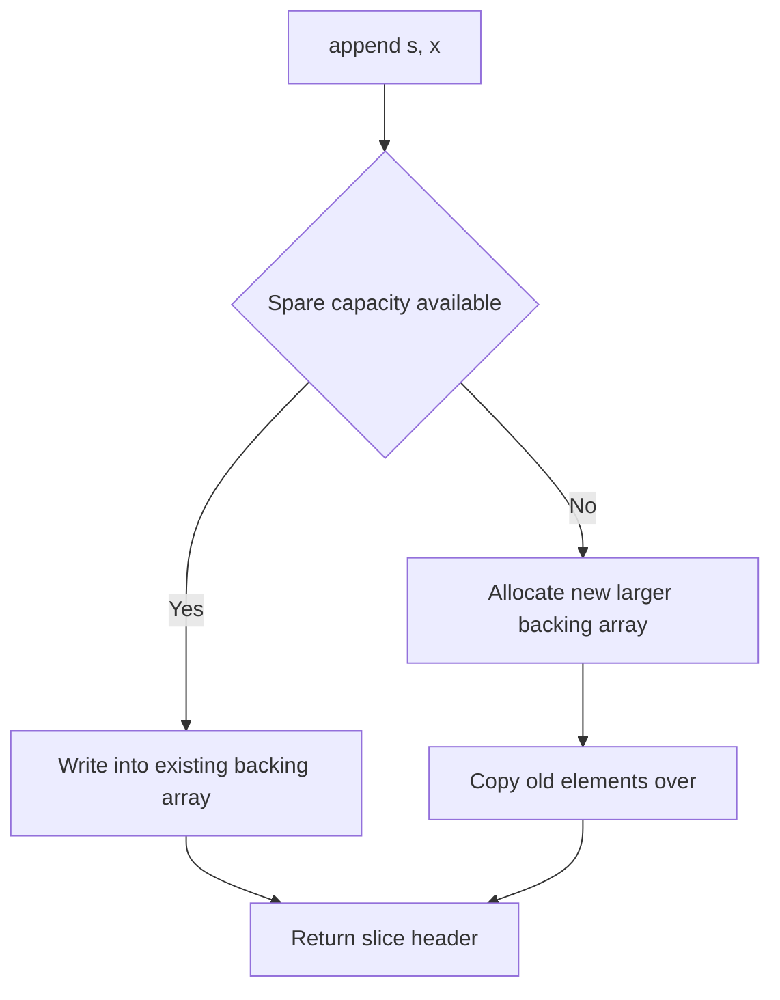

# Lecture 2 — The Zero Value, Slices, Maps, Structs, and `defer`

> **Time:** 2 hours. Take the zero-value-and-declarations material first, then the slices-and-maps material — the latter is where the surprises live. **Prerequisites:** Lecture 1 (a module and the toolchain). **Citations:** A Tour of Go at <https://go.dev/tour>, Effective Go at <https://go.dev/doc/effective_go>, "Go Slices: usage and internals" at <https://go.dev/blog/slices-intro>, "Go maps in action" at <https://go.dev/blog/maps>, and "Defer, Panic, and Recover" at <https://go.dev/blog/defer-panic-and-recover>.

## 1. Declarations and the zero value

Go has two ways to introduce a variable. The long form is `var`:

```go
var count int          // count is 0
var name string        // name is ""
var ready bool         // ready is false
var prices []float64   // prices is nil (a nil slice)
var lookup map[string]int // lookup is nil (a nil map)
```

The short form, usable only inside a function, is `:=`, which declares and infers the type from the right-hand side:

```go
count := 0             // int
name := "crunch"       // string
ready := true          // bool
ratio := 3.14          // float64
```

The choice between them is idiomatic, not arbitrary:

- Use `:=` when you are assigning a meaningful initial value (`count := len(words)`).
- Use `var` when you want the **zero value** explicitly and have nothing better to assign (`var buf bytes.Buffer`), or at package scope (where `:=` is not allowed).

The deep idea is the **zero value**. Every type has one, and a freshly declared variable *is* its zero value — never uninitialized garbage, never undefined behaviour:

| Type | Zero value |
|---|---|
| numeric (`int`, `float64`, …) | `0` |
| `string` | `""` (empty, not nil — strings are never nil) |
| `bool` | `false` |
| pointer, slice, map, channel, function, interface | `nil` |
| struct | a struct whose every field is its own zero value |

This is why Go has **no constructors**. Where Java writes `new ArrayList<>()` and C# writes `new List<int>()`, idiomatic Go aims to make the zero value directly useful so no constructor call is needed. The standard library is full of this: a `bytes.Buffer` works at its zero value, a `sync.Mutex` is ready to lock at its zero value, an `http.Server{}` struct literal with a few fields set is a working server. The design instinct you are building — and it is the opposite of your old one — is **"make the zero value useful."** Citation: <https://go.dev/tour/basics/12> and Effective Go's allocation section at <https://go.dev/doc/effective_go#allocation_new>.

Constants and `iota` close out declarations. `iota` is a counter that resets to 0 in each `const` block and increments per line, the idiomatic way to make an enumeration:

```go
type Level int

const (
	Debug Level = iota // 0
	Info               // 1
	Warn               // 2
	Error              // 3
)
```

Citation: the constants section of the spec at <https://go.dev/ref/spec#Iota>.

## 2. Slices — the most important data structure to understand precisely

A slice is **not** an array. An array (`[3]int`) is a fixed-size value type, rarely used directly. A *slice* (`[]int`) is a small three-word header that *describes a window into a backing array*:

```
slice header:  { ptr → backing array, len, cap }
```

- **`ptr`** points at the first element the slice covers.
- **`len`** is how many elements the slice currently covers (what `range` and indexing see).
- **`cap`** is how many elements exist from `ptr` to the end of the backing array (how far the slice can grow without reallocating).

You create one with a literal or with `make`:

```go
a := []int{10, 20, 30}        // len 3, cap 3
b := make([]int, 0, 8)        // len 0, cap 8 — empty but room for 8
```

### 2.1 `append` and reallocation — the central mechanic

`append` adds elements, growing `len`. If there is spare `cap`, it writes into the existing backing array and returns a header with a larger `len`. If there is *not* enough `cap`, it allocates a **new, larger** backing array, copies the elements over, and returns a header pointing at the new array:

```go
s := make([]int, 0, 2) // len 0, cap 2
s = append(s, 1)       // len 1, cap 2 — same backing array
s = append(s, 2)       // len 2, cap 2 — same backing array
s = append(s, 3)       // len 3, cap 4 — REALLOCATED, new backing array
```

This is why you **always write `s = append(s, x)`**, capturing the returned header — the returned slice may point at a different array than the one you passed in. Forgetting the assignment is a classic bug. Citation: <https://go.dev/blog/slices-intro>.


*Whether `append` mutates in place or reallocates depends entirely on spare capacity.*

### 2.2 The shared-backing-array aliasing trap

Slicing (`s[1:3]`) produces a new header that *shares the same backing array*. Mutating through one slice is visible through the other:

```go
base := []int{1, 2, 3, 4, 5}
window := base[1:3]    // {2, 3}, shares base's backing array
window[0] = 99
fmt.Println(base)      // [1 99 3 4 5]  — base saw the change
```

And the subtle version: `append` into a sub-slice that still has spare capacity overwrites the parent's elements.

```go
base := []int{1, 2, 3, 4, 5}
window := base[1:3]        // len 2, cap 4 (shares to end of base)
window = append(window, 99) // writes into base[3]!
fmt.Println(base)          // [1 2 3 99 5]
```

The defensive move, when you need an independent copy, is the full-slice expression `base[1:3:3]` (which caps `cap` at `len`, forcing the next `append` to reallocate) or an explicit `slices.Clone`. The reviewer's question "does this slice alias its parent?" is one you must always be able to answer. Citation: the full-slice expression in the spec at <https://go.dev/ref/spec#Slice_expressions> and `slices.Clone` at <https://pkg.go.dev/slices#Clone>.

### 2.3 The nil slice is usable

A `nil` slice (`var s []int`) has `len 0`, `cap 0`, and a nil pointer — and it is **safe to `range` over and to `append` to**:

```go
var s []int          // nil
fmt.Println(len(s))  // 0
for range s {}       // runs zero times, no panic
s = append(s, 1)     // fine — append allocates a backing array
```

So you almost never need to "initialize" a slice before appending. `var result []T` then `result = append(result, ...)` in a loop is idiomatic. Citation: <https://go.dev/blog/slices-intro>.

## 3. Maps

A map is a reference to a hash table: `make(map[K]V)` (or a literal `map[string]int{"a": 1}`). The key type must be comparable (`==` must work on it — so structs of comparable fields are valid keys, but slices are not).

### 3.1 The comma-ok read

Reading a missing key returns the value type's zero value, which is ambiguous — did the key map to `0`, or is it absent? The two-value "comma-ok" form disambiguates:

```go
m := map[string]int{"cat": 2}
v := m["dog"]        // v == 0 (zero value), but was "dog" present?
v, ok := m["dog"]    // v == 0, ok == false  → absent
v, ok = m["cat"]     // v == 2, ok == true   → present
```

Use the comma-ok form whenever absence and a zero value mean different things. Citation: <https://go.dev/blog/maps>.

### 3.2 The nil-map asymmetry

A nil map (`var m map[string]int`) is **safe to read** (every key returns the zero value, `ok` is false) but **panics on write**:

```go
var m map[string]int
_ = m["x"]      // fine, returns 0, false
m["x"] = 1      // PANIC: assignment to entry in nil map
```

So unlike a slice, you *must* initialize a map with `make` (or a literal) before writing to it. This asymmetry is a frequent quiz and interview question. Citation: <https://go.dev/blog/maps>.

### 3.3 Iteration order is randomized — on purpose

`for k, v := range m` visits keys in a **randomized** order that differs run to run. This is a deliberate language decision to stop programs from accidentally depending on an order that was never guaranteed. If you need a stable order, collect the keys into a slice and `sort.Strings` them:

```go
keys := make([]string, 0, len(m))
for k := range m {
	keys = append(keys, k)
}
sort.Strings(keys)
for _, k := range keys {
	fmt.Println(k, m[k])
}
```

Citation: the "Iteration order" note in <https://go.dev/blog/maps> and the spec's range statement at <https://go.dev/ref/spec#For_statements>.

### 3.4 Maps are not safe for concurrent writes

A map written by two goroutines at once is a data race that the runtime will detect and crash on (`fatal error: concurrent map writes`). We do not solve that this week — it is a Week 3/4 topic (a `sync.Mutex` or `sync.Map`) — but you should know the constraint exists now, because the runtime's crash message is blunt. Citation: <https://go.dev/blog/maps> ("Concurrency").

## 4. Structs and composition

A struct is a fixed set of named fields:

```go
type Pair struct {
	Word  string
	Count int
}

p := Pair{Word: "cat", Count: 2} // keyed literal — preferred, survives field reordering
q := Pair{"dog", 1}              // positional — fragile, avoid in exported types
```

Prefer the **keyed** literal: it is readable and does not break if someone adds a field. Structs are *value types* — assigning one or passing it to a function copies every field. A pointer to a struct (`*Pair`) shares it.

### 4.1 Embedding is composition, not inheritance

Go has no inheritance. Reuse comes from **embedding** — declaring a field with no name, just a type:

```go
type Base struct {
	ID string
}

func (b Base) Describe() string { return "id=" + b.ID }

type User struct {
	Base          // embedded: User "has a" Base, and promotes its fields/methods
	Name string
}

u := User{Base: Base{ID: "u1"}, Name: "alice"}
fmt.Println(u.ID)         // "u1"        — promoted field
fmt.Println(u.Describe()) // "id=u1"     — promoted method
```

`User` does not *inherit from* `Base`; it *contains* a `Base` and Go *promotes* the embedded type's fields and methods so you can write `u.ID` instead of `u.Base.ID`. The difference matters: there is no "is-a" subtyping, no virtual method dispatch by base class, no `super`. When you want polymorphism, you reach for an interface (Week 2), not a base class. Citation: Effective Go's embedding section at <https://go.dev/doc/effective_go#embedding>.

### 4.2 The empty struct

`struct{}` is a struct with no fields. It occupies **zero bytes**. Its idiomatic use is as a map value when you only care about the keys (a set) or as a channel signal type:

```go
seen := make(map[string]struct{})
seen["cat"] = struct{}{}        // add to the set
_, ok := seen["cat"]            // membership test
```

A `map[string]struct{}` is a set that uses no memory per value, versus `map[string]bool` which stores a byte per entry. Citation: the empty-struct discussion in <https://go.dev/ref/spec#Struct_types>.

## 5. `defer` — cleanup that co-locates with acquisition

`defer` schedules a function call to run when the surrounding function returns — by any path: a normal return, an early return, or a panic unwinding through it. Its canonical use is cleanup, written immediately after acquisition so the two are adjacent and impossible to forget:

```go
func readAll(name string) ([]byte, error) {
	f, err := os.Open(name)
	if err != nil {
		return nil, err
	}
	defer f.Close() // runs no matter how readAll returns below

	return io.ReadAll(f)
}
```

Three properties to burn in:

1. **LIFO order.** Multiple `defer`s run last-in-first-out. The last `defer` you wrote runs first.

   ```go
   defer fmt.Println("1")
   defer fmt.Println("2")
   defer fmt.Println("3")
   // prints 3, 2, 1
   ```

   ```mermaid
   flowchart TD
     A["defer Println 1"] --> Stack["Deferred call stack"]
     B["defer Println 2"] --> Stack
     C["defer Println 3"] --> Stack
     Stack --> D["Function returns"]
     D --> E["Runs 3 first"]
     E --> F["Runs 2 next"]
     F --> G["Runs 1 last"]
   
```
   *Deferred calls stack up in order written and unwind last-in-first-out.*

2. **Arguments are evaluated at the `defer` statement, not when it runs.** This trips up everyone once:

   ```go
   i := 0
   defer fmt.Println("deferred i =", i) // captures i==0 NOW
   i = 99
   // at return, prints "deferred i = 0"  (not 99)
   ```

   If you want the value at run time, defer a closure: `defer func() { fmt.Println(i) }()` prints 99, because the closure reads `i` when it runs.

3. **It works with `panic`.** A `defer`red call runs even as a panic unwinds the stack, which is exactly how a deferred `recover()` turns a panic back into an ordinary error at a boundary — covered in Lecture 3. Citation: <https://go.dev/blog/defer-panic-and-recover>.

`defer` has a tiny per-call cost (a few nanoseconds), negligible everywhere except the hottest inner loops. Reach for it for any cleanup that must happen on every exit path: closing files, unlocking mutexes (Week 3), rolling back transactions (Week 6).

## 6. Strings, bytes, and runes — a thirty-second orientation

A Go `string` is an immutable sequence of bytes, conventionally UTF-8. Indexing a string (`s[0]`) gives you a **byte** (a `uint8`), not a character. Ranging over a string (`for i, r := range s`) gives you **runes** (a `rune` is an `int32` Unicode code point) and their byte offsets, correctly decoding multi-byte UTF-8:

```go
s := "héllo"
fmt.Println(len(s))        // 6 — bytes, because é is two bytes in UTF-8
for i, r := range s {
	fmt.Printf("%d:%c ", i, r) // 0:h 1:é 3:l 4:l 5:o — note the jump 1→3
}
```

The takeaway for this week: `len(s)` counts bytes, not characters; `range` over a string decodes runes; and you build strings efficiently with a `strings.Builder`, never with repeated `+=` in a loop (which reallocates each time — `staticcheck` will flag it). Citation: the "Strings, bytes, runes and characters in Go" blog post at <https://go.dev/blog/strings>.

## 7. Exercise pointer

Now do **Exercise 2 — Slices, Maps, Structs**. You will reproduce the slice-aliasing trap and fix it with a full-slice expression, use the comma-ok map read to distinguish absent from zero, build a set with `map[string]struct{}`, embed a struct and call a promoted method, and predict the output of a `defer` LIFO sequence before running it. The acceptance criterion is that you can explain, without running the program, why `append` into a sub-slice mutated its parent.

## 8. Summary

- Every type has a **zero value**; a declared variable *is* its zero value. Idiomatic Go makes the zero value useful, which is why there are no constructors.
- A **slice** is a `{ptr, len, cap}` header over a backing array. `append` reallocates when `cap` is exceeded — so always write `s = append(s, x)`. Sub-slices share the backing array; mutation aliases. The full-slice expression `s[a:b:b]` or `slices.Clone` breaks the aliasing.
- A **nil slice** is safe to `range` and `append`; a **nil map** is safe to read but panics on write. Use comma-ok (`v, ok := m[k]`) to distinguish absent from zero. Map iteration order is randomized; maps are not safe for concurrent writes.
- **Structs** are value types; copying copies all fields. **Embedding** is composition with field/method promotion — not inheritance. `struct{}` is the zero-byte set-value type.
- **`defer`** runs on every exit path, in LIFO order; its arguments are evaluated at the `defer` statement, not when it runs. Use it for cleanup co-located with acquisition.
- A **string** is immutable UTF-8 bytes; `len` counts bytes, `range` decodes runes; build strings with `strings.Builder`.

Cited references this lecture pulled from: <https://go.dev/tour>, <https://go.dev/doc/effective_go>, <https://go.dev/blog/slices-intro>, <https://go.dev/blog/maps>, <https://go.dev/blog/defer-panic-and-recover>, <https://go.dev/blog/strings>.
