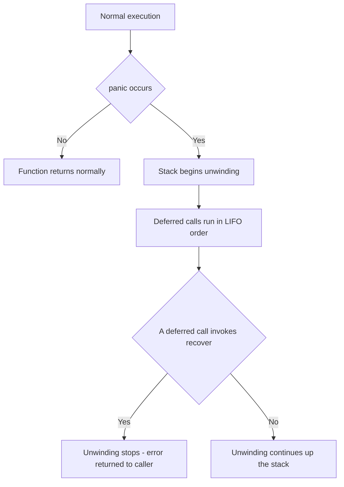
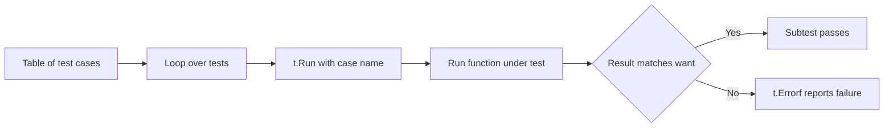

# Lecture 3 — Functions, Errors as Values, and Table-Driven Tests

> **Time:** 2 hours. Take the functions-and-errors material first, then spend the back half writing tests by hand. **Prerequisites:** Lectures 1 and 2. **Citations:** Effective Go's functions and errors sections at <https://go.dev/doc/effective_go#functions> and <https://go.dev/doc/effective_go#errors>, the `testing` package docs at <https://pkg.go.dev/testing>, the "Add a test" tutorial at <https://go.dev/doc/tutorial/add-a-test>, and the Go wiki's TableDrivenTests page at <https://go.dev/wiki/TableDrivenTests>.

## 1. Functions, multiple returns, and closures

A Go function can return more than one value, and this single feature is why Go does not need exceptions, out-parameters, or tuple types:

```go
func divide(a, b int) (int, error) {
	if b == 0 {
		return 0, errors.New("divide by zero")
	}
	return a / b, nil
}

q, err := divide(10, 2) // q == 5, err == nil
```

The convention is rigid and you should follow it: **the error is the last return value**, and a non-nil error means the other return values are not to be trusted (return their zero values alongside the error). Callers check the error immediately.

### 1.1 Named returns — use sparingly

You can name the return values in the signature:

```go
func split(sum int) (x, y int) {
	x = sum * 4 / 9
	y = sum - x
	return // a "naked" return: returns the current x, y
}
```

Named returns read well for very short functions and are occasionally necessary (a deferred closure that modifies the return value — see error wrapping below). But naked returns in a long function are a readability trap; `staticcheck` and reviewers will push back. Default to explicit returns; reach for named returns only when they earn their keep. Citation: Effective Go's "Named result parameters" at <https://go.dev/doc/effective_go#named-results>.

### 1.2 Variadic functions

A trailing `...T` parameter accepts zero or more arguments, received as a `[]T`:

```go
func sum(nums ...int) int {
	total := 0
	for _, n := range nums {
		total += n
	}
	return total
}

sum(1, 2, 3)        // 6
nums := []int{1, 2, 3}
sum(nums...)        // 6 — spread a slice into a variadic call
```

`fmt.Println` and `append` are the variadic functions you already use. Citation: the spec's "Passing arguments to ... parameters" at <https://go.dev/ref/spec#Passing_arguments_to_..._parameters>.

### 1.3 Functions are values; closures capture variables

Functions are first-class: you can store one in a variable, pass it as an argument, and return one. A function literal that references variables from its enclosing scope is a **closure** — it captures those variables by reference:

```go
func counter() func() int {
	n := 0
	return func() int { // closure over n
		n++
		return n
	}
}

next := counter()
fmt.Println(next(), next(), next()) // 1 2 3 — n persists across calls
```

You already used a closure this week: the comparison function you passed to `sort.Slice` in Lecture 1 captured the slice it sorted. Closures are everywhere in Go — `http.HandlerFunc`, the `t.Run` subtest body, `defer func(){...}()`. The one trap, which bit every Go programmer before Go 1.22, was a loop variable captured by a closure inside the loop; Go 1.22 changed loop-variable scoping so each iteration gets a fresh variable, removing the trap. This is one concrete reason the track requires 1.22+. Citation: the Go 1.22 release notes' loop-variable change at <https://go.dev/blog/loopvar-preview>.

## 2. Errors are values

Go has no exceptions. The error-handling model is: a function that can fail returns an `error`, and the caller decides what to do. `error` is a tiny interface in the standard library:

```go
type error interface {
	Error() string
}
```

Anything with an `Error() string` method is an error. You create simple ones with `errors.New` or `fmt.Errorf`:

```go
errors.New("file not found")
fmt.Errorf("opening %s: %w", name, err) // %w wraps an underlying error (Week 2)
```

The caller's reflex — the single most-typed pattern in Go — is:

```go
data, err := os.ReadFile(path)
if err != nil {
	return nil, fmt.Errorf("loading config: %w", err)
}
// use data; if we got here, err was nil and data is valid
```

This is more verbose than `try { ... } catch`, and the verbosity is the feature: every line that can fail shows its failure handling *right there*, not unwound to a `catch` three frames up. A senior Go reviewer reads the error paths first, because that is where the bugs hide, and Go puts them in plain sight. We go deep on *constructing* error chains, sentinel vs typed errors, and `errors.Is` / `errors.As` in **Week 2**; this week the goal is only the reflex: **check `err != nil` on every call that returns one, and never silently discard an error.** `staticcheck` flags an ignored error (`err` assigned and never used) for exactly this reason. Citation: Effective Go's errors at <https://go.dev/doc/effective_go#errors> and the `errors` package at <https://pkg.go.dev/errors>.

### 2.1 `panic` and `recover` — not error handling

Go has `panic` (stop normal flow, unwind the stack running deferred calls) and `recover` (inside a deferred call, stop the unwinding). They exist for **programmer mistakes and truly unrecoverable situations**, not ordinary failure:

- A nil-pointer dereference, an out-of-bounds slice index, a `nil`-map write — the runtime panics. These are bugs, not conditions to handle.
- You may `panic` deliberately in a constructor-like helper that genuinely cannot continue (a `regexp.MustCompile` with a bad pattern is a program-author error, so it panics).
- A library at a process boundary (an HTTP handler) may `recover` a panic to keep the server alive and turn it into a 500 — we do exactly this with recovery middleware in Week 5.

The mantra: **don't panic; return an error.** A panic in a code path that should return an error is a code smell a reviewer will catch. Citation: <https://go.dev/blog/defer-panic-and-recover>.


*Panic unwinds through deferred calls; only a deferred `recover` stops it.*

## 3. The `testing` package

Tests are first-class and built in. The rules:

1. A test file is named `*_test.go` and lives in the same package as the code (or in `package foo_test` for black-box tests).
2. A test function is `func TestXxx(t *testing.T)` where `Xxx` starts with a capital letter.
3. `go test` runs every such function in the package. `go test ./...` runs the whole tree.
4. A test *fails* by calling a method on `t` — there is no assertion library and you do not need one.

The two failure methods to know:

- **`t.Errorf(format, args...)`** records a failure and *keeps running* the test. Use it when one failed assertion does not invalidate the rest.
- **`t.Fatalf(format, args...)`** records a failure and *stops the test function* (via `runtime.Goexit`). Use it when continuing makes no sense — for example, the thing under test returned an unexpected error, so checking its result would just be noise.

A first test, the long way (one function per case — which we will immediately improve):

```go
package count

import "testing"

func TestTop_ReturnsMostFrequentFirst(t *testing.T) {
	got := Top("a a b", 2)
	if len(got) != 2 {
		t.Fatalf("len = %d, want 2", len(got))
	}
	if got[0].Word != "a" || got[0].Count != 2 {
		t.Errorf("got[0] = %+v, want {a 2}", got[0])
	}
}
```

```sh
$ go test ./internal/count/
ok      github.com/you/wordfreq/internal/count        0.004s
$ go test -v ./internal/count/
=== RUN   TestTop_ReturnsMostFrequentFirst
--- PASS: TestTop_ReturnsMostFrequentFirst (0.00s)
PASS
```

Citation: <https://pkg.go.dev/testing> and <https://go.dev/doc/tutorial/add-a-test>.

## 4. Table-driven tests — the idiomatic shape

One test function per case does not scale; the idiomatic Go shape is **one test function holding a table** of cases, iterated as named subtests with `t.Run`:

```go
func TestTop(t *testing.T) {
	tests := []struct {
		name string
		text string
		n    int
		want []Pair
	}{
		{
			name: "empty input",
			text: "",
			n:    3,
			want: []Pair{},
		},
		{
			name: "single word repeated",
			text: "go go go",
			n:    1,
			want: []Pair{{Word: "go", Count: 3}},
		},
		{
			name: "ties broken alphabetically",
			text: "b a b a c",
			n:    3,
			want: []Pair{{Word: "a", Count: 2}, {Word: "b", Count: 2}, {Word: "c", Count: 1}},
		},
		{
			name: "n larger than vocabulary clamps",
			text: "one two",
			n:    99,
			want: []Pair{{Word: "one", Count: 1}, {Word: "two", Count: 1}},
		},
	}

	for _, tc := range tests {
		t.Run(tc.name, func(t *testing.T) {
			got := Top(tc.text, tc.n)
			if !reflect.DeepEqual(got, tc.want) {
				t.Errorf("Top(%q, %d) = %+v, want %+v", tc.text, tc.n, got, tc.want)
			}
		})
	}
}
```

Why this shape wins:

1. **Each case is a named subtest.** `go test -v` prints `--- PASS: TestTop/ties_broken_alphabetically`, and you can run exactly that one with `go test -run 'TestTop/ties_broken_alphabetically'`. Naming the cases is not optional decoration; it is how you locate a failure.
2. **Adding a case is adding a struct literal** — one line of test data, not a new function. The cohort that writes table tests writes more cases, because each case is cheap.
3. **The assertion logic is written once.** A bug in the comparison is in one place, not copied across ten functions.

A note on comparing values: `reflect.DeepEqual` works for arbitrary structures but is slow and has sharp edges (it distinguishes a nil slice from an empty slice, for instance). For the mini-project we will use it; in real code prefer the `cmp` package (<https://pkg.go.dev/github.com/google/go-cmp/cmp>) for clearer diffs, which we introduce in Week 8. Citation: <https://go.dev/wiki/TableDrivenTests>.


*Each table row becomes one named, independently runnable subtest.*

### 4.1 Subtests, parallelism, and helpers — a preview

Three more `testing` features you will use as the track deepens:

- **`t.Parallel()`** inside a subtest marks it to run concurrently with other parallel subtests — useful once tests are slow (integration tests in Week 6).
- **`t.Helper()`** in a test helper function makes failures report the *caller's* line number, not the helper's. Mark every assertion helper with it.
- **`testing.T.Cleanup(fn)`** registers cleanup that runs when the test (and its subtests) finish — the test-scoped analogue of `defer`, used for tearing down temp directories and containers.

We use all three by Week 8. This week, table + `t.Run` + `t.Errorf` is the whole toolkit. Citation: <https://pkg.go.dev/testing#T>.

## 5. Coverage — a signal, not a goal

`go test -cover` reports the percentage of statements executed by your tests; `-coverprofile` writes a profile you can render line-by-line:

```sh
$ go test -cover ./...
ok      github.com/you/wordfreq/internal/count        0.005s  coverage: 92.3% of statements
$ go test -coverprofile=cover.out ./... && go tool cover -html=cover.out
```

The HTML view colours every line: green = covered, red = never executed. Read it once per project to find the error path you forgot to test (it is almost always an error path). But internalize the framing the syllabus insists on: **coverage is a signal, not a goal.** 100% coverage of trivial getters proves nothing; 80% coverage that exercises every error branch and every boundary proves a lot. Chase the branches that matter, not the number. Citation: the "Cover" tooling docs at <https://go.dev/blog/cover>.

## 6. Putting it together — the testable function shape

The reason errors-as-values and table tests live in the same lecture is that they reinforce each other. A function that returns `(T, error)` is trivially table-testable: each case declares its input and both expected outputs.

```go
// ParseTopN parses the --top flag value; it must be a positive integer.
func ParseTopN(s string) (int, error) {
	n, err := strconv.Atoi(s)
	if err != nil {
		return 0, fmt.Errorf("--top %q: not an integer: %w", s, err)
	}
	if n <= 0 {
		return 0, fmt.Errorf("--top must be positive, got %d", n)
	}
	return n, nil
}
```

```go
func TestParseTopN(t *testing.T) {
	tests := []struct {
		name    string
		in      string
		want    int
		wantErr bool
	}{
		{"valid", "20", 20, false},
		{"zero is invalid", "0", 0, true},
		{"negative is invalid", "-3", 0, true},
		{"non-numeric is invalid", "abc", 0, true},
	}
	for _, tc := range tests {
		t.Run(tc.name, func(t *testing.T) {
			got, err := ParseTopN(tc.in)
			if (err != nil) != tc.wantErr {
				t.Fatalf("ParseTopN(%q) error = %v, wantErr %v", tc.in, err, tc.wantErr)
			}
			if got != tc.want {
				t.Errorf("ParseTopN(%q) = %d, want %d", tc.in, got, tc.want)
			}
		})
	}
}
```

The `(err != nil) != tc.wantErr` check is the canonical "did we get an error when we expected one (or not)" assertion. In Week 2 we tighten it from "an error happened" to "*this specific* error happened" with `errors.Is`. This week, "an error happened" is enough. Citation: <https://go.dev/wiki/TableDrivenTests>.

## 7. Exercise pointer

Now do **Exercise 3 — Errors and Table Tests**. You will write a small function that returns `(T, error)`, give it a table-driven test covering the happy path and every error branch, run it with `go test -v` and `go test -run` to execute a single case, check coverage with `go test -cover`, and confirm the package is clean under `go vet` and `staticcheck`. The acceptance criterion is a green `go test ./...` plus a coverage number you can explain — including which lines the red bars in the HTML view point at.

## 8. Summary

- Functions return **multiple values**, with the **error last**; a non-nil error means the other returns are zero/invalid. Named returns are occasionally useful but default to explicit. Variadic `...T` parameters receive a slice; spread a slice with `slice...`.
- Functions are **values**; closures capture enclosing variables by reference. Go 1.22 fixed the loop-variable-capture trap (one reason the track requires 1.22+).
- **Errors are values.** `error` is a one-method interface; create errors with `errors.New` / `fmt.Errorf`; check `err != nil` on every fallible call; never silently discard an error. `panic`/`recover` are for programmer bugs and process boundaries, **not** error handling.
- The **`testing` package** is built in: `func TestXxx(t *testing.T)` in `*_test.go`; fail with `t.Errorf` (continue) or `t.Fatalf` (stop); no assertion library needed.
- **Table-driven tests** — a slice of `{name, input, want}` cases iterated with `t.Run` — are the idiomatic shape: named subtests you can run individually, cheap to extend, assertion logic written once.
- **Coverage** (`go test -cover`) is a signal, not a goal; read the HTML view to find untested error branches, then chase the branches that matter rather than the number.

Cited references this lecture pulled from: <https://go.dev/doc/effective_go#functions>, <https://go.dev/doc/effective_go#errors>, <https://pkg.go.dev/testing>, <https://go.dev/doc/tutorial/add-a-test>, <https://go.dev/wiki/TableDrivenTests>, <https://go.dev/blog/cover>, <https://pkg.go.dev/errors>.
