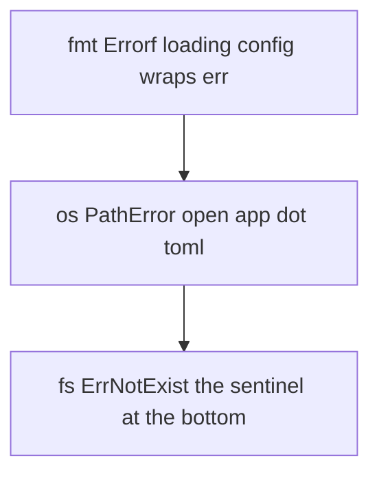
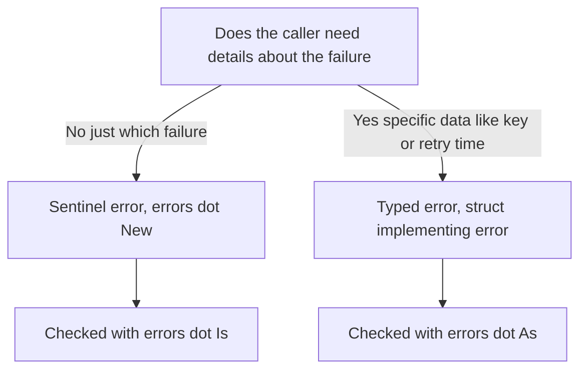

# Lecture 2 — Errors: Wrapping, Sentinel, and Typed

> **Time:** 2 hours. Take the interface-and-wrapping material first, then the `Is`/`As` and sentinel-vs-typed material. **Prerequisites:** Week 1 (errors as values, the `if err != nil` reflex) and Lecture 1 (interfaces, type assertions). **Citations:** the `errors` package docs at <https://pkg.go.dev/errors>, the Go 1.13 errors blog post at <https://go.dev/blog/go1.13-errors>, and the "Error handling and Go" post at <https://go.dev/blog/error-handling-and-go>.

## 1. Why this lecture

In Week 1 you learned the *reflex*: a fallible function returns `error` last, and the caller writes `if err != nil`. That reflex answers "did it fail?" This lecture answers the two harder questions a real service must answer: **"*how* did it fail?"** (so the caller can react differently to "not found" than to "permission denied") and **"*what was the underlying cause*, three layers down?"** (so a log line tells you the root, not just the outermost annotation). The machinery is three things — `%w` wrapping, `errors.Is`, and `errors.As` — plus one design decision, *sentinel vs typed*, repeated on every error you define. Get this right and Go's verbose error handling becomes a genuine asset; get it wrong and you end up string-matching error messages, which is the cardinal sin we spend this lecture unlearning.

## 2. The error interface, revisited

`error` is the one-method interface you met in Week 1:

```go
type error interface {
	Error() string
}
```

Anything with `Error() string` is an error. Two builders cover the simple cases:

```go
errors.New("connection refused")          // a plain error with a fixed message
fmt.Errorf("dial %s: timed out", addr)     // a formatted error, NO wrapping
fmt.Errorf("dial %s: %w", addr, cause)     // a formatted error that WRAPS cause
```

`errors.New` returns an opaque error value. `fmt.Errorf` formats a message; with the `%w` verb (and only `%w`) it also *wraps* an underlying error, building a chain you can later inspect. The distinction between `%v` and `%w` is the whole game, and §4 makes it precise. Citation: <https://pkg.go.dev/errors#New> and <https://pkg.go.dev/fmt#Errorf>.

## 3. The cardinal sin: string-matching an error

Before the machinery, the anti-pattern it exists to kill:

```go
// NEVER do this.
if err.Error() == "record not found" {
	// ...
}
if strings.Contains(err.Error(), "not found") {
	// ...
}
```

An error's *message string* is for humans — a log line, a stack trace — and is **not part of the API contract**. The moment someone rewords "record not found" to "no such record", or wraps it so the message gains a prefix, your `==` silently stops matching and a bug ships. You assert an error's *identity* (`errors.Is`) or its *type* (`errors.As`), never its rendered string. This lecture's entire purpose is to give you those two tools so you never write the code above. Citation: <https://go.dev/blog/go1.13-errors>.

## 4. Wrapping with `%w` — building a chain

When a low-level function fails and you want to add context *without throwing away the cause*, wrap it with `%w`:

```go
func loadConfig(path string) (*Config, error) {
	data, err := os.ReadFile(path)
	if err != nil {
		// Annotate with what WE were doing, and keep os's error underneath.
		return nil, fmt.Errorf("loading config %q: %w", path, err)
	}
	// ... parse ...
}
```

If `os.ReadFile` returns `fs.ErrNotExist`, the caller of `loadConfig` now holds an error whose message reads `loading config "app.toml": open app.toml: no such file or directory` *and* whose chain still contains `fs.ErrNotExist` underneath, ready to be detected. The chain is:

```
loading config "app.toml": ...   (our fmt.Errorf, wraps ↓)
  └─ open app.toml: ...          (os's *PathError, wraps ↓)
       └─ fs.ErrNotExist          (the sentinel at the bottom)
```

A wrapped error implements `Unwrap() error`, returning the error it wraps. `errors.Unwrap(err)` peels one layer; `errors.Is`/`errors.As` (next) walk the whole chain for you, so you rarely call `Unwrap` directly. Citation: <https://pkg.go.dev/errors#Unwrap> and <https://go.dev/blog/go1.13-errors>.


*Each `%w` layer wraps the one beneath it; the sentinel sits at the bottom of the chain.*

### 4.1 `%w` vs `%v` — the abstraction-boundary decision

`%w` keeps the cause *inspectable* by callers; `%v` formats it into the message and then *hides* it (the chain stops there). The choice is an API-design decision:

- Use **`%w`** when a caller of yours might reasonably want to react to the underlying cause — e.g. your repository wraps `pgx`'s "no rows" so the service layer can detect "not found".
- Use **`%v`** (or a fresh `errors.New`) when the cause is an *implementation detail* you do not want to leak into your package's API. If you wrap a third-party error with `%w`, that third-party error type is now *part of your public contract* — callers can write `errors.Is(err, somelib.ErrX)`, and you can never swap the library without breaking them. Wrapping is a commitment; make it deliberately.

The rule of thumb: wrap to *expose a cause you are willing to support*; annotate (with `%v`) to *hide a cause that is yours to change freely*. Citation: <https://go.dev/blog/go1.13-errors> ("Whether to Wrap").

### 4.2 Wrapping more than once: `errors.Join`

Since Go 1.20, `errors.Join(err1, err2, ...)` wraps *multiple* errors into one whose chain contains all of them — useful when you accumulate failures (validating every field of a form, closing several resources). `errors.Is`/`errors.As` search every branch:

```go
err := errors.Join(validateName(n), validateEmail(e), validateAge(a))
if err != nil {
	return err // carries every field failure; Is/As find any of them
}
```

We use single-`%w` wrapping for the mini-project and mention `Join` so you recognise it. Citation: <https://pkg.go.dev/errors#Join>.

## 5. `errors.Is` — testing a chain for a *sentinel*

`errors.Is(err, target)` reports whether `target` appears *anywhere* in `err`'s chain. It is how you test for a known, package-level error value (a *sentinel*) regardless of how many layers wrapped it:

```go
var ErrNotFound = errors.New("not found")

func lookup(k string) (string, error) {
	v, ok := store[k]
	if !ok {
		return "", fmt.Errorf("lookup %q: %w", k, ErrNotFound) // wrap the sentinel
	}
	return v, nil
}

func main() {
	_, err := lookup("missing")
	if errors.Is(err, ErrNotFound) { // walks the chain; finds the wrapped sentinel
		fmt.Println("not found — using default")
	}
}
```

`err == ErrNotFound` would be **false** here, because `err` is the wrapping `fmt.Errorf` value, not the sentinel itself. `errors.Is` is the wrap-aware equality you must use once any wrapping is in play. (It also lets a custom error opt into matching by implementing `Is(target error) bool`, but you rarely need that.) Citation: <https://pkg.go.dev/errors#Is>.

## 6. `errors.As` — extracting a *typed* error from a chain

When the failure carries *data* you want — a key, a retry-after duration, an HTTP status — you model it as a *typed* error (a struct implementing `error`) and pull it out of the chain with `errors.As`:

```go
// ExpiredError is a TYPED error: it carries data about the failure.
type ExpiredError struct {
	Key       string
	ExpiredAt time.Time
}

func (e *ExpiredError) Error() string {
	return fmt.Sprintf("key %q expired at %s", e.Key, e.ExpiredAt.Format(time.RFC3339))
}

func get(k string) (string, error) {
	e := entries[k]
	if time.Now().After(e.deadline) {
		return "", fmt.Errorf("get %q: %w", k, &ExpiredError{Key: k, ExpiredAt: e.deadline})
	}
	return e.val, nil
}

func main() {
	_, err := get("session")
	var ee *ExpiredError
	if errors.As(err, &ee) { // walks the chain; if a *ExpiredError is in it, binds ee to it
		fmt.Printf("expired %s ago\n", time.Since(ee.ExpiredAt)) // read the data!
	}
}
```

`errors.As(err, &target)` searches the chain for an error *assignable to* `*target`'s type; on a match it assigns it into `target` and returns `true`. Note the **pointer-to-the-target** argument (`&ee`) — `As` must be able to set it. The payoff over `Is` is that you get the *value* back, with its fields, not just a yes/no. Citation: <https://pkg.go.dev/errors#As>.

### 6.1 Custom typed errors and `Unwrap`

A typed error can itself wrap a cause by storing it and exposing `Unwrap`:

```go
type QueryError struct {
	Query string
	Err   error // the underlying cause
}

func (e *QueryError) Error() string { return e.Query + ": " + e.Err.Error() }
func (e *QueryError) Unwrap() error { return e.Err } // makes Is/As see through it
```

With `Unwrap`, `errors.Is(someQueryErr, ErrNotFound)` will find a wrapped `ErrNotFound` *underneath* a `QueryError`, and `errors.As(..., &qe)` will find the `QueryError` itself. Implementing `Unwrap` is what makes your typed error a good chain citizen. Pointer receiver on `Error()` (and thus pointer in the chain) is the convention, so `errors.As(err, &target)` with `var target *QueryError` works. Citation: <https://pkg.go.dev/errors> and <https://go.dev/blog/go1.13-errors>.

## 7. Sentinel vs typed — the decision

This is the design call you make on every error you define. The matrix:

| | **Sentinel error** | **Typed error** |
|---|---|---|
| **Shape** | `var ErrNotFound = errors.New("not found")` | `type ExpiredError struct{ Key string; ... }` |
| **Checked with** | `errors.Is(err, ErrNotFound)` | `errors.As(err, &target)` |
| **Carries data?** | No — identity only | Yes — fields the caller reads |
| **Use when** | The caller only needs to know *which* failure | The caller needs *details about* the failure |
| **Cost** | Adds it to your API surface (callers depend on the value) | Adds it to your API surface (callers depend on the type + fields) |

Reach for a **sentinel** when "not found" / "already exists" / "closed" is all the caller needs — a single comparable value, tested with `errors.Is`. Reach for a **typed error** when the caller needs to *do something with the specifics* — retry after `ee.RetryAfter`, report which `ee.Key` expired, return HTTP `ee.Status`. Both become part of your package's public contract the moment a caller depends on them, so define them deliberately and document them. In Lab 02 you build *both*: a sentinel `ErrMiss` for "key not in cache" and a typed `*ExpiredError` carrying the key and expiry time. Citation: <https://go.dev/blog/error-handling-and-go> and <https://go.dev/blog/go1.13-errors>.


*Picking sentinel vs typed comes down to whether the caller needs data, not just identity.*

## 8. `panic` is still not error handling

A reminder from Week 1, sharpened now that you have the full toolkit: `panic`/`recover` are for *programmer bugs* (nil dereference, index out of range) and *process-boundary recovery* (an HTTP handler converting a panic into a 500), **not** for ordinary failure. A function whose failure is *expected* — a cache miss, a parse error, a missing file — returns an `error`, a sentinel or a typed one, that the caller checks. If you find yourself `recover`-ing to implement control flow, you have reinvented exceptions, and a reviewer will flag it. The mantra holds: **don't panic; return an error.** Citation: <https://go.dev/blog/defer-panic-and-recover>.

## 9. Testing errors with `errors.Is`

Week 1's table tests carried a `wantErr bool`. Now you can tighten that to *which* error, which is the senior-level assertion:

```go
func TestLookup(t *testing.T) {
	tests := []struct {
		name    string
		key     string
		want    string
		wantErr error // the SENTINEL we expect in the chain (nil if none)
	}{
		{"present", "a", "alpha", nil},
		{"absent", "z", "", ErrNotFound},
	}
	for _, tc := range tests {
		t.Run(tc.name, func(t *testing.T) {
			got, err := lookup(tc.key)
			if !errors.Is(err, tc.wantErr) { // wrap-aware; nil case works too
				t.Fatalf("lookup(%q) error = %v, want Is(%v)", tc.key, err, tc.wantErr)
			}
			if got != tc.want {
				t.Errorf("lookup(%q) = %q, want %q", tc.key, got, tc.want)
			}
		})
	}
}
```

`errors.Is(nil, nil)` is `true`, so the "no error expected" case (`wantErr: nil`) reads naturally. For a typed error you would instead carry a `wantType` and assert with `errors.As`. This is exactly the test posture Lab 02 requires: every miss and expiry checked with `errors.Is`, not by string. Citation: <https://pkg.go.dev/errors#Is> and <https://go.dev/wiki/TableDrivenTests>.

## 10. A worked end-to-end chain

To make the layering concrete, here is a three-layer chain with both a sentinel and a typed error, inspected at the top:

```go
package store

var ErrMiss = errors.New("store: key not present") // sentinel

type ExpiredError struct { // typed
	Key       string
	ExpiredAt time.Time
}

func (e *ExpiredError) Error() string {
	return fmt.Sprintf("store: key %q expired at %s", e.Key, e.ExpiredAt.Format(time.RFC3339))
}

func (s *MemStore) Get(k string) (string, error) {
	e, ok := s.m[k]
	if !ok {
		return "", fmt.Errorf("get %q: %w", k, ErrMiss) // wrap sentinel
	}
	if time.Now().After(e.deadline) {
		return "", fmt.Errorf("get %q: %w", k, &ExpiredError{Key: k, ExpiredAt: e.deadline}) // wrap typed
	}
	return e.val, nil
}
```

```go
// caller (a different package, the consumer)
v, err := s.Get("session")
switch {
case err == nil:
	use(v)
case errors.Is(err, store.ErrMiss):
	v = loadFromSource() // miss: fall back to the source of truth
case func() bool { var ee *store.ExpiredError; return errors.As(err, &ee) }():
	// (in real code you'd bind ee outside the switch; shown inline for contrast)
	refresh()
default:
	return fmt.Errorf("session load: %w", err) // unknown: propagate, still wrapped
}
```

The caller reacts to "miss" and "expired" *differently*, using `Is` for the sentinel and `As` for the typed error — and never once looks at `err.Error()`. That is the whole lecture in one block.

## 11. Exercise pointer

Now do **Exercise 2 — Error Wrapping**. You will define a sentinel and a typed error, wrap them through a two-layer call chain with `%w`, and assert the chain with `errors.Is` (the sentinel) and `errors.As` (the typed error, then read its fields). PREDICT comments ask you to say, before running, whether `err == ErrX` and whether `errors.Is(err, ErrX)` are true for a wrapped error. The acceptance criterion is a program that detects both errors by identity/type, never by string, and tests that prove it.

## 12. Summary

- `error` is the one-method interface; build simple errors with `errors.New` and `fmt.Errorf`. **Never** branch on `err.Error()` — the message is not the contract.
- **`%w` wraps**: `fmt.Errorf("...: %w", err)` adds context and keeps the cause inspectable; **`%v` annotates** and hides the cause. Wrapping a cause makes it part of your API — wrap deliberately. `errors.Join` wraps several causes into one.
- **`errors.Is(err, target)`** walks the chain testing for a *sentinel* value; use it because `err == sentinel` fails once anything wraps the sentinel. `errors.Is(nil, nil)` is `true`.
- **`errors.As(err, &target)`** walks the chain for a *typed* error assignable to `*target`, binds it, and lets you read its fields. Note the pointer-to-target argument.
- A **sentinel** (`var ErrX = errors.New(...)`) answers *which* failure; a **typed error** (a struct implementing `error`, usually with `Unwrap`) answers *with what details*. Choose per error; both join your public contract.
- Implement **`Unwrap() error`** on a typed error so `Is`/`As` see through it; use a pointer receiver so `errors.As(err, &target)` binds.
- **`panic`/`recover` is not error handling** — expected failure returns an error you check; panic is for bugs and process boundaries.
- In tests, tighten Week 1's `wantErr bool` to `errors.Is(err, wantErr)` (sentinel) or `errors.As` (typed) — assert *which* error, never the string.

Cited references this lecture pulled from: <https://pkg.go.dev/errors>, <https://pkg.go.dev/fmt#Errorf>, <https://go.dev/blog/go1.13-errors>, <https://go.dev/blog/error-handling-and-go>, <https://go.dev/blog/defer-panic-and-recover>, <https://go.dev/wiki/TableDrivenTests>.
