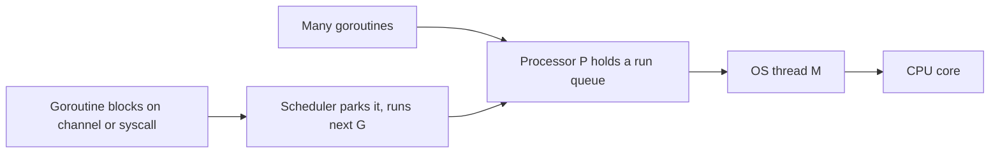
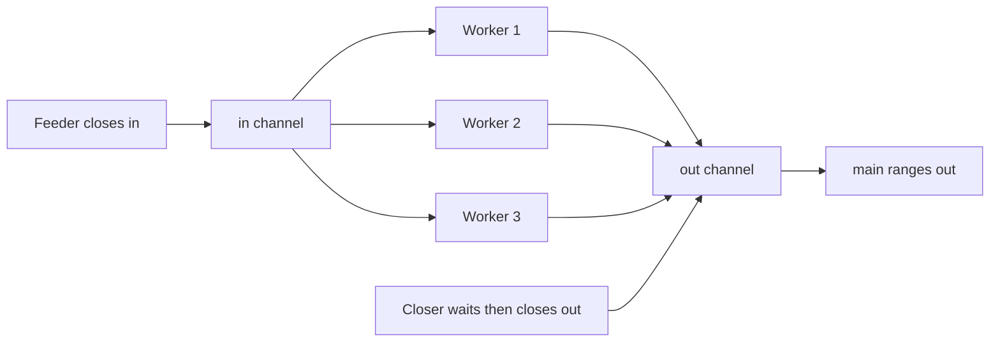

# Lecture 1 — Goroutines, the Scheduler, and Channels

> **Time:** 2 hours. Take goroutines and the scheduler in one sitting and channels (unbuffered, buffered, directions, closing) in a second. **Prerequisites:** Weeks 1–2. **Citations:** the Tour's concurrency intro at <https://go.dev/tour/concurrency/1>, Effective Go's goroutines and channels sections at <https://go.dev/doc/effective_go#goroutines> and <https://go.dev/doc/effective_go#channels>, and the pipelines blog at <https://go.dev/blog/pipelines>.

## 1. Why concurrency, and why now

Phase I of this track exists to make you fluent in Go's concurrency model before any service work begins, because every operational property of a cloud-native service — handling thousands of simultaneous requests, calling three downstreams in parallel, draining in-flight work on shutdown — is an expression of goroutines and channels. Week 1 gave you the toolchain and the binary; Week 2 gave you interfaces, errors, and generics. This week gives you the primitive that the HTTP server in Week 5, the worker pool in Week 4, and the graceful shutdown in Week 11 are all built from.

The mental model to carry in: Go does not give you threads to manage. It gives you *goroutines*, which are cheap, and *channels*, which coordinate them. The proverb that anchors the week — "Do not communicate by sharing memory; instead, share memory by communicating" — says that the idiomatic way to coordinate concurrent work in Go is to pass values over channels rather than to guard shared variables with locks. We spend Lecture 3 on exactly when that proverb applies and when a `sync.Mutex` is the simpler answer; this lecture builds the primitives.

## 2. A goroutine is a concurrent function call

You start a goroutine with the `go` keyword in front of a function call:

```go
package main

import "fmt"

func main() {
	go fmt.Println("from the goroutine")
	fmt.Println("from main")
}
```

Run this and you will very likely see only `from main`. That is the first and most important lesson: **`go f()` returns immediately, and when `main` returns, the program exits and kills every goroutine still running** — mid-statement, with no deferred calls, no cleanup, nothing. The goroutine printing its line simply did not get scheduled before `main` finished. A goroutine is not a promise that the work runs; it is a request to the runtime to run it concurrently, and the work only happens if the program stays alive long enough. Citation: <https://go.dev/tour/concurrency/1>.

The naive fix — `time.Sleep` — is how the Tour first demonstrates it, and it is *never* how you do it in real code:

```go
func main() {
	go fmt.Println("from the goroutine")
	fmt.Println("from main")
	time.Sleep(10 * time.Millisecond) // a hack: never coordinate with sleep
}
```

This now usually prints both lines, but it is a race in disguise: you are guessing how long the goroutine needs. The whole rest of this week is the *real* tools for "wait until the goroutine is actually done" — channels and `sync.WaitGroup` — that replace every `time.Sleep` you are ever tempted to write for coordination.

### 2.1 Why goroutines are cheap

A goroutine is not an OS thread. An OS thread reserves a large fixed stack (often 1–8 MB) and is scheduled by the kernel, so a program can hold a few thousand before it strains. A goroutine starts with a tiny stack — on the order of 2 KB in recent runtimes — that the runtime grows and shrinks on demand by copying it to a larger segment when it is about to overflow. The result: a Go program comfortably holds hundreds of thousands, even millions, of goroutines. This is why "one goroutine per incoming request" is a normal, idiomatic design for a Go HTTP server, where "one OS thread per request" would be reckless. Citation: Effective Go's goroutines section at <https://go.dev/doc/effective_go#goroutines>.

### 2.2 The GMP scheduler, at a high level

The runtime multiplexes your goroutines onto a small pool of OS threads with its own scheduler, usually described by three letters:

- **G** — a goroutine: the function, its stack, and its state.
- **M** — a machine thread: an actual OS thread that runs goroutine code.
- **P** — a processor: a scheduling context that holds a queue of runnable goroutines. The number of Ps defaults to the number of CPU cores, set by `GOMAXPROCS`.

A goroutine (G) runs on a thread (M) only while it is attached to a processor (P). When a goroutine blocks — on a channel operation, a mutex, a system call, network I/O — the scheduler parks it and runs another runnable goroutine on that P, so the thread is never idle while there is work to do. When a goroutine makes a blocking *system call*, the runtime can hand its P to another thread so other goroutines keep running. The scheduler is *cooperative-ish with preemption*: since Go 1.14 the runtime can preempt a goroutine that has run too long without yielding, so a tight CPU loop no longer starves its neighbours. You do not manage any of this; you write `go f()` and reason about coordination, and the scheduler handles placement. What you *do* control is `GOMAXPROCS`:


*The GMP scheduler multiplexes many cheap goroutines onto a small pool of OS threads.*

```go
import "runtime"

fmt.Println("logical CPUs:", runtime.NumCPU())
fmt.Println("GOMAXPROCS:", runtime.GOMAXPROCS(0)) // 0 = query, don't change
```

`runtime.GOMAXPROCS(0)` returns the current setting without changing it. For almost all programs you leave it at the default (one P per core). Citation: <https://pkg.go.dev/runtime#GOMAXPROCS>.

The one practical consequence to remember: **goroutine scheduling is not deterministic.** Two goroutines that print in a loop will interleave differently from run to run. If your program's *correctness* depends on the order in which goroutines run, you have a bug, and the fix is a channel or a lock to impose the order you need — not a `time.Sleep` to make the lucky ordering more likely.

## 3. Channels: the synchronisation primitive

A channel is a typed conduit through which you send and receive values with the `<-` operator. You make one with `make`:

```go
ch := make(chan int)      // unbuffered
buf := make(chan int, 8)  // buffered, capacity 8
```

The operations:

```go
ch <- 42       // send 42 into ch
v := <-ch      // receive from ch into v
v, ok := <-ch  // receive; ok is false if ch is closed AND drained
<-ch           // receive and discard (used purely for synchronisation)
```

The headline, the sentence the whole week turns on: **a channel is a synchronisation primitive, not a queue.** Its job is to make one goroutine wait for another. That it also carries a value is, in the unbuffered case, almost incidental.

### 3.1 Unbuffered channels are a rendezvous

An unbuffered channel (`make(chan T)`) has no room to hold a value. A send blocks until another goroutine is ready to receive; a receive blocks until another goroutine is ready to send. The two operations complete *at the same instant* — a rendezvous. When `ch <- v` returns, you know for certain that some goroutine has received `v` and reached the line after its `<-ch`. This is the channel's superpower: the hand-off is itself a synchronisation point.

```go
func main() {
	ch := make(chan string)

	go func() {
		ch <- "work done" // blocks here until main receives
		fmt.Println("goroutine: after the send")
	}()

	msg := <-ch // blocks here until the goroutine sends
	fmt.Println("main received:", msg)
	// We now KNOW the goroutine has passed its send. No sleep needed.
}
```

```
main received: work done
goroutine: after the send
```

The channel replaced the `time.Sleep` from section 2 with a *guarantee*. The receive in `main` cannot complete until the goroutine sends; the goroutine cannot pass its send until `main` receives. That is coordination in time, expressed as a value hand-off. Citation: <https://go.dev/tour/concurrency/2>, Effective Go's channels section at <https://go.dev/doc/effective_go#channels>.

A subtle but vital consequence: **a send on an unbuffered channel with no receiver blocks forever.** If you do `ch <- 1` in `main` with no goroutine reading, the program cannot proceed — and if *every* goroutine is blocked like this, the runtime detects it and panics with `fatal error: all goroutines are asleep - deadlock!`. We treat deadlocks in depth in Lecture 2.

### 3.2 Buffered channels decouple sender from receiver

A buffered channel (`make(chan T, n)`) holds up to `n` values. A send blocks only when the buffer is *full*; a receive blocks only when the buffer is *empty*. Between those bounds, sender and receiver run independently.

```go
func main() {
	ch := make(chan int, 2) // capacity 2

	ch <- 1 // does not block: buffer has room (1/2)
	ch <- 2 // does not block: buffer has room (2/2)
	// ch <- 3 // WOULD block here: buffer full, no receiver yet

	fmt.Println(<-ch) // 1 — FIFO
	fmt.Println(<-ch) // 2
}
```

A buffered channel *is* a bounded FIFO queue, and that is exactly the trap in the week's slogan. It is tempting to reach for a buffer to "make the deadlock go away," but a buffer only delays the block until the buffer fills. The buffer's legitimate uses are narrow and you should be able to name yours:

- **Absorbing a known burst.** You know a producer emits exactly `n` values before any are consumed; a buffer of `n` lets it run without blocking.
- **Decoupling rates.** A slow consumer and a bursty producer; a small buffer smooths the bursts.
- **A semaphore.** A buffered channel of capacity `n` used as `slot <- struct{}{}` / `<-slot` limits concurrency to `n` — the bounded-worker-pool pattern of Challenge 2.

The default, when in doubt, is **unbuffered**, because it forces you to think about the rendezvous and surfaces coordination bugs early instead of hiding them behind a buffer that is "big enough" until it isn't. Citation: <https://go.dev/doc/effective_go#channels>.

### 3.3 `len` and `cap` on a channel

```go
ch := make(chan int, 4)
ch <- 1
ch <- 2
fmt.Println(len(ch), cap(ch)) // 2 4 — 2 buffered, capacity 4
```

`cap(ch)` is the buffer size; `len(ch)` is how many values are currently buffered. These are useful for diagnostics and tests, but **never** for control flow — between reading `len(ch)` and acting on it, another goroutine can change it. If you find yourself writing `if len(ch) == 0`, you almost certainly want a `select` with a `default` instead (Lecture 2). Citation: <https://pkg.go.dev/builtin#len>.

## 4. Channel direction types

A channel value can be restricted to send-only or receive-only by its type, and this is one of Go's quietest, most useful safety features. A function parameter typed `chan<- T` may only send; one typed `<-chan T` may only receive:

```go
// produce can only SEND into out (chan<-).
func produce(out chan<- int, n int) {
	for i := 0; i < n; i++ {
		out <- i
	}
	close(out) // the sender closes — see section 6
}

// consume can only RECEIVE from in (<-chan).
func consume(in <-chan int) {
	for v := range in {
		fmt.Println(v)
	}
}

func main() {
	ch := make(chan int) // a plain bidirectional channel
	go produce(ch, 3)    // passed as chan<- int — compiler narrows it
	consume(ch)          // passed as <-chan int
}
```

You create a bidirectional channel and pass it where a directional type is expected; the compiler narrows it automatically and then *enforces* the restriction. If `consume` tried to `in <- 5`, the program would not compile (`invalid operation: cannot send to receive-only channel`). The mnemonic is the arrow points the way the data flows relative to the channel: `chan<- T` means "data goes *into* the channel" (send-only), `<-chan T` means "data comes *out of* the channel" (receive-only). Use directional types on every pipeline-stage function signature: they document the data flow and make a whole class of bug — closing a channel you only read from, sending on one you only consume — a compile error. Citation: the spec's channel types at <https://go.dev/ref/spec#Channel_types>, Effective Go's channels section at <https://go.dev/doc/effective_go#channels>.

## 5. The for-range-over-channel pattern

Reading a channel until it is exhausted is so common it has dedicated syntax:

```go
for v := range ch {
	use(v)
}
// reached only after ch is closed AND fully drained
```

`for v := range ch` receives values one at a time and **stops when the channel is closed and empty**. It is the consumer half of the producer/consumer shape, and it is why a producer must `close` its output channel: without the close, the `range` loop blocks forever waiting for a value that never comes — a goroutine leak. Compare with the comma-ok form, which is the manual version of the same idea:

```go
for {
	v, ok := <-ch
	if !ok {
		break // ch is closed and drained
	}
	use(v)
}
```

The comma-ok receive — `v, ok := <-ch` — sets `ok` to `false` exactly when the channel is closed and there are no more buffered values; `v` is then the element's zero value. This is how you distinguish "received a real zero value" from "the channel is done." Most of the time you write `for v := range ch` and let the loop handle it; you reach for explicit comma-ok inside a `select` (Lecture 2), where you need to react to a close as one of several events. Citation: <https://go.dev/tour/concurrency/4>, <https://go.dev/doc/effective_go#channels>.

## 6. Closing channels and the "who closes" rule

`close(ch)` marks a channel as having no more values coming. After a close:

- A receive returns immediately with the zero value and `ok == false` (forever — every subsequent receive too).
- A `for range` loop ends after draining any buffered values.
- A **send** on a closed channel **panics**: `panic: send on closed channel`.
- A **close** of an already-closed channel **panics**: `panic: close of closed channel`.
- A **close** of a `nil` channel **panics**: `panic: close of nil channel`.

Those three panics dictate the single rule you must never break, the rule a reviewer checks first:

> **The sender closes the channel — exactly once, and never the receiver.**

The reasoning is mechanical. Only the goroutine that owns the sending side knows when the last value has been sent, so only it can correctly say "done." If a receiver closed the channel, a sender might then panic by sending into it. If two senders both tried to close, the second would panic. So: **one owner of the send side, and that owner closes, once.** A receiver *never* closes — a receiver that wants to stop early signals the sender by other means (a `done` channel, or `context` next week), and lets the sender do the closing. Citation: <https://go.dev/tour/concurrency/4>, <https://go.dev/doc/effective_go#channels>.

Here is the canonical correct shape — producer owns and closes; consumer ranges:

```go
func producer(out chan<- int) {
	defer close(out) // the sender closes, once, on the way out
	for i := 0; i < 5; i++ {
		out <- i * i
	}
}

func main() {
	out := make(chan int)
	go producer(out)
	for v := range out { // ends when producer closes out
		fmt.Println(v)
	}
}
```

```
0
1
4
9
16
```

`defer close(out)` is the idiom: it guarantees the channel is closed however the producer returns, and it co-locates the close with the function that owns the send side. Note one more rule: **you do not have to close a channel.** Closing is a *signal* to receivers, not a resource-freeing operation — an un-closed channel with no references is garbage-collected like any other value. You close a channel precisely when a receiver needs to know "no more values are coming" (which is most pipeline channels) and not otherwise.

### 6.1 When *two* senders share one channel

If you genuinely have N senders writing to one channel, none of them can unilaterally close it — the others would panic. The idiom is a `sync.WaitGroup` and a *closer goroutine* that waits for all senders to finish, then closes:

```go
func fanOutSenders(out chan<- int, n int) {
	var wg sync.WaitGroup
	for i := 0; i < n; i++ {
		wg.Add(1)
		go func(id int) {
			defer wg.Done()
			out <- id // each sender contributes one value
		}(i)
	}
	// One goroutine waits for all senders, THEN closes — the only safe closer.
	go func() {
		wg.Wait()
		close(out) // safe: every sender has returned, so no send can race the close
	}()
}
```

This "WaitGroup + closer goroutine" pattern is the backbone of fan-in (Lecture 3) and of the link-checker's merge step. We cover `WaitGroup` properly in Lecture 2; for now, note the structure: the closer is a *separate* goroutine that closes only after every sender is provably done. Citation: the pipelines blog's fan-in section at <https://go.dev/blog/pipelines>.

## 7. A first real coordination: collect results

Putting the pieces together, here is a complete, runnable program that launches several workers, collects their results over a channel, and finishes cleanly with no sleep:

```go
package main

import (
	"fmt"
	"sort"
	"sync"
)

// square reads jobs from in and sends squares to out. It is a pipeline stage:
// in (receive-only), out (send-only).
func square(in <-chan int, out chan<- int, wg *sync.WaitGroup) {
	defer wg.Done()
	for n := range in { // drains in until it is closed
		out <- n * n
	}
}

func main() {
	const workers = 3
	in := make(chan int)
	out := make(chan int)

	// Feed jobs, then close in so the workers' range loops can end.
	go func() {
		defer close(in) // the feeder owns in, so the feeder closes it
		for i := 1; i <= 6; i++ {
			in <- i
		}
	}()

	// Fan out: N workers all read from the same in channel.
	var wg sync.WaitGroup
	for i := 0; i < workers; i++ {
		wg.Add(1)
		go square(in, out, &wg) // pass the WaitGroup BY POINTER
	}

	// Closer goroutine: close out once every worker has returned.
	go func() {
		wg.Wait()
		close(out) // safe: all senders (workers) are done
	}()

	// Fan in: collect every result until out is closed.
	var results []int
	for r := range out {
		results = append(results, r)
	}

	sort.Ints(results) // results arrive in nondeterministic order; sort for display
	fmt.Println(results)
}
```

```
[1 4 9 16 25 36]
```

Read that program against the three reviewer questions: **who closes each channel** (the feeder closes `in`; the closer goroutine closes `out`), **who waits for whom** (`main` waits on the `range out` loop, which ends when the closer closes `out`, which happens after `wg.Wait()` sees every worker done), and **what happens to every goroutine** (the feeder returns after closing `in`; each worker returns when `in` is drained; the closer returns after `wg.Wait()`; `main` returns after the `range out`). Every goroutine has a guaranteed exit. That is a leak-free design, and it is the exact skeleton of Lecture 3's fan-out/fan-in and of the mini-project. We did not write a single `time.Sleep`.


*Who closes each channel and who waits for whom in the leak-free collection pattern.*

## 8. Exercise pointer

Now do **Exercise 1 — Goroutines and Channels**. You will launch goroutines, send and receive on both an unbuffered and a buffered channel and observe the difference in blocking, range over a channel that a producer closes, deliberately write a deadlock and read the runtime's diagnostic, then fix it. Work the PREDICT comments before you run. The acceptance criterion is that you can state, for any channel in the program, *who closes it and what would happen if nobody did.*

## 9. Summary

- A **goroutine** is a concurrent function call (`go f()`); it is cheap (tiny growable stack), scheduled by the runtime's **GMP** scheduler onto a small pool of threads. `go f()` returns immediately, and `main` returning kills every live goroutine. Never coordinate with `time.Sleep`.
- A **channel is a synchronisation primitive, not a queue.** An **unbuffered** channel is a *rendezvous*: send and receive complete at the same instant, each blocking until the other is ready. A **buffered** channel decouples sender and receiver up to its capacity; reach for a buffer only when you can name the burst it absorbs.
- **Channel directions** — `chan<- T` (send-only), `<-chan T` (receive-only) — document data flow and make misuse a compile error. Use them on pipeline-stage signatures.
- **`for v := range ch`** drains a channel until it is closed and empty; the **comma-ok receive** (`v, ok := <-ch`) reports a closed-and-drained channel with `ok == false`.
- The **"who closes" rule:** the sender closes the channel, exactly once, never the receiver. Send-on-closed, close-of-closed, and close-of-nil all **panic**. For N senders, use a `WaitGroup` plus a single closer goroutine that closes only after all senders are done.
- A leak-free collection pattern: a feeder that closes its output, fan-out workers that range over the input, a closer goroutine that closes the output after `wg.Wait()`, and a consumer that ranges the output — every goroutine with a guaranteed exit, and no `time.Sleep`.

Cited references this lecture pulled from: <https://go.dev/tour/concurrency/1>, <https://go.dev/tour/concurrency/2>, <https://go.dev/tour/concurrency/4>, <https://go.dev/doc/effective_go#goroutines>, <https://go.dev/doc/effective_go#channels>, <https://go.dev/blog/pipelines>, <https://pkg.go.dev/runtime#GOMAXPROCS>, <https://go.dev/ref/spec#Channel_types>.
