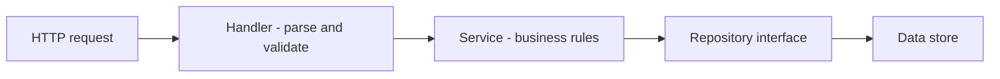

# Lecture 1 — `net/http`, the 1.22 Routing Patterns, the Handler/Service/Repository Seam, and JSON I/O

> **Time:** 2 hours. Take the server-and-routing material in one sitting and the seam-and-JSON material in a second. **Prerequisites:** Week 4 (`context`) and Week 2 (interfaces, `errors.Is`/`errors.As`). **Citations:** the `net/http` docs at <https://pkg.go.dev/net/http>, the Go 1.22 routing post at <https://go.dev/blog/routing-enhancements>, the `encoding/json` docs at <https://pkg.go.dev/encoding/json>, and RFC 9110 at <https://www.rfc-editor.org/rfc/rfc9110>.

## 1. Why standard-library-first, and why this lecture first

Coming from Django, Express, or Spring, the instinct is to ask "which framework?" Go's answer is mildly subversive: *mostly none.* The standard library's `net/http` is a complete, production HTTP/1.1 and HTTP/2 server — the same server that powers a large fraction of the cloud-native control plane, because Kubernetes, Docker, and Prometheus all serve HTTP from `net/http`. A "framework" in Go is, at most, a router and some middleware helpers layered on top. So we start at the standard library, build a real service with it, and only reach for `chi` (Lecture 3) when we want ergonomics the standard library leaves to us. You will understand what a router and a middleware *are* before you use a library that provides them — which is the difference between using a tool and being used by it.

This lecture is first because **every later piece — middleware in Lecture 2, route groups and graceful shutdown in Lecture 3, the Postgres repository in Week 6, the gRPC twin in Week 7 — sits on the handler/service/repository seam this lecture establishes.** Get the seam right and the rest of Phase II is composing layers onto it. Get it wrong — a handler with a SQL query in it — and everything downstream is harder to test and reason about.

## 2. The whole foundation: `Handler`, `HandlerFunc`, `ListenAndServe`

The entire `net/http` server surface you build on is two interfaces and a function:

```go
package main

import (
	"fmt"
	"net/http"
)

// A handler is anything with this method.
type pingHandler struct{}

func (pingHandler) ServeHTTP(w http.ResponseWriter, r *http.Request) {
	fmt.Fprintln(w, "pong")
}

func main() {
	mux := http.NewServeMux()

	// A struct that implements http.Handler:
	mux.Handle("/ping", pingHandler{})

	// An ordinary function adapted to http.Handler via http.HandlerFunc:
	mux.HandleFunc("/hello", func(w http.ResponseWriter, r *http.Request) {
		fmt.Fprintf(w, "hello, %s\n", r.URL.Query().Get("name"))
	})

	http.ListenAndServe(":8080", mux) // demo shortcut; see Section 9 for the real shape
}
```

Four constructs:

1. **`http.Handler`** is `interface { ServeHTTP(http.ResponseWriter, *http.Request) }`. Everything that handles a request is an `http.Handler`, including the router itself.
2. **`http.HandlerFunc`** is `type HandlerFunc func(ResponseWriter, *Request)` with a `ServeHTTP` method that just calls the function. It adapts an ordinary function to the interface. This adapter is why you can write handlers as plain functions.
3. **`http.ResponseWriter`** is how you write the response: `w.Header().Set(...)`, `w.WriteHeader(statusCode)`, `w.Write(body)`. **Order matters:** set headers, then call `WriteHeader` once, then `Write` the body. After the first `Write`, headers and status are frozen.
4. **`*http.Request`** is the inbound request: `r.Method`, `r.URL`, `r.Header`, `r.Body`, and crucially `r.Context()` — the request's `Context`, cancelled when the client disconnects.

Citation: <https://pkg.go.dev/net/http#Handler>.

## 3. Routing with the Go 1.22 `ServeMux`

Before Go 1.22, `ServeMux` matched only on path prefix — no method routing, no path parameters. Go 1.22 added both, and for many services the standard `ServeMux` is now a sufficient router on its own:

```go
mux := http.NewServeMux()

// Method + path. The method is part of the pattern.
mux.HandleFunc("GET /notes", listNotes)
mux.HandleFunc("POST /notes", createNote)

// A path parameter, extracted with r.PathValue.
mux.HandleFunc("GET /notes/{id}", getNote)
mux.HandleFunc("PATCH /notes/{id}", updateNote)
mux.HandleFunc("DELETE /notes/{id}", deleteNote)

func getNote(w http.ResponseWriter, r *http.Request) {
	id := r.PathValue("id") // the {id} segment
	// ...
}
```

Five things the 1.22 router gives you:

1. **Method matching.** `"GET /notes"` matches only `GET`. A `POST` to `/notes` that has no `POST` pattern gets an automatic `405 Method Not Allowed` with the correct `Allow` header — the standard library does this for you.
2. **Path wildcards.** `{id}` matches one path segment; `r.PathValue("id")` reads it. `{path...}` (trailing) matches the rest of the path.
3. **Precedence by specificity.** When two patterns match, the more specific one wins — `/notes/{id}` beats `/notes/` for `/notes/42`. The rules are deterministic and documented; you do not order routes by hand the way some routers require.
4. **The `{$}` anchor.** `"GET /{$}"` matches *only* the root `/`, not every path — the fix for the classic "my root handler catches everything" surprise of the old `ServeMux`.
5. **Conflicts are a startup panic, not a silent shadow.** Two patterns that overlap ambiguously panic at registration, so you find the bug at boot, not in production.

Citation: <https://go.dev/blog/routing-enhancements> and the `ServeMux` docs at <https://pkg.go.dev/net/http#ServeMux>.

## 4. The handler/service/repository seam

A request flows through three layers, each with one job:

```
HTTP request  -->  Handler  -->  Service  -->  Repository  -->  data store
                   (HTTP)        (logic)       (persistence)
```

- The **handler** speaks HTTP and nothing else: parse the body, validate input, call **one** service method, translate the result or error into a status code and a JSON body. No business rules, no SQL.
- The **service** owns the business logic and is HTTP-ignorant: it takes a `context` and plain Go types, applies the rules, calls the repository, and returns plain Go types and typed errors. You could call it from a CLI, a gRPC server (Week 7), or a test, with no HTTP in sight.
- The **repository** owns persistence behind a small interface, so the service can run against an in-memory fake in tests and a Postgres implementation in production (Week 6).


*Each layer only talks to the layer directly below it, through an interface.*

The domain and the repository interface:

```go
package notes

import (
	"context"
	"errors"
	"time"
)

type Note struct {
	ID        string
	Title     string
	Body      string
	CreatedAt time.Time
	UpdatedAt time.Time
}

// Sentinel errors the service returns; the handler maps these to status codes.
var (
	ErrNotFound = errors.New("note not found")
	ErrConflict = errors.New("note already exists")
)

// Repository is defined HERE, at the consumer (the service), per Week 2's
// "interfaces at the consumer" rule. It is small on purpose.
type Repository interface {
	Create(ctx context.Context, n Note) error
	Get(ctx context.Context, id string) (Note, error)
	List(ctx context.Context) ([]Note, error)
	Update(ctx context.Context, n Note) error
	Delete(ctx context.Context, id string) error
}
```

The service — logic only, HTTP-free, `context`-threaded:

```go
type Service struct {
	repo Repository
	now  func() time.Time // injectable clock for deterministic tests
}

func NewService(repo Repository) *Service {
	return &Service{repo: repo, now: time.Now}
}

func (s *Service) Create(ctx context.Context, title, body string) (Note, error) {
	n := Note{
		ID:        newID(),
		Title:     title,
		Body:      body,
		CreatedAt: s.now().UTC(),
		UpdatedAt: s.now().UTC(),
	}
	if err := s.repo.Create(ctx, n); err != nil {
		return Note{}, err // ErrConflict bubbles up unchanged for the handler to map
	}
	return n, nil
}

func (s *Service) Get(ctx context.Context, id string) (Note, error) {
	return s.repo.Get(ctx, id) // ErrNotFound bubbles up
}
```

The in-memory repository — a mutex-guarded map, exactly Week 4's `SafeCounter` pattern:

```go
type MemRepo struct {
	mu    sync.RWMutex
	notes map[string]Note
}

func NewMemRepo() *MemRepo { return &MemRepo{notes: map[string]Note{}} }

func (r *MemRepo) Create(ctx context.Context, n Note) error {
	r.mu.Lock()
	defer r.mu.Unlock()
	if _, exists := r.notes[n.ID]; exists {
		return ErrConflict
	}
	r.notes[n.ID] = n
	return nil
}

func (r *MemRepo) Get(ctx context.Context, id string) (Note, error) {
	r.mu.RLock()
	defer r.mu.RUnlock()
	n, ok := r.notes[id]
	if !ok {
		return Note{}, ErrNotFound
	}
	return n, nil
}
```

The point of the seam: the service's tests use a fake `Repository` (or `MemRepo`), the handler's tests use a fake `Service`, and only Week 6's repository tests need a real database. Each layer is testable in isolation because it depends on the layer below through an *interface*, not a concrete type. Citation: the interface guidance from Week 2 and the standard-library `database/sql` design that inspired this shape.

## 5. JSON decode — carefully

Decoding a request body is where un-careful services get breached or OOM'd. The careful shape:

```go
// decodeJSON reads exactly one JSON value of type T from the request body,
// rejecting unknown fields and oversized bodies.
func decodeJSON[T any](w http.ResponseWriter, r *http.Request) (T, error) {
	var v T
	// Cap the body so a malicious client cannot exhaust memory.
	r.Body = http.MaxBytesReader(w, r.Body, 1<<20) // 1 MiB
	dec := json.NewDecoder(r.Body)
	dec.DisallowUnknownFields() // a typo'd field is a 400, not silently ignored
	if err := dec.Decode(&v); err != nil {
		return v, fmt.Errorf("decode body: %w", err)
	}
	// Reject trailing garbage after the JSON value.
	if dec.More() {
		return v, errors.New("body must contain a single JSON object")
	}
	return v, nil
}
```

Four disciplines:

1. **`http.MaxBytesReader`** caps the body. Without it, a client can send a 2 GB body and OOM your process. 1 MiB is a sane default for a JSON API; raise it deliberately where you accept uploads.
2. **`DisallowUnknownFields`** turns a misspelled field into a decode error instead of a silently-dropped value. A client that sends `{"titel": "x"}` should get a 400, not a note with an empty title.
3. **The `dec.More()` check** rejects two JSON objects glued together, a common smuggling shape.
4. **Wrap the error with `%w`** so the handler can classify it (a `*json.SyntaxError` or `*http.MaxBytesError`) and choose the right status.

Citation: <https://pkg.go.dev/encoding/json#Decoder.DisallowUnknownFields> and <https://pkg.go.dev/net/http#MaxBytesReader>.

## 6. JSON encode and the wire/domain split

Encode through a helper that sets the content type and status in the right order, and serialise *wire structs*, not domain types:

```go
func writeJSON(w http.ResponseWriter, status int, v any) {
	w.Header().Set("Content-Type", "application/json; charset=utf-8")
	w.WriteHeader(status)
	if err := json.NewEncoder(w).Encode(v); err != nil {
		// The status is already sent; we can only log.
		slog.Error("encode response", "err", err)
	}
}

// noteResponse is the WIRE shape. It is decoupled from the domain Note so the
// API contract does not change just because an internal field is renamed.
type noteResponse struct {
	ID        string    `json:"id"`
	Title     string    `json:"title"`
	Body      string    `json:"body"`
	CreatedAt time.Time `json:"created_at"`
	UpdatedAt time.Time `json:"updated_at"`
}

func toResponse(n notes.Note) noteResponse {
	return noteResponse{n.ID, n.Title, n.Body, n.CreatedAt, n.UpdatedAt}
}
```

Two points: **(1)** `Header().Set` *then* `WriteHeader` *then* `Encode` — once you call `WriteHeader` (or the first `Write`), headers freeze. **(2)** the wire struct decouples the API from the domain. If you serialise `notes.Note` directly, renaming a domain field silently changes your public API. An explicit `noteResponse` with `json` tags is the contract you control. Citation: <https://pkg.go.dev/encoding/json#Marshal>.

## 7. The status-code map and the error envelope

Every error response carries the same envelope, and the domain-error → status-code mapping lives in *one* `writeError` helper:

```go
type errEnvelope struct {
	Error struct {
		Code    string `json:"code"`
		Message string `json:"message"`
	} `json:"error"`
}

func writeError(w http.ResponseWriter, err error) {
	status, code := http.StatusInternalServerError, "internal"
	switch {
	case errors.Is(err, notes.ErrNotFound):
		status, code = http.StatusNotFound, "not_found"
	case errors.Is(err, notes.ErrConflict):
		status, code = http.StatusConflict, "conflict"
	case errors.Is(err, errValidation):
		status, code = http.StatusUnprocessableEntity, "validation"
	case errors.Is(err, errBadRequest):
		status, code = http.StatusBadRequest, "bad_request"
	}
	if status == http.StatusInternalServerError {
		slog.Error("unhandled error", "err", err) // log the detail; do not leak it
	}
	var env errEnvelope
	env.Error.Code = code
	env.Error.Message = publicMessage(err, status) // never leak internals on 500
	writeJSON(w, status, env)
}
```

The status-code vocabulary every handler uses:

| Code | When |
|------|------|
| `200 OK` | a successful read or update returning a body |
| `201 Created` | a successful create; set the `Location` header to the new resource |
| `204 No Content` | a successful delete or an update with no body |
| `400 Bad Request` | malformed input — bad JSON, body too large, wrong type |
| `404 Not Found` | the resource does not exist (`ErrNotFound`) |
| `409 Conflict` | a uniqueness or state conflict (`ErrConflict`) |
| `422 Unprocessable Entity` | input parsed but failed validation (a missing required field) |
| `405 Method Not Allowed` | wrong method for the path (the router emits this for you) |
| `500 Internal Server Error` | a bug; log the detail, return a generic message |

The rule from the README: **the mapping lives in one place.** A handler never writes a status code directly for an error — it calls `writeError(w, err)` and lets the map decide. On a `500`, log the real error and return a generic message; never leak an internal error string to a client. Citation: RFC 9110 §15 (Status Codes) at <https://www.rfc-editor.org/rfc/rfc9110#name-status-codes>.

## 8. A complete handler, tying it together

```go
type Handler struct{ svc *notes.Service }

func (h *Handler) Create(w http.ResponseWriter, r *http.Request) {
	type request struct {
		Title string `json:"title"`
		Body  string `json:"body"`
	}
	req, err := decodeJSON[request](w, r)
	if err != nil {
		writeError(w, fmt.Errorf("%w: %v", errBadRequest, err))
		return
	}
	if strings.TrimSpace(req.Title) == "" {
		writeError(w, fmt.Errorf("%w: title is required", errValidation))
		return
	}

	// Thread the REQUEST's context into the service — cancellation, server-side.
	n, err := h.svc.Create(r.Context(), req.Title, req.Body)
	if err != nil {
		writeError(w, err) // ErrConflict -> 409, handled by the map
		return
	}

	w.Header().Set("Location", "/notes/"+n.ID)
	writeJSON(w, http.StatusCreated, toResponse(n))
}
```

Trace the layers: the handler *parses* (`decodeJSON`), *validates* (the title check), *calls one service method* (`h.svc.Create`), and *translates* (the `Location` header, the 201, the error map). It threads `r.Context()` so a client disconnect cancels the create. It contains no business logic and no storage — those live in the service and repository. This is the seam, working.

## 9. The real server shape (preview of Lecture 3)

`http.ListenAndServe` is a demo shortcut. A real service constructs the server explicitly so it can set timeouts and shut down gracefully:

```go
srv := &http.Server{
	Addr:              ":8080",
	Handler:           router,
	ReadHeaderTimeout: 5 * time.Second,  // defeat slow-loris
	ReadTimeout:       15 * time.Second,
	WriteTimeout:      15 * time.Second,
	IdleTimeout:       60 * time.Second,
}
// graceful shutdown wiring is Lecture 3
```

We cover the timeouts and `srv.Shutdown(ctx)` in Lecture 3. For now, know that the bare `ListenAndServe` lacks every one of these timeouts, which is why it is a demo shortcut, not a production server. Citation: <https://pkg.go.dev/net/http#Server>.

## 10. Exercise pointer

Now do **Exercise 1 — Router and JSON**. Build a 1.22-routed `ServeMux` for a small resource, with the `decodeJSON`/`writeJSON`/`writeError` helpers and the status-code map, and test it with `httptest`. The acceptance criterion is that a `POST` with a bad field returns 400, a `GET` of a missing id returns 404, and a successful create returns 201 with a `Location` header.

## 11. Summary

- `net/http` is a production server. The foundation is `http.Handler`, `http.HandlerFunc`, and `http.Server`.
- Go 1.22 `ServeMux` routes on method and path: `"POST /notes/{id}"`, `r.PathValue("id")`, automatic 405, specificity precedence, `{$}` for the root.
- The handler/service/repository seam: handler speaks HTTP, service owns logic and is HTTP-free, repository owns persistence behind an interface. Each layer is testable in isolation.
- Decode JSON carefully: `http.MaxBytesReader`, `DisallowUnknownFields`, the `dec.More()` check, wrap errors with `%w`.
- Encode through a helper that sets content type then status then body; serialise wire structs, not domain types.
- One `writeError` maps domain errors to status codes; log the detail on a 500, return a generic message.
- Thread `r.Context()` into the service so a client disconnect cancels the work.
- Construct `http.Server` explicitly for timeouts and graceful shutdown (Lecture 3).

Cited references this lecture pulled from: <https://pkg.go.dev/net/http>, <https://go.dev/blog/routing-enhancements>, <https://pkg.go.dev/encoding/json>, <https://pkg.go.dev/net/http#MaxBytesReader>, <https://www.rfc-editor.org/rfc/rfc9110>.
