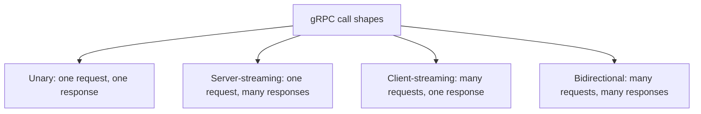
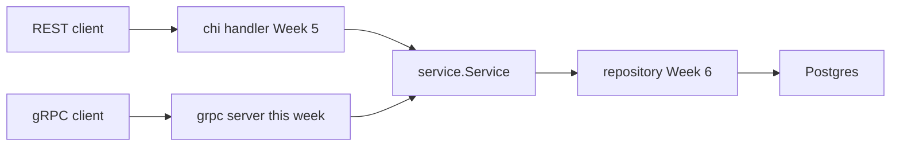

# Lecture 2 — The gRPC Server and Client in Go: HTTP/2, the Four Call Types, and One Domain Over Two Transports

Lecture 1 gave you the contract: a `.proto` file, the wire format, the `buf` toolchain, and the Go that `protoc-gen-go-grpc` generates — a `NotesServiceServer` interface to implement and a `NotesServiceClient` interface to call. This lecture turns that contract into a running server and a running client, walks the four call types with real Go, and then makes the central argument of the week concrete: **the gRPC handler is a thin adapter over the same `service.Service` your chi handlers already call.** One domain, two transports.

## 1. gRPC over HTTP/2

gRPC is a remote-procedure-call protocol layered on **HTTP/2**. Every RPC is one HTTP/2 stream. The method name is the `:path` (`/crunch.notes.v1.NotesService/GetNote`); the request and response messages are length-prefixed protobuf in `DATA` frames; the final gRPC status rides in HTTP/2 *trailers* (`grpc-status`, `grpc-message`). Because HTTP/2 multiplexes many streams over one TCP connection, a single client connection carries thousands of concurrent RPCs without head-of-line blocking. Because the framing is binary and the payload is protobuf, there are no string keys to scan and no base64 to decode. The wire mapping is specified at <https://grpc.io/docs/guides/wire/>, and the core concepts — channels, the four call types, deadlines — at <https://grpc.io/docs/what-is-grpc/core-concepts/>.

You do not write any of that framing. The generated code and `google.golang.org/grpc` handle it. You write four method shapes.

## 2. The four call types

The `.proto` declares which shape each RPC is by where it puts the `stream` keyword:

```proto
service NotesService {
  rpc GetNote(GetNoteRequest) returns (GetNoteResponse);            // unary
  rpc WatchNotes(WatchNotesRequest) returns (stream NoteEvent);     // server-streaming
  rpc ImportNotes(stream Note) returns (ImportNotesResponse);       // client-streaming
  rpc Sync(stream NoteEvent) returns (stream NoteEvent);            // bidirectional
}
```

- **Unary** — one request, one response. The shape you already know from any function call.
- **Server-streaming** — one request, a *stream* of responses. "Subscribe to changes."
- **Client-streaming** — a *stream* of requests, one response. "Bulk import, give me a summary."
- **Bidirectional** — both sides stream, independently. "Live sync session."


*All four call types ride the same HTTP/2 framing but generate distinct Go method signatures.*

The choice is a *design* decision, not a transport one — all four ride the same HTTP/2 framing — but each generates a distinct Go method signature, and picking wrong costs a refactor. The rest of this section writes each one against an in-memory store so the code runs without Postgres; §6 swaps the store for the Week-6 repository.

### 2.1 Unary

```go
func (s *server) GetNote(ctx context.Context, req *notesv1.GetNoteRequest) (*notesv1.GetNoteResponse, error) {
	n, err := s.svc.Get(ctx, req.GetId())
	if err != nil {
		return nil, mapError(err) // domain error -> status.Error, see Lecture 3
	}
	return &notesv1.GetNoteResponse{Note: toProto(n)}, nil
}
```

Take `ctx`, take the request, return the response (or an error). The `ctx` carries the deadline and cancellation — pass it down, always (Lecture 3). `mapError` and `toProto` are the adapter seams: the rest of the method is a one-line delegation to `s.svc`, the exact same `service.Service` your REST handler calls.

### 2.2 Server-streaming

The generated signature gives you a typed *stream* with a `Send`:

```go
func (s *server) WatchNotes(req *notesv1.WatchNotesRequest, stream notesv1.NotesService_WatchNotesServer) error {
	events, err := s.svc.Watch(stream.Context(), req.GetTagFilter())
	if err != nil {
		return mapError(err)
	}
	for {
		select {
		case <-stream.Context().Done():
			return status.FromContextError(stream.Context().Err()).Err()
		case ev, ok := <-events:
			if !ok {
				return nil // producer closed: clean end of stream
			}
			if err := stream.Send(toProtoEvent(ev)); err != nil {
				return err // client went away; Send already returns the right status
			}
		}
	}
}
```

No `ctx` parameter — `stream.Context()` is the call context, and you `select` on its `Done()` so the loop exits the instant the client disconnects or the deadline fires. Returning `nil` ends the stream cleanly; returning an error ends it with that status. `stream.Send` returns an error when the client has gone away — do not ignore it.

### 2.3 Client-streaming

The stream has `Recv` (read the next request) and `SendAndClose` (send the single response and finish):

```go
func (s *server) ImportNotes(stream notesv1.NotesService_ImportNotesServer) error {
	var imported int32
	for {
		note, err := stream.Recv()
		if errors.Is(err, io.EOF) {
			// Client closed its send side: reply once and finish.
			return stream.SendAndClose(&notesv1.ImportNotesResponse{Imported: imported})
		}
		if err != nil {
			return err
		}
		if _, err := s.svc.Create(stream.Context(), toDomain(note)); err != nil {
			return mapError(err)
		}
		imported++
	}
}
```

The `io.EOF` from `Recv` is the signal that the client finished sending — it is normal, not an error. You react by calling `SendAndClose` exactly once.

### 2.4 Bidirectional

Both directions are independent streams. The simple pattern is a single goroutine doing read-then-write; the general pattern runs concurrent reader and writer goroutines coordinated with the context. Here is the read-respond loop, which suffices for a request/response sync protocol:

```go
func (s *server) Sync(stream notesv1.NotesService_SyncServer) error {
	for {
		ev, err := stream.Recv()
		if errors.Is(err, io.EOF) {
			return nil // client closed; we close our side by returning
		}
		if err != nil {
			return err
		}
		applied, err := s.svc.Apply(stream.Context(), toDomainEvent(ev))
		if err != nil {
			return mapError(err)
		}
		if err := stream.Send(toProtoEvent(applied)); err != nil {
			return err
		}
	}
}
```

When the two directions are truly independent — server pushes unsolicited events while also receiving them — split into two goroutines and join with an `errgroup.Group`; whichever goroutine errors first cancels the other through the shared context. The deadlock to avoid: both sides only `Recv` and never `Send`. Nobody writes, both block forever, and only the deadline breaks it — which is one more reason every call carries a deadline.

## 3. Standing up the server

A gRPC server is a `net.Listener`, a `*grpc.Server`, and a registration call:

```go
package main

import (
	"context"
	"log/slog"
	"net"
	"os"
	"os/signal"
	"syscall"

	"google.golang.org/grpc"

	notesv1 "example.com/notes/gen/notes/v1"
)

func main() {
	lis, err := net.Listen("tcp", "127.0.0.1:50051")
	if err != nil {
		slog.Error("listen failed", "err", err)
		os.Exit(1)
	}

	srv := grpc.NewServer( // interceptors are wired here; see Lecture 3
		grpc.ChainUnaryInterceptor(loggingUnary, recoveryUnary),
	)
	notesv1.RegisterNotesServiceServer(srv, newServer())

	go func() {
		slog.Info("gRPC server listening", "addr", lis.Addr().String())
		if err := srv.Serve(lis); err != nil {
			slog.Error("serve failed", "err", err)
		}
	}()

	// Graceful shutdown: stop accepting new RPCs, let in-flight ones drain.
	stop := make(chan os.Signal, 1)
	signal.Notify(stop, syscall.SIGINT, syscall.SIGTERM)
	<-stop
	slog.Info("shutting down")
	srv.GracefulStop()
}
```

`grpc.NewServer` builds the server; `RegisterNotesServiceServer` (generated) attaches your implementation; `Serve` blocks accepting connections. **`GracefulStop` is the production move**: it stops accepting new RPCs, lets in-flight ones complete, then returns. The hard `Stop()` cancels everything immediately — reach for it only after a `GracefulStop` timeout. The grpc-go API is documented at <https://pkg.go.dev/google.golang.org/grpc>.

## 4. The client — `grpc.NewClient`, not `grpc.Dial`

`grpc.Dial` is **deprecated**. Modern grpc-go uses `grpc.NewClient`, which constructs a lazily-connecting `*grpc.ClientConn`. For a local plaintext server you supply `insecure` transport credentials; for anything across a network you supply TLS credentials.

```go
package main

import (
	"context"
	"errors"
	"io"
	"log/slog"
	"time"

	"google.golang.org/grpc"
	"google.golang.org/grpc/credentials/insecure"

	notesv1 "example.com/notes/gen/notes/v1"
)

func main() {
	// ONE conn for the process. It is goroutine-safe and multiplexes.
	conn, err := grpc.NewClient(
		"127.0.0.1:50051",
		grpc.WithTransportCredentials(insecure.NewCredentials()),
	)
	if err != nil {
		slog.Error("dial failed", "err", err)
		return
	}
	defer conn.Close()

	client := notesv1.NewNotesServiceClient(conn)

	// --- Unary, with a deadline ---
	ctx, cancel := context.WithTimeout(context.Background(), 2*time.Second)
	defer cancel()
	resp, err := client.GetNote(ctx, &notesv1.GetNoteRequest{Id: "n-1"})
	if err != nil {
		slog.Error("GetNote failed", "err", err)
	} else {
		slog.Info("got note", "title", resp.GetNote().GetTitle())
	}

	// --- Server-streaming: iterate until io.EOF ---
	wctx, wcancel := context.WithTimeout(context.Background(), 10*time.Second)
	defer wcancel()
	stream, err := client.WatchNotes(wctx, &notesv1.WatchNotesRequest{TagFilter: "work"})
	if err != nil {
		slog.Error("WatchNotes failed", "err", err)
		return
	}
	for {
		ev, err := stream.Recv()
		if errors.Is(err, io.EOF) {
			break // server ended the stream
		}
		if err != nil {
			slog.Error("stream recv failed", "err", err)
			break
		}
		slog.Info("event", "kind", ev.GetKind().String(), "id", ev.GetNote().GetId())
	}
}
```

Three things to lock in:

1. **One `ClientConn` per server, reused for the process lifetime.** The conn owns the connection pool and is goroutine-safe; constructing one per call throws away connection reuse and load-balancing state. This is the Go analogue of "reuse your `*sql.DB`."
2. **`insecure.NewCredentials()` is for local development only.** It is *not* the same as the deprecated `grpc.WithInsecure()` — it is the explicit, non-deprecated way to say "no TLS, I mean it." Production uses `credentials.NewTLS(...)`.
3. **A client stream is drained with `Recv` until `io.EOF`.** `io.EOF` is the normal end; any other error is a real failure carrying a status code (Lecture 3).

Quickstart and the basics tutorial cover this end to end: <https://grpc.io/docs/languages/go/quickstart/> and <https://grpc.io/docs/languages/go/basics/>.

### Driving the streaming-client side

The client side of client-streaming and bidirectional mirror the server side:

```go
// Client-streaming: push N, then CloseAndRecv for the single response.
imp, _ := client.ImportNotes(ctx)
for _, n := range notes {
	if err := imp.Send(n); err != nil {
		break // server may have errored early; the status is on CloseAndRecv
	}
}
summary, err := imp.CloseAndRecv()

// Bidirectional: concurrent send and receive.
sync, _ := client.Sync(ctx)
go func() {
	for _, ev := range outbound {
		_ = sync.Send(ev)
	}
	_ = sync.CloseSend()
}()
for {
	ev, err := sync.Recv()
	if errors.Is(err, io.EOF) {
		break
	}
	// handle ev
}
```

`CloseAndRecv` (client side) pairs with the server's `SendAndClose`. `CloseSend` tells the server "I am done sending" while you keep receiving.

## 5. The adapter layer: protobuf types in, domain types out

Your `service.Service` from Weeks 5–6 speaks *domain* types — a `domain.Note` with `time.Time`, not a `notesv1.Note` with `*timestamppb.Timestamp`. The gRPC handler's only real job, beyond delegation, is translating at the boundary. Keep these conversions in one small file:

```go
func toProto(n domain.Note) *notesv1.Note {
	p := &notesv1.Note{
		Id:        n.ID,
		Title:     n.Title,
		Body:      n.Body,
		Tags:      n.Tags,
		CreatedAt: timestamppb.New(n.CreatedAt),
		UpdatedAt: timestamppb.New(n.UpdatedAt),
	}
	if n.ArchivedAt != nil {
		p.ArchivedAt = timestamppb.New(*n.ArchivedAt) // optional -> pointer
	}
	return p
}

func toDomain(p *notesv1.Note) domain.Note {
	n := domain.Note{
		ID:    p.GetId(),
		Title: p.GetTitle(),
		Body:  p.GetBody(),
		Tags:  p.GetTags(),
	}
	if p.GetArchivedAt() != nil {
		t := p.GetArchivedAt().AsTime()
		n.ArchivedAt = &t
	}
	return n
}
```

Note the use of getters (`p.GetId()`, nil-safe) on the way in and `timestamppb.New`/`AsTime` for the time conversion. This conversion file is the *only* place protobuf types appear on the server side; the service and repository never import `notesv1`. That isolation is the whole point of §6.

## 6. One domain, two transports

Here is the architecture this week is built to demonstrate. Both transports are thin adapters over a single shared service layer:

```
                ┌─────────────────────────┐
   REST client →│ chi handler (Week 5)    │┐
                └─────────────────────────┘│
                                           ├→ service.Service ─→ repository ─→ Postgres
                ┌─────────────────────────┐│        (Week 6)        (Week 6)
  gRPC client →│ grpc server (this week)  │┘
                └─────────────────────────┘
```


*Two transport-specific handlers sit in front of one shared service and repository layer.*

`service.Service` is constructed *once*, and both front doors receive the same pointer:

```go
func main() {
	pool := mustOpenPool(ctx)             // pgxpool, Week 6
	repo := repository.New(pool)          // sqlc-backed, Week 6
	svc := service.New(repo)              // domain logic, Weeks 5-6

	// Front door #1: REST over chi, on :8080
	go func() { _ = http.ListenAndServe(":8080", restserver.New(svc).Router()) }()

	// Front door #2: gRPC, on :50051 — SAME svc pointer
	lis, _ := net.Listen("tcp", "127.0.0.1:50051")
	g := grpc.NewServer(grpc.ChainUnaryInterceptor(loggingUnary, recoveryUnary))
	notesv1.RegisterNotesServiceServer(g, grpcserver.New(svc))
	_ = g.Serve(lis)
}
```

The chi handler and the gRPC handler each own *only* their transport concern: chi parses path params and writes JSON with status codes; the gRPC handler converts protobuf and returns status codes. Validation, business rules, transactions, and persistence live in `service.Service` and below — written once, exercised twice. A bug fix in `svc.Create` fixes both transports. A new business rule lands once. This is not an academic nicety; it is why the cloud-native pattern is "REST to the world, gRPC between services" rather than two parallel implementations that drift apart.

The discipline that makes it work is the one Lecture 1 set up and Lecture 3 finishes: the service layer returns *domain* errors (sentinel values like `domain.ErrNotFound`), and each transport maps those to its own vocabulary — chi to HTTP status codes, gRPC to `codes.Code`. The service layer never knows which transport called it.

## 7. What you now know

You can implement all four gRPC call types in Go with the correct generated signatures: unary `(ctx, req) (resp, error)`; server-streaming with `stream.Send` and a `select` on `stream.Context().Done()`; client-streaming with `Recv` until `io.EOF` then `SendAndClose`; bidirectional with concurrent `Recv`/`Send`. You can stand up a server with `grpc.NewServer`, `RegisterNotesServiceServer`, `Serve`, and `GracefulStop`, and a client with the modern `grpc.NewClient` plus `insecure.NewCredentials()` for local work — never the deprecated `grpc.Dial`. Most importantly, you can see the gRPC handler for what it is: a thin adapter that converts protobuf to domain types and delegates to the *same* `service.Service` your REST handlers call. Lecture 3 adds the cross-cutting machinery — interceptors, status codes, error details, and deadline propagation — that turns this from "it runs" into "you would run it in production."
