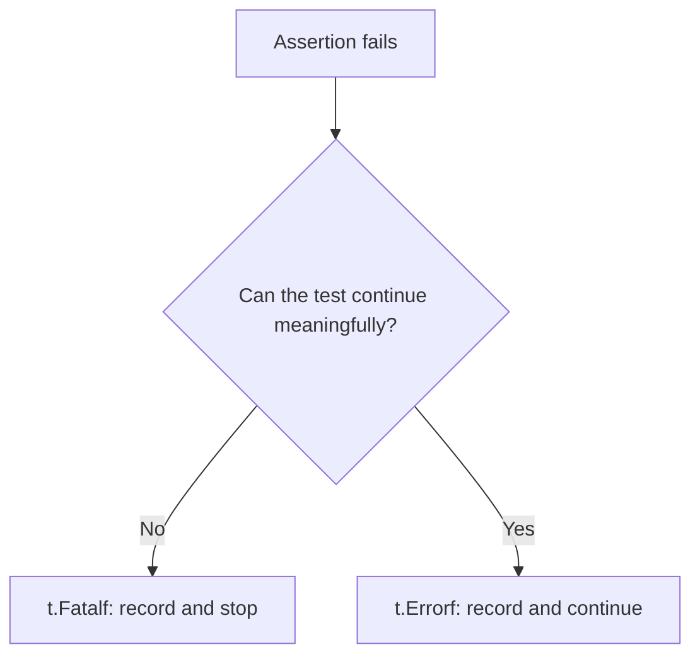
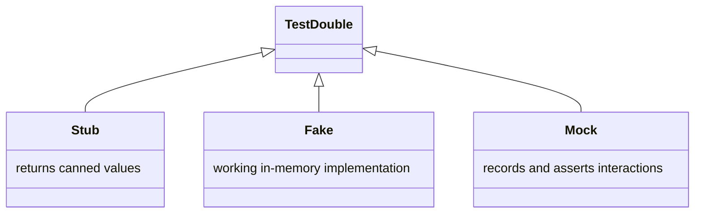

# Lecture 1 — The `testing` Package, Table-Driven Tests, Test Doubles, Golden Files, and Coverage

> **Time:** 2.5 hours. Take the `testing`-package and table-driven section in one sitting, the `go-cmp` and golden-file section in a second, and the doubles + `httptest` + coverage section last. **Prerequisites:** Week 5 (the `notes` handler/service/repository split) and basic Go interfaces. **Citations:** the `testing` package godoc at <https://pkg.go.dev/testing>, the Go blog "Using Subtests and Sub-benchmarks" at <https://go.dev/blog/subtests>, the table-driven-tests wiki at <https://go.dev/wiki/TableDrivenTests>, `go-cmp` at <https://pkg.go.dev/github.com/google/go-cmp/cmp>, and Dave Cheney's "Prefer table driven tests" at <https://dave.cheney.net/2019/05/07/prefer-table-driven-tests>.

## 1. The `testing` package is the whole framework

Go does not have a testing *framework* in the sense that .NET has xUnit or Java has JUnit. It has the `testing` package in the standard library, the `go test` command that drives it, and a naming convention. That is the entire apparatus, and it is enough to write the test suite for a production service. The convention:

- A test file ends in `_test.go`. It lives in the same directory as the code it tests, and `go test` compiles it only when testing — it is invisible to a normal `go build`.
- A test function is `func TestXxx(t *testing.T)`, where `Xxx` starts with an uppercase letter. `go test` finds these by reflection.
- The `*testing.T` value is your handle into the framework: you call its methods to fail, log, skip, spawn subtests, and register cleanup.

A minimal test:

```go
package notes

import "testing"

func TestSlugify(t *testing.T) {
	got := Slugify("Hello, World!")
	want := "hello-world"
	if got != want {
		t.Errorf("Slugify(%q) = %q, want %q", "Hello, World!", got, want)
	}
}
```

Run it with `go test ./...`. Three things to internalize about that body.

First, **`t.Errorf` records a failure and keeps going; `t.Fatalf` records a failure and stops the test function**. Use `Errorf` when you want to report several independent problems in one run (three assertions, three failures, one read of the output). Use `Fatalf` when continuing makes no sense — most often after an error you cannot recover from, like a `nil` you are about to dereference:

```go
got, err := ParseNote(input)
if err != nil {
	t.Fatalf("ParseNote(%q) returned error: %v", input, err)  // can't continue; got is unusable
}
if got.Title != "x" {
	t.Errorf("Title = %q, want %q", got.Title, "x")           // keep going; report all field mismatches
}
```


*Choosing between t.Fatalf and t.Errorf comes down to whether the rest of the test can still run.*

Second, **the failure message is for the human reading the CI log, not for you right now**. Always print the input, the got, and the want. `t.Errorf("Slugify(%q) = %q, want %q", in, got, want)` tells whoever reads the failure exactly what broke. `t.Error("wrong")` tells them nothing. The Go convention is `got, want` order, every time; the reader learns to expect it.

Third, **there is no assertion library and you do not need one**. `if got != want { t.Errorf(...) }` is the assertion. For complex values you reach for `go-cmp` (Section 4), but the control flow is always a plain `if`. This is deliberate: the test reads like Go, not like a DSL, and a junior can follow it without learning a framework first.

## 2. Table-driven tests: the Go idiom

The moment you have more than one case for a function — and you always do — you do not write `TestSlugifyHello`, `TestSlugifyEmpty`, `TestSlugifyUnicode`. You write one test with a *table* of cases. This is the dominant idiom in Go, used throughout the standard library's own tests, and codified in the wiki at <https://go.dev/wiki/TableDrivenTests>.

```go
func TestSlugify(t *testing.T) {
	tests := []struct {
		name string
		in   string
		want string
	}{
		{name: "simple", in: "Hello World", want: "hello-world"},
		{name: "punctuation", in: "Hello, World!", want: "hello-world"},
		{name: "leading trailing space", in: "  trim me  ", want: "trim-me"},
		{name: "collapse dashes", in: "a---b", want: "a-b"},
		{name: "empty", in: "", want: ""},
		{name: "unicode letters kept", in: "café", want: "café"},
		{name: "all punctuation", in: "!!!", want: ""},
	}

	for _, tc := range tests {
		t.Run(tc.name, func(t *testing.T) {
			got := Slugify(tc.in)
			if got != tc.want {
				t.Errorf("Slugify(%q) = %q, want %q", tc.in, got, tc.want)
			}
		})
	}
}
```

Read what this buys you. The table is a slice of anonymous structs with a `name` and the inputs and expectations. The loop ranges over it and calls **`t.Run(tc.name, func(t *testing.T) { ... })`** — this creates a *subtest*, a named child test that runs and reports independently. The failure output is precise:

```
--- FAIL: TestSlugify (0.00s)
    --- FAIL: TestSlugify/all_punctuation (0.00s)
        slugify_test.go:42: Slugify("!!!") = "-", want ""
```

The subtest name `all_punctuation` (spaces become underscores) tells you exactly which case failed, and you can rerun just that one with `go test -run 'TestSlugify/all_punctuation'`. Adding a case is one line in the table. This is why the idiom won: the cost of a new case is a line, the failure output is exact, and the structure is uniform across the codebase.

### 2.1 `wantErr` for functions that return errors

Most real functions return `(T, error)`. The table grows a `wantErr` field:

```go
func TestParseTagList(t *testing.T) {
	tests := []struct {
		name    string
		in      string
		want    []string
		wantErr bool
	}{
		{name: "single", in: "go", want: []string{"go"}},
		{name: "multiple", in: "go,testing,fuzz", want: []string{"go", "testing", "fuzz"}},
		{name: "trims spaces", in: " go , testing ", want: []string{"go", "testing"}},
		{name: "empty is empty slice", in: "", want: []string{}},
		{name: "too many tags", in: "a,b,c,d,e,f,g,h,i,j,k", wantErr: true},
		{name: "tag too long", in: strings.Repeat("x", 100), wantErr: true},
	}

	for _, tc := range tests {
		t.Run(tc.name, func(t *testing.T) {
			got, err := ParseTagList(tc.in)
			if (err != nil) != tc.wantErr {
				t.Fatalf("ParseTagList(%q) error = %v, wantErr = %v", tc.in, err, tc.wantErr)
			}
			if tc.wantErr {
				return // error case: don't compare the value
			}
			if !slices.Equal(got, tc.want) {
				t.Errorf("ParseTagList(%q) = %v, want %v", tc.in, got, tc.want)
			}
		})
	}
}
```

The pattern `(err != nil) != tc.wantErr` is the canonical "did we get an error when we wanted one, or vice versa" check. When you want to assert *which* error — a specific sentinel — use `errors.Is`:

```go
if !errors.Is(err, ErrTooManyTags) {
	t.Errorf("got error %v, want ErrTooManyTags", err)
}
```

Add a `wantErrIs error` field to the table when different cases should produce different sentinel errors. The discipline is the same: one table, one loop, exact failure output.

### 2.2 `t.Parallel()` and the post-Go-1.22 loop variable

Independent subtests can run concurrently. Call `t.Parallel()` as the first line of the subtest body, and `go test` will pause that subtest until all the non-parallel work in the parent finishes, then run the parallel ones together:

```go
for _, tc := range tests {
	t.Run(tc.name, func(t *testing.T) {
		t.Parallel()
		got := Slugify(tc.in)
		if got != tc.want {
			t.Errorf("Slugify(%q) = %q, want %q", tc.in, got, tc.want)
		}
	})
}
```

There used to be a notorious footgun here. Before Go 1.22, the loop variable `tc` was a *single variable* reused across iterations. A parallel subtest, which runs *after* the loop has finished iterating, would capture that one variable and see its final value — every parallel subtest tested the last case. The fix was to shadow the variable: `tc := tc` at the top of the loop body. **As of Go 1.22, each iteration of a `range` loop gets a fresh `tc`** (the loop-variable semantics changed; see <https://go.dev/blog/loopvar-preview>), so the `tc := tc` shadow is no longer necessary and `go vet` no longer warns about it. Because C30 targets Go 1.22+, we omit the shadow — but you will see it in older code, and you should understand *why* it was there: it was working around a closure capturing a shared loop variable that no longer exists. Citation: the Go 1.22 release notes, <https://go.dev/doc/go1.22>.

A subtest that calls `t.Parallel()` must not depend on shared mutable state that another parallel subtest also touches — that is a data race, and `go test -race` will catch it. Parallelize *read-only* or *independent* cases; keep stateful integration tests serial unless you isolate their state (Lecture 3).

### 2.3 `t.Helper()` for assertion helpers

When you factor a repeated assertion into a helper, line numbers in failure messages point at the helper, not at the call site — useless. Call `t.Helper()` as the first line of the helper and the framework attributes failures to the *caller*:

```go
func assertNoError(t *testing.T, err error) {
	t.Helper() // failures report the caller's line, not this line
	if err != nil {
		t.Fatalf("unexpected error: %v", err)
	}
}

func assertNote(t *testing.T, got, want Note) {
	t.Helper()
	if diff := cmp.Diff(want, got); diff != "" {
		t.Errorf("Note mismatch (-want +got):\n%s", diff)
	}
}
```

`t.Helper()` is documented at <https://pkg.go.dev/testing#T.Helper>. Use it on every function whose only job is to assert and report — it is the difference between a failure that points at your test and one that points at plumbing.

### 2.4 `t.Cleanup()` and `t.TempDir()`

`t.Cleanup(fn)` registers a function to run when the test (and its subtests) finish, in last-in-first-out order. It is `defer` that survives across helper boundaries — a helper that opens a resource can register its own cleanup, and the caller does not have to remember to close it:

```go
func newTestStore(t *testing.T) *Store {
	t.Helper()
	dir := t.TempDir() // auto-removed when the test ends; no manual cleanup
	s, err := OpenStore(filepath.Join(dir, "notes.db"))
	if err != nil {
		t.Fatalf("OpenStore: %v", err)
	}
	t.Cleanup(func() { s.Close() })
	return s
}
```

`t.TempDir()` returns a fresh temporary directory unique to the test and removes it (and its contents) automatically at the end — no `defer os.RemoveAll`. Both are documented in the `testing` godoc. Prefer `t.Cleanup` over `defer` inside helpers, because `defer` runs when the *helper* returns, which is too early.

## 3. `TestMain` for suite-level setup

Sometimes the whole package's tests share expensive setup — a database container, a fixture file, a global. `TestMain` is the hook:

```go
func TestMain(m *testing.M) {
	// setup that all tests in this package share
	flag.Parse()
	code := m.Run() // runs all TestXxx in the package
	// teardown
	os.Exit(code)
}
```

If a package defines `TestMain`, `go test` calls it instead of running the tests directly; you call `m.Run()` to run them and `os.Exit` with its return code. We use this in Lecture 3 to start one Postgres container, run migrations once, and tear it all down after the whole integration suite — far cheaper than a container per test. Documented at <https://pkg.go.dev/testing#hdr-Main>.

## 4. Assertions without a framework: `go-cmp`

For scalars, `==` is the assertion. For slices, `slices.Equal`; for maps, `maps.Equal`. For structs — especially structs with nested structs, slices, pointers, or unexported fields — you want `github.com/google/go-cmp/cmp`. It is the one third-party dependency the Go team itself blesses for test comparisons, and `cmp.Diff` produces a *human-readable diff* instead of a boolean.

```go
import (
	"github.com/google/go-cmp/cmp"
	"github.com/google/go-cmp/cmp/cmpopts"
)

func TestServiceCreate(t *testing.T) {
	svc := NewService(newFakeRepo())
	got, err := svc.Create(context.Background(), CreateInput{Title: "Hi", Body: "there"})
	if err != nil {
		t.Fatalf("Create: %v", err)
	}
	want := Note{Title: "Hi", Body: "there", Tags: []string{}}
	if diff := cmp.Diff(want, got, cmpopts.IgnoreFields(Note{}, "ID", "CreatedAt")); diff != "" {
		t.Errorf("Create() mismatch (-want +got):\n%s", diff)
	}
}
```

Three things to know:

- **`cmp.Diff(want, got)` returns `""` when equal**, and a unified diff string when not. The idiom is `if diff := cmp.Diff(want, got); diff != "" { t.Errorf("...:\n%s", diff) }`. The `-want +got` legend tells the reader which side is which.
- **`cmpopts` configures the comparison.** `cmpopts.IgnoreFields(Note{}, "ID", "CreatedAt")` ignores fields you cannot predict (a generated UUID, a timestamp). `cmpopts.EquateApprox(0.0, 1e-9)` compares floats with a tolerance. `cmpopts.SortSlices(less)` treats slices as sets. The full set is at <https://pkg.go.dev/github.com/google/go-cmp/cmp/cmpopts>.
- **`cmp` panics on unexported fields by default** — this is on purpose, because comparing private state is usually a test smell. If you genuinely must, pass `cmp.AllowUnexported(Note{})`. Prefer comparing through the public surface.

Why not `reflect.DeepEqual`? It returns a bare `true`/`false`, so the failure message is "not equal" with no indication of *which field*. For a `Note` with ten fields, that is useless. `cmp.Diff` shows you the one field that differs. Use `reflect.DeepEqual` only when you genuinely just need a boolean and the values are trivially small; reach for `cmp.Diff` for anything you want to debug from the failure log alone. Citation: the `go-cmp` package overview at <https://pkg.go.dev/github.com/google/go-cmp/cmp>.

## 5. Golden-file tests

Some functions produce large structured output — a rendered Markdown document, a generated SQL statement, a JSON payload. Asserting that output inline (a 40-line `want` string literal in the test) is unreadable and miserable to update. The **golden-file** pattern stores the expected output in a file under `testdata/` and compares against it, with a `-update` flag that regenerates the file when you intend the output to change.

```go
var update = flag.Bool("update", false, "update golden files")

func TestRenderNoteMarkdown(t *testing.T) {
	note := Note{
		Title: "Release Notes",
		Body:  "We shipped **fuzzing** support.\n\nSee the [docs](https://go.dev).",
		Tags:  []string{"release", "go"},
	}

	got := RenderNoteMarkdown(note)
	golden := filepath.Join("testdata", "render_note.golden")

	if *update {
		if err := os.WriteFile(golden, []byte(got), 0o644); err != nil {
			t.Fatalf("writing golden: %v", err)
		}
		t.Logf("updated %s", golden)
	}

	want, err := os.ReadFile(golden)
	if err != nil {
		t.Fatalf("reading golden (run with -update to create it): %v", err)
	}
	if diff := cmp.Diff(string(want), got); diff != "" {
		t.Errorf("RenderNoteMarkdown mismatch (-golden +got):\n%s", diff)
	}
}
```

The workflow:

1. **First run:** the golden file does not exist. Run `go test -run TestRenderNoteMarkdown -update`. The test writes the current output to `testdata/render_note.golden`. You *read the golden file* and confirm it is what you intended — this review step is the whole point.
2. **Normal runs:** `go test` reads the golden and compares. A mismatch means the output drifted.
3. **Intentional change:** you change `RenderNoteMarkdown`, the test fails with a diff, you eyeball the diff to confirm it is the change you meant, then `go test -update` to bless the new output, and you *commit the golden diff* so the reviewer sees exactly how the output changed.

`testdata/` is special: the `go` tool ignores any directory named `testdata` for compilation and for package resolution (documented in `go help test`), so you can put fixtures, golden files, and corpus there without them becoming part of your package. The golden diff in a code review is a feature — it makes output changes *visible and reviewable* instead of buried in a string literal nobody reads.

## 6. Test doubles via small interfaces

Your Week-5 service depended on a repository through an interface:

```go
type Repository interface {
	Create(ctx context.Context, n Note) (Note, error)
	GetByID(ctx context.Context, id string) (Note, error)
	List(ctx context.Context) ([]Note, error)
	Delete(ctx context.Context, id string) error
}

type Service struct {
	repo Repository
}
```

To test the *service logic* — validation, ID generation, the rules about what a valid note is — you do not want a real database. You want a **fake**: a hand-written implementation of `Repository` with in-memory state. This is twenty lines:

```go
type fakeRepo struct {
	mu      sync.Mutex
	notes   map[string]Note
	failOn  string // if set, methods touching this id return errBoom
}

func newFakeRepo() *fakeRepo {
	return &fakeRepo{notes: make(map[string]Note)}
}

var errBoom = errors.New("fake repo: induced failure")

func (f *fakeRepo) Create(_ context.Context, n Note) (Note, error) {
	f.mu.Lock()
	defer f.mu.Unlock()
	if n.ID == f.failOn {
		return Note{}, errBoom
	}
	f.notes[n.ID] = n
	return n, nil
}

func (f *fakeRepo) GetByID(_ context.Context, id string) (Note, error) {
	f.mu.Lock()
	defer f.mu.Unlock()
	n, ok := f.notes[id]
	if !ok {
		return Note{}, ErrNotFound
	}
	return n, nil
}

func (f *fakeRepo) List(_ context.Context) ([]Note, error) { /* ... */ }
func (f *fakeRepo) Delete(_ context.Context, id string) error { /* ... */ }
```

Inject it: `svc := NewService(newFakeRepo())`. Now your service tests run in microseconds, with no database, and you can drive error paths by setting `failOn`. The `mu sync.Mutex` is there so the fake is safe to use from parallel subtests.

Three properties make this the right tool:

- **The interface is defined by the consumer.** `Repository` lives in the service package and lists exactly the methods the service uses — not every method the Postgres implementation happens to have. This is "accept interfaces, return structs": the service accepts the small interface, the Postgres struct satisfies it. A small consumer interface is trivial to fake.
- **The fake is readable.** Anyone can open `fakeRepo` and see precisely what it returns. A generated mock with `mockRepo.EXPECT().GetByID(gomock.Any()).Return(note, nil).Times(1)` hides the behaviour behind a DSL and, worse, asserts *call counts and order* you usually did not mean to assert — making the test brittle to refactors that do not change behaviour.
- **Fakes vs stubs vs mocks.** A *stub* returns canned values. A *fake* is a working in-memory implementation (our `fakeRepo` is a fake — it actually stores and retrieves). A *mock* records and asserts interactions. Reach for fakes by default; reach for a stub when you need one canned answer; reach for a mock only when the *interaction itself* is the thing under test (rare — e.g. "this code must call `Commit` exactly once"). For that narrow case, `go.uber.org/mock` (the maintained successor to `golang/mock`) is fine, but it is the exception, not the default.


*Three kinds of test double; fakes are the default, stubs and mocks are the exceptions.*

## 7. Testing HTTP handlers with `httptest`

The handler layer turns `*http.Request` into `http.ResponseWriter` writes. You test it without a real network using `net/http/httptest`. Two tools:

**`httptest.NewRecorder`** for a single handler. You build a request, call the handler directly, and inspect the recorder:

```go
func TestCreateHandler(t *testing.T) {
	svc := NewService(newFakeRepo())
	h := NewHandler(svc)

	body := strings.NewReader(`{"title":"Hi","body":"there"}`)
	req := httptest.NewRequest(http.MethodPost, "/notes", body)
	req.Header.Set("Content-Type", "application/json")
	rec := httptest.NewRecorder()

	h.ServeHTTP(rec, req)

	if rec.Code != http.StatusCreated {
		t.Fatalf("status = %d, want %d; body = %s", rec.Code, http.StatusCreated, rec.Body)
	}
	var got Note
	if err := json.Unmarshal(rec.Body.Bytes(), &got); err != nil {
		t.Fatalf("decoding response: %v", err)
	}
	if got.Title != "Hi" {
		t.Errorf("Title = %q, want %q", got.Title, "Hi")
	}
}
```

**`httptest.NewServer`** for a full round-trip through a real `chi` router over a real (loopback) socket — useful when middleware, routing, and content negotiation are part of what you are testing:

```go
func TestRouterRoundTrip(t *testing.T) {
	srv := httptest.NewServer(NewRouter(NewService(newFakeRepo())))
	t.Cleanup(srv.Close)

	resp, err := http.Post(srv.URL+"/notes", "application/json",
		strings.NewReader(`{"title":"Hi","body":"there"}`))
	if err != nil {
		t.Fatalf("POST: %v", err)
	}
	defer resp.Body.Close()
	if resp.StatusCode != http.StatusCreated {
		t.Fatalf("status = %d, want %d", resp.StatusCode, http.StatusCreated)
	}
}
```

`httptest.NewRecorder` is faster (no socket) and is the default for handler unit tests; `httptest.NewServer` exercises the real transport and is the default for router/middleware tests. Both are documented at <https://pkg.go.dev/net/http/httptest>.

## 8. Coverage as a signal, not a goal

`go test -cover` reports the fraction of statements executed during the tests:

```
$ go test -cover ./internal/notes/
ok   github.com/crunch/notes/internal/notes   0.012s   coverage: 84.6% of statements
```

For more detail, write a profile and inspect it:

```
$ go test -coverprofile=cover.out ./internal/notes/
$ go tool cover -func=cover.out
github.com/crunch/notes/internal/notes/service.go:21:   Create     100.0%
github.com/crunch/notes/internal/notes/service.go:48:   GetByID     75.0%
github.com/crunch/notes/internal/notes/render.go:14:    Render      92.3%
total:                                                   (statements) 84.6%
$ go tool cover -html=cover.out      # opens an annotated source view in the browser
```

The HTML view colours covered lines green and uncovered lines red. **Use it to find the holes you forgot** — an error branch you never test, a validation case you skipped. That is what coverage is good for: it is a *hole-finder*.

It is a bad *goal*. Here is why 100% is a smell:

- **It is trivially gameable.** A test that calls every function once and asserts *nothing* hits 100% coverage and proves *nothing*. Coverage measures lines executed, not behaviour verified.
- **Chasing the last few percent produces bad tests.** The uncovered lines are usually error paths that are hard to trigger (`os.WriteFile` failing) and getters not worth a test. To cover them you write contorted tests that assert implementation details, which then break on every refactor — the tests become a cost, not an asset.
- **A high number can hide a low-value suite.** 95% coverage with no assertions is worse than 70% coverage that checks behaviour, because the 95% lies to you.

A healthy service package usually lands in the 70–90% range. Treat a number below ~60% as a prompt to look for untested logic; treat the climb from 90% to 100% as almost always not worth it. Coverage is a flashlight you point at your suite to find dark corners — not a score to maximize.

## 9. Wrap-up — the testing checklist

When you write tests this week:

- [ ] Tests are table-driven: a `[]struct{ name string; ... }` and a `t.Run(tc.name, ...)` loop.
- [ ] Failure messages print `got` and `want` (in that order) and the input.
- [ ] `t.Fatalf` for unrecoverable failures, `t.Errorf` for independent assertions.
- [ ] Independent subtests call `t.Parallel()`; no `tc := tc` shadow needed on Go 1.22+.
- [ ] Assertion helpers call `t.Helper()`.
- [ ] Cleanup uses `t.Cleanup` / `t.TempDir`, not bare `defer` inside helpers.
- [ ] Struct comparisons use `cmp.Diff` with `cmpopts`, not `reflect.DeepEqual`.
- [ ] Large output is a golden file under `testdata/`, with an `-update` flag.
- [ ] Doubles are hand-written small-interface fakes, not generated mocks.
- [ ] HTTP handlers are tested with `httptest.NewRecorder` or `httptest.NewServer`.
- [ ] Coverage is read to find holes, not maximized to a number.

Read the "Using Subtests and Sub-benchmarks" blog post before Wednesday — <https://go.dev/blog/subtests> — and skim Dave Cheney's table-driven-tests piece. The exercise for this lecture (`exercise-01-table-driven-and-golden`) checks the table-driven, `go-cmp`, and golden-file patterns against your output.

Next lecture: benchmarking with `testing.B`, comparing runs with `benchstat`, and finding the hot path with `pprof`.
