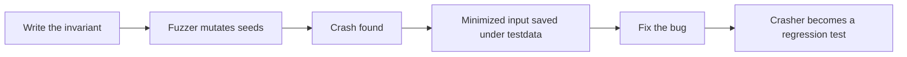
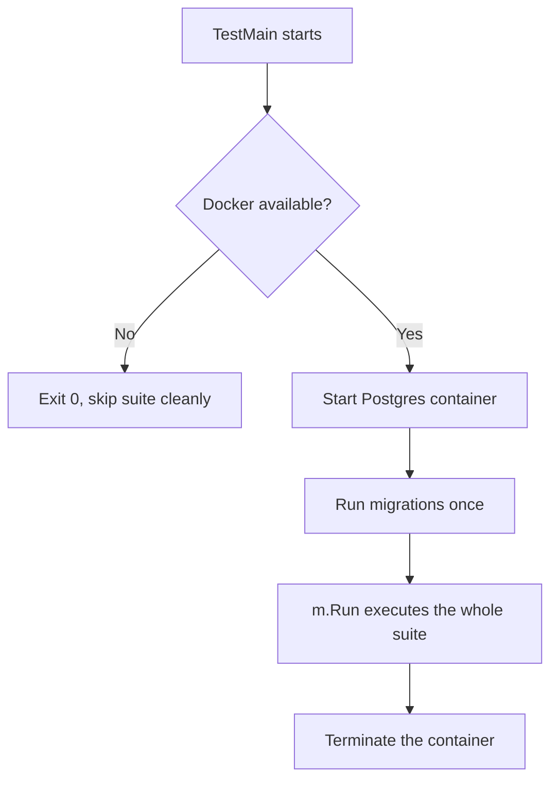

# Lecture 3 — Fuzzing with `testing.F` and Integration Tests Against a Real Postgres with `testcontainers-go`

> **Time:** 2.5 hours. Take the fuzzing section first — it is the conceptual heart of the week — and the integration-test section second, with Docker running so you can watch a container come up. **Prerequisites:** Lecture 1 (the `testing` package), Week 6 (Postgres with `pgx`, `sqlc`, and `golang-migrate`). **Citations:** the Go fuzzing documentation at <https://go.dev/security/fuzz/>, the fuzzing tutorial at <https://go.dev/doc/tutorial/fuzz>, the GA announcement in the Go 1.18 release notes at <https://go.dev/doc/go1.18#fuzzing>, the historical "Fuzzing is Beta Ready" post at <https://go.dev/blog/fuzz-beta>, the `testing` godoc at <https://pkg.go.dev/testing>, and the `testcontainers-go` documentation at <https://golang.testcontainers.org/> with the Postgres module at <https://golang.testcontainers.org/modules/postgres/>.

## 1. The idea: let the machine find the inputs you didn't think of

A table-driven test checks the cases *you* thought of. You imagined the empty string, the happy path, the one with a comma. You did *not* imagine the input that is 4096 null bytes, or the one that is a valid header followed by one truncated byte, or the UTF-8 sequence that is one continuation byte short of valid. Those are exactly the inputs that crash parsers in production. Fuzzing is the technique that generates them automatically: you give the engine a few example inputs (the *seed corpus*), you tell it an *invariant* that must always hold, and it mutates the seeds — flipping bits, splicing, growing, shrinking — looking for an input that violates the invariant. Coverage-guided fuzzing (which Go's engine is) watches which code paths each input exercises and keeps the inputs that reach *new* code, so it efficiently explores the branches your hand-written tests never reach.

Native fuzzing has been a first-class part of `go test` since Go 1.18 (GA; <https://go.dev/doc/go1.18#fuzzing>). It is not a separate tool and not a third-party library — it is `func FuzzXxx(f *testing.F)` next to your `TestXxx` functions, run with `go test -fuzz`.

## 2. Anatomy of a fuzz target

```go
func FuzzParseTagList(f *testing.F) {
	// 1. Seed corpus: example inputs that exercise known code paths.
	f.Add("go")
	f.Add("go,testing,fuzz")
	f.Add(" go , testing ")
	f.Add("")
	f.Add(",,,")

	// 2. The fuzz function: runs once per seed and then on engine-generated inputs.
	f.Fuzz(func(t *testing.T, in string) {
		tags, err := ParseTagList(in)
		if err != nil {
			return // a rejected input is fine; we only assert on accepted ones
		}
		// 3. Invariants that must hold for every accepted input:
		for _, tag := range tags {
			if len(tag) == 0 {
				t.Errorf("ParseTagList(%q) returned an empty tag in %v", in, tags)
			}
			if strings.ContainsAny(tag, ", ") {
				t.Errorf("ParseTagList(%q) returned tag %q with a delimiter/space", in, tag)
			}
		}
	})
}
```

Three pieces:

- **`f.Add(seed)`** registers a seed-corpus entry. The arguments to `f.Add` must match — in type and order — the non-`*testing.T` arguments of the `f.Fuzz` function. Seeds serve two purposes: they are run as ordinary subtests on every `go test` (even without `-fuzz`, so they act as regression tests), and they are the starting points the engine mutates when fuzzing. Seed inputs that exercise distinct branches give the engine a better head start.
- **`f.Fuzz(func(t *testing.T, in string) { ... })`** is the body. The first parameter is always `*testing.T`; the remaining parameters are the *fuzzed inputs*. Supported fuzz-argument types are the built-ins: `[]byte`, `string`, `int`/`int8`…`int64`, `uint`…`uint64`, `float32`/`float64`, `bool`, and `rune`/`byte`. You cannot fuzz a struct directly — fuzz a `[]byte` or `string` and parse it into your struct inside the body.
- **The invariant** is what makes a fuzz target able to *find* a bug. The engine can only report a failure if the body calls `t.Error`/`t.Fatal` or *panics*. A fuzz target with no assertion can only catch panics; a fuzz target with a real invariant catches logic bugs too.

### 2.1 The three invariant patterns

What do you assert in a fuzz body? Three patterns cover almost everything:

1. **Never-panic.** The weakest and most universal: just call the parser. If any input makes it panic (index out of range, nil dereference, slice bounds), the fuzzer reports it. Every parser of untrusted input should at minimum have a never-panic fuzz target. You do not even need an explicit assertion — a panic *is* a failure.

2. **Round-trip.** If you have a parse and a serialize that are supposed to be inverses, assert `serialize(parse(x))` reproduces `x` (or `parse(serialize(parse(x))) == parse(x)`, the "parse is idempotent" form, when serialization normalizes). This finds cases where the parser accepts something the serializer cannot reproduce — a real correctness bug:

```go
f.Fuzz(func(t *testing.T, in string) {
	q, err := ParseQuery(in)
	if err != nil {
		return
	}
	out := q.String()       // serialize back
	q2, err := ParseQuery(out)
	if err != nil {
		t.Fatalf("re-parsing serialized output failed: ParseQuery(%q) -> %q -> error %v", in, out, err)
	}
	if !reflect.DeepEqual(q, q2) {
		t.Errorf("round-trip mismatch:\n in:  %q -> %#v\n out: %q -> %#v", in, q, out, q2)
	}
})
```

3. **Output-validity / differential.** Assert that the output always satisfies a property (every returned tag is non-empty and delimiter-free, as above), or that two implementations agree (a fast path and a reference path return the same answer). Differential fuzzing — "the optimized parser must agree with the simple parser on every input" — is a powerful way to validate an optimization.

## 3. Running a fuzz target and reading a crasher

The seeds run on every test:

```
$ go test ./internal/notes/
ok   github.com/crunch/notes/internal/notes   0.018s
```

To actually fuzz — generate and mutate inputs — pass `-fuzz` with the target name and a time budget:

```
$ go test -run='^$' -fuzz=FuzzParseQuery -fuzztime=30s ./internal/notes/
```

(`-run='^$'` skips the normal tests so only the fuzzer runs; `-fuzztime=30s` stops after 30 seconds of wall-clock. You can also use `-fuzztime=100000x` for a fixed iteration count.) A run that finds nothing:

```
fuzz: elapsed: 3s, execs: 412033 (137340/sec), new interesting: 18 (total: 23)
fuzz: elapsed: 6s, execs: 901240 (163069/sec), new interesting: 2 (total: 25)
...
fuzz: elapsed: 30s, execs: 4988201 (166273/sec), new interesting: 0 (total: 25)
PASS
ok   github.com/crunch/notes/internal/notes   30.142s
```

`execs` is inputs tried; `new interesting` is inputs that reached new code paths (coverage-guided exploration). A run that *finds* a crash:

```
fuzz: elapsed: 2s, execs: 138204 (69102/sec), new interesting: 12 (total: 19)
--- FAIL: FuzzParseQuery (1.93s)
    --- FAIL: FuzzParseQuery (0.00s)
        testing.go:1591: panic: runtime error: index out of range [1] with length 1

        goroutine 51 [running]:
        ...
        github.com/crunch/notes/internal/notes.ParseQuery(...)
            /Users/you/notes/internal/notes/query.go:34

    Failing input written to testdata/fuzz/FuzzParseQuery/9b2c1f3e7a8d4c5e
    To re-run:
    go test -run=FuzzParseQuery/9b2c1f3e7a8d4c5e
FAIL
```

Two things happened. First, the engine **wrote the failing input to `testdata/fuzz/FuzzParseQuery/<hash>`** — a small file containing the exact bytes that triggered the crash. That file is now part of your seed corpus: it is committed to the repo, it runs on every `go test` (no `-fuzz` needed), and it will *stay* a regression test forever. Second, it gave you the **re-run command** — `go test -run=FuzzParseQuery/9b2c1f3e7a8d4c5e` runs *only* that minimized crasher, so your fix-and-rerun loop is fast. The crasher file looks like:

```
go test fuzz v1
string("\"")
```

A single double-quote character. You would never have typed that. The fuzzer did, in 2 seconds.

## 4. A worked fuzz target that finds a real bug

Here is a parser with a real, subtle bug — a query-string parser for the `notes` search endpoint that handles `key:value` filters:

```go
// ParseQuery parses a search string like `tag:go author:alice text` into a Query.
func ParseQuery(s string) (Query, error) {
	var q Query
	for _, field := range strings.Fields(s) {
		if strings.ContainsRune(field, ':') {
			parts := strings.SplitN(field, ":", 2)
			key, val := parts[0], parts[1]
			switch key {
			case "tag":
				q.Tags = append(q.Tags, val)
			case "author":
				q.Author = val
			default:
				return Query{}, fmt.Errorf("unknown field %q", key)
			}
		} else {
			q.Terms = append(q.Terms, field)
		}
	}
	return q, nil
}
```

Looks fine. `strings.SplitN(field, ":", 2)` on a string containing `:` *should* give two parts. But consider the input `":"` — a bare colon. `strings.Fields(":")` yields `[":"]`; `strings.ContainsRune(":", ':')` is true; `strings.SplitN(":", ":", 2)` yields `["", ""]` — two parts, `key=""`, `val=""`. `key` is `""`, which falls through to `default` and returns an error. No panic there. But now consider how a *slightly different* version that hand-indexes would break — and consider the real bug in *this* code: there isn't a panic in this exact form, which is the lesson. So we plant the bug the exercise actually uses, a manual index:

```go
// BUGGY: hand-rolled split that assumes a non-empty value after the colon.
func ParseQuery(s string) (Query, error) {
	var q Query
	for _, field := range strings.Fields(s) {
		if i := strings.IndexByte(field, ':'); i >= 0 {
			key := field[:i]
			val := field[i+1:]
			if key == "tag" {
				// BUG: assumes val has at least one character and reads val[0]
				if val[0] == '#' { // index out of range when field is "tag:"
					val = val[1:]
				}
				q.Tags = append(q.Tags, val)
			} else if key == "author" {
				q.Author = val
			} else {
				return Query{}, fmt.Errorf("unknown field %q", key)
			}
		} else {
			q.Terms = append(q.Terms, field)
		}
	}
	return q, nil
}
```

The input `"tag:"` makes `val == ""`, and `val[0]` is `index out of range [0] with length 0` — a panic. A human writing tests thinks of `tag:go` and `tag:#go`; nobody thinks of `tag:` with nothing after the colon. The fuzzer finds it in milliseconds, because mutating the seed `tag:go` by deleting characters reaches `tag:` almost immediately.

**The fix** is to guard the length before indexing:

```go
if key == "tag" {
	if len(val) > 0 && val[0] == '#' { // guard the index
		val = val[1:]
	}
	q.Tags = append(q.Tags, val)
}
```

Re-run the crasher: `go test -run=FuzzParseQuery/<hash>` now passes. Re-run the fuzzer for 30 seconds: it finds nothing new. The crasher file stays committed so this exact bug can never silently come back. This is the full fuzzing loop — **write the invariant, find the crash, read the minimized input, fix the bug, keep the crasher as a regression test.**


*The fuzzing loop: an invariant plus mutation finds inputs no one thought to write by hand.*

## 5. When to fuzz, and the property mindset

Fuzz anything that turns *untrusted bytes into structured values*: HTTP request bodies, query strings, headers, file formats, protocol frames, anything from `io.Reader`. The mindset shift from example-based testing is from "does it give the right answer for *this* input" to "does this *property* hold for *every* input." Properties are more powerful than examples because they cover inputs you cannot enumerate. The trade is that a property is harder to state — but for parsers, the three patterns in Section 2.1 (never-panic, round-trip, output-validity) cover almost every case, and you reach for them by reflex. Fuzzing is not a replacement for table-driven tests; it is a complement. The table tests the cases you understand; the fuzzer guards the boundary against the cases you do not.

## 6. Integration tests: when a fake is not enough

A `fakeRepo` (Lecture 1) proves your *service logic* is right. It cannot prove your *SQL* is right, your *migrations* apply cleanly, or that a `pgx` scan maps columns to struct fields correctly — because there is no Postgres in a fake. For that you need a real database, and an **integration test** is a test that uses one. Integration tests are slower (a real connection, real round-trips, a container to start) and need infrastructure (Docker), so you make two decisions explicit:

1. **Gate them behind a build tag** so they do not run in your fast inner loop.
2. **`t.Skip` when the infrastructure is absent** so `go test ./...` on a Docker-less machine stays green.

### 6.1 The build tag

Put `//go:build integration` as the first line of the file (before the `package` clause, with a blank line after):

```go
//go:build integration

package notes_test

import "testing"
// ...
```

Now `go test ./...` *ignores* this file entirely — it is not even compiled. Only `go test -tags=integration ./...` includes it. Your unit tests run on every save in milliseconds; the integration tests run on demand and in CI. Build constraints are documented at <https://pkg.go.dev/cmd/go#hdr-Build_constraints>.

### 6.2 `testcontainers-go` brings up a real Postgres

`testcontainers-go` (<https://golang.testcontainers.org/>) starts a Docker container from inside `go test`, gives you its mapped port and a connection string, and cleans it up when you are done. The Postgres module (<https://golang.testcontainers.org/modules/postgres/>) wraps the official `postgres` image with the right wait strategy:

```go
//go:build integration

package notes_test

import (
	"context"
	"database/sql"
	"os"
	"testing"
	"time"

	"github.com/testcontainers/testcontainers-go"
	tcpostgres "github.com/testcontainers/testcontainers-go/modules/postgres"
	"github.com/testcontainers/testcontainers-go/wait"
)

var testDSN string // set by TestMain, used by every integration test

func TestMain(m *testing.M) {
	ctx := context.Background()

	// Skip the whole suite cleanly if Docker is not available.
	if _, err := testcontainers.NewDockerProvider(); err != nil {
		println("integration: Docker not available, skipping integration suite:", err.Error())
		os.Exit(0)
	}

	pg, err := tcpostgres.Run(ctx,
		"postgres:16-alpine",
		tcpostgres.WithDatabase("notes"),
		tcpostgres.WithUsername("notes"),
		tcpostgres.WithPassword("notes"),
		testcontainers.WithWaitStrategy(
			wait.ForLog("database system is ready to accept connections").
				WithOccurrence(2).
				WithStartupTimeout(60*time.Second),
		),
	)
	if err != nil {
		println("integration: failed to start postgres container:", err.Error())
		os.Exit(1)
	}

	testDSN, err = pg.ConnectionString(ctx, "sslmode=disable")
	if err != nil {
		println("integration: connection string:", err.Error())
		os.Exit(1)
	}

	// Run migrations once for the whole suite.
	if err := runMigrations(testDSN); err != nil {
		println("integration: migrations:", err.Error())
		os.Exit(1)
	}

	code := m.Run()

	// Tear down the container.
	_ = pg.Terminate(ctx)
	os.Exit(code)
}
```


*One container and one migration pass for the entire suite, not one per test.*

The shape is: `TestMain` starts *one* container, runs migrations *once*, runs the whole suite with `m.Run()`, and terminates the container after — far cheaper than a container per test. The **wait strategy** matters: a container that is "running" is not the same as a Postgres that is "ready to accept connections," and connecting too early gives you a connection-refused flake. `wait.ForLog("...ready to accept connections").WithOccurrence(2)` waits for the log line that the Postgres image prints twice (once during init, once when truly ready). The Postgres module's default wait strategy already handles this; the explicit form above shows what it is doing. There is also `wait.ForListeningPort` and `wait.ForSQL` (which actually executes a `SELECT 1`) — `wait.ForSQL` is the most reliable for "I can run queries now."

### 6.3 Running migrations in `TestMain`

You already have `golang-migrate` files from Week 6. Apply them against the container's DSN before any test runs:

```go
import (
	"github.com/golang-migrate/migrate/v4"
	_ "github.com/golang-migrate/migrate/v4/database/postgres"
	_ "github.com/golang-migrate/migrate/v4/source/file"
)

func runMigrations(dsn string) error {
	m, err := migrate.New("file://../../migrations", dsn)
	if err != nil {
		return err
	}
	if err := m.Up(); err != nil && err != migrate.ErrNoChange {
		return err
	}
	return nil
}
```

This is also where you prove your migrations are *reversible*: a `m.Up()` followed by `m.Down()` followed by `m.Up()` should succeed, which catches a `down` migration that does not actually undo its `up`. Challenge 1 makes you assert exactly that.

### 6.4 The integration test itself

With `testDSN` set and migrations applied, an integration test opens a connection and exercises the real repository:

```go
//go:build integration

func TestPostgresRepo_CreateAndGet(t *testing.T) {
	ctx := context.Background()
	pool, err := pgxpool.New(ctx, testDSN)
	if err != nil {
		t.Fatalf("connecting: %v", err)
	}
	t.Cleanup(pool.Close)

	repo := NewPostgresRepo(pool)
	created, err := repo.Create(ctx, Note{Title: "Hi", Body: "there", Tags: []string{"go"}})
	if err != nil {
		t.Fatalf("Create: %v", err)
	}
	got, err := repo.GetByID(ctx, created.ID)
	if err != nil {
		t.Fatalf("GetByID(%q): %v", created.ID, err)
	}
	if diff := cmp.Diff(created, got, cmpopts.IgnoreFields(Note{}, "CreatedAt")); diff != "" {
		t.Errorf("round-trip mismatch (-created +got):\n%s", diff)
	}
}
```

This test runs your *actual SQL* against a *real Postgres*. It catches the bugs a fake never can: a column name typo, a `NULL` you did not handle, a `pgx` scan into the wrong field, a constraint you forgot.

### 6.5 Parallel-safe isolation

Two integration tests that both insert into the `notes` table and then count rows will interfere — `t.Parallel()` turns that into a flaky test. Two clean isolation strategies:

- **Transaction rollback.** Each test runs inside a transaction and rolls it back in `t.Cleanup`. The rows never commit, so tests cannot see each other's data. Fast and clean — but it does not work if the code under test manages its own transactions or commits.

```go
func withTx(t *testing.T, pool *pgxpool.Pool) pgx.Tx {
	t.Helper()
	tx, err := pool.Begin(context.Background())
	if err != nil {
		t.Fatalf("begin: %v", err)
	}
	t.Cleanup(func() { _ = tx.Rollback(context.Background()) })
	return tx
}
```

- **Schema-per-test.** Each test creates a fresh `CREATE SCHEMA test_<random>`, runs migrations into it, and sets `search_path`. Fully isolated, supports the code committing its own transactions, but more setup per test. Use it when the transaction-rollback approach does not fit.

For most repository tests, transaction rollback is enough and is the default. Keep integration tests serial (no `t.Parallel()`) unless you have isolated them, and prefer correctness over speed here — these tests are already slow, and a flake costs more than a few seconds.

### 6.6 The compose-harness alternative

`testcontainers-go` is the in-process approach: the container's lifecycle is owned by `go test`. The alternative is an external `docker-compose.yml` that you bring up before the suite (`docker compose up -d`) and the tests connect to via a fixed DSN from an environment variable:

```go
dsn := os.Getenv("TEST_DATABASE_URL")
if dsn == "" {
	t.Skip("TEST_DATABASE_URL not set; skipping integration test")
}
```

The compose approach is simpler to reason about (the database is just *there*), shares one database across many `go test` invocations (faster for repeated runs), and is often how CI is wired. The trade is that the lifecycle is now *your* responsibility — you bring it up, you tear it down, you reset state between runs. `testcontainers-go` is better for "a developer runs `go test -tags=integration` and it Just Works with no setup"; compose is better for "CI has a Postgres service container already running." Both are legitimate; both gate behind the build tag and skip when the database is absent.

## 7. Wrap-up — the fuzzing and integration checklist

When you fuzz and write integration tests this week:

- [ ] Every parser of untrusted input has a fuzz target with at least a never-panic invariant.
- [ ] `f.Add` seeds match the `f.Fuzz` argument types and cover the known branches.
- [ ] The fuzz body asserts a real invariant (never-panic / round-trip / output-validity), not nothing.
- [ ] A discovered crasher is committed under `testdata/fuzz/` and becomes a permanent regression test.
- [ ] Integration tests are behind `//go:build integration` and run only with `-tags=integration`.
- [ ] The suite `t.Skip`s (or `TestMain` exits 0) cleanly when Docker is absent.
- [ ] `TestMain` starts one container, runs migrations once, and terminates the container after.
- [ ] The container uses a real wait strategy (`wait.ForSQL` / the module default), not a `time.Sleep`.
- [ ] Parallel integration tests are isolated (transaction rollback or schema-per-test), or kept serial.

Read the fuzzing tutorial before the mini-project — <https://go.dev/doc/tutorial/fuzz> — and skim the `testcontainers-go` Postgres module page. The exercise for this lecture (`exercise-03-fuzz-target`) hands you a buggy parser and the fuzz target that finds the crash; Challenge 1 has you stand up the full `testcontainers-go` Postgres integration suite.

This is the last lecture of the week. The mini-project brings all three lectures together: a layered test suite, a measured optimization, and a fuzz target that finds and fixes a real crash — the hardening of the `notes` service into something you would put behind a load balancer.
