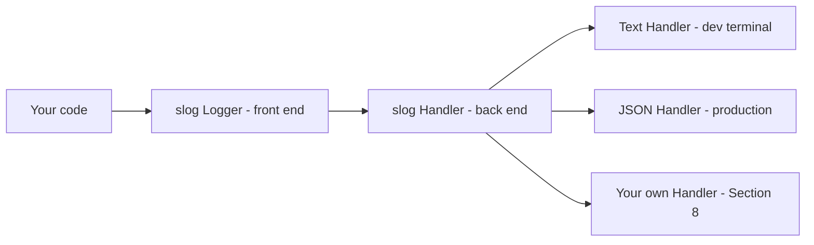
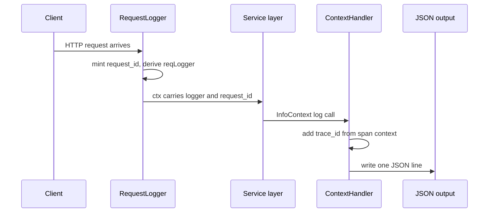

# Lecture 1 — Structured Logging with `log/slog`: Handlers, Levels, Attributes, and Request-Scoped Loggers

> **Time:** 2 hours. Read the `Logger`/`Handler` split first, the attributes and performance material second, and the request-scoped/context-aware material last — that final section is the bridge into Lecture 2's trace correlation. **Prerequisites:** Week 5 (the chi handler → service → repository split) and comfort with `context.Context`. **Citations:** the `log/slog` package documentation at <https://pkg.go.dev/log/slog>, the Go blog's "Structured Logging with slog" at <https://go.dev/blog/slog>, and the original design discussion at <https://go.dev/wiki/Proposal-for-structured-logging>.

## 1. Why structured, and why in the standard library

For most of Go's life the logging story was `log.Printf`. It produces a line of text:

```
2026/06/19 14:32:07 user alice created note 4f2 in 38ms
```

That line is fine for a human reading a terminal. It is hostile to every machine that will actually consume it in production. To answer "how many requests did user `alice` make today," an operator writes a regular expression against the line. To answer "show me every request that took over 100ms," they write a different, more fragile regular expression that parses `38ms` out of free text. The day someone reorders the format string — moves the duration before the note ID — every one of those regexes silently breaks, and nobody notices until an alert that should have fired did not.

Structured logging inverts the model. Instead of formatting values into a sentence, you emit them as typed key/value pairs, and the handler serializes them into a machine-readable format — usually JSON in production:

```json
{"time":"2026-06-19T14:32:07.123Z","level":"INFO","msg":"note created","user_id":"alice","note_id":"4f2","duration_ms":38}
```

Now "every request over 100ms" is the query `duration_ms > 100`, evaluated by the log backend (Loki, Elasticsearch, CloudWatch, whatever you run), and it never breaks because the field is named, not positional. The cost is that you type `"user_id", id` instead of interpolating `%s`. That cost is trivial and the payoff is the difference between logs you can query and logs you can only grep.

`log/slog` is Go's standard-library answer, added in Go 1.21 (citation: <https://go.dev/blog/slog>). Before slog, the community settled on third-party loggers — `logrus`, then `zap`, then `zerolog` — each with its own API, and choosing one was a small political act on every team. slog ended that: it is in the standard library, its `Handler` interface lets the high-performance third-party backends plug in underneath the same front-end API, and new Go code should reach for it by default. We will use it exclusively this week.

## 2. The `Logger`/`Handler` split

The single most important structural fact about slog is that it has **two layers, and they have different jobs**:

- A `*slog.Logger` is the **front end**. It is what your code calls: `logger.Info`, `logger.Error`, `logger.With`. It is cheap, it is safe for concurrent use, and it does almost no work itself — it builds a `slog.Record` (the message, level, time, and attributes) and hands it to its handler.
- A `slog.Handler` is the **back end**. It is an interface, and it decides *what the log actually becomes*: the output format (text or JSON), where it goes (stdout, a file, a network socket), the minimum level, and any transformation of the attributes. The standard library ships two implementations, `slog.NewTextHandler` and `slog.NewJSONHandler`; you can write your own, and in Section 8 we do.


*The Logger is a thin front end; the Handler it wraps decides format and destination.*

The `Handler` interface is small — four methods (citation: <https://pkg.go.dev/log/slog#Handler>):

```go
type Handler interface {
	Enabled(context.Context, Level) bool
	Handle(context.Context, Record) error
	WithAttrs(attrs []Attr) Handler
	WithGroup(name string) Handler
}
```

`Enabled` is the fast level check — slog calls it *before* building the record so that a disabled `Debug` call costs almost nothing (more on this in Section 6). `Handle` does the actual work of formatting and writing one record. `WithAttrs` and `WithGroup` return a *new* handler with extra attributes or a group prefix baked in — this is how `logger.With(...)` works, and it is why a request-scoped logger is cheap to derive (Section 7).

You almost never write a `Logger` from scratch; you wrap a handler:

```go
package main

import (
	"log/slog"
	"os"
)

func main() {
	handler := slog.NewJSONHandler(os.Stdout, nil)
	logger := slog.New(handler)
	logger.Info("service starting", "port", 8080)
}
```

Output (one line, pretty-printed here):

```json
{"time":"2026-06-19T14:32:07.001Z","level":"INFO","msg":"service starting","port":8080}
```

## 3. Text vs JSON: choose by reader

The two built-in handlers differ only in serialization. `NewTextHandler` emits `key=value` pairs meant for a human at a terminal:

```go
slog.New(slog.NewTextHandler(os.Stdout, nil)).Info("service starting", "port", 8080)
// time=2026-06-19T14:32:07.001Z level=INFO msg="service starting" port=8080
```

`NewJSONHandler` emits one JSON object per line — newline-delimited JSON, the format every log aggregator ingests:

```go
slog.New(slog.NewJSONHandler(os.Stdout, nil)).Info("service starting", "port", 8080)
// {"time":"...","level":"INFO","msg":"service starting","port":8080}
```

The rule is simple and worth stating as doctrine: **text in development, JSON in production**. A developer reads logs with their eyes, so the text handler's `key=value` form is friendlier at a local terminal. A production system ships logs to a backend that parses JSON, so the JSON handler is mandatory there. Wire this as one branch at startup:

```go
func newLogger(env string, level slog.Level) *slog.Logger {
	opts := &slog.HandlerOptions{Level: level}
	var h slog.Handler
	if env == "production" {
		h = slog.NewJSONHandler(os.Stdout, opts)
	} else {
		h = slog.NewTextHandler(os.Stdout, opts)
	}
	return slog.New(h)
}
```

Every call site downstream — `logger.Info(...)` — is identical regardless of which handler it wrapped. That is the whole point of the `Logger`/`Handler` split: the *format* is a deployment decision, not a code decision.

## 4. Levels: `Debug`, `Info`, `Warn`, `Error`

slog has four built-in levels, modeled as an integer type `slog.Level` with named values (citation: <https://pkg.go.dev/log/slog#Level>):

```go
slog.LevelDebug // -4
slog.LevelInfo  //  0
slog.LevelWarn  //  4
slog.LevelError //  8
```

The integer spacing is deliberate: it leaves room between the named levels so you can define intermediate custom levels (`slog.Level(2)` is a "notice" between Info and Warn if you want one). A handler emits a record only if its level is at or above the handler's configured minimum. The convention:

- **`Debug`** — verbose diagnostic detail, off in production. "Cache miss for key X," "retrying connection, attempt 2."
- **`Info`** — the normal narrative of the service. "Request handled," "note created," "service started." This is the default production level.
- **`Warn`** — something is wrong but the service recovered or degraded gracefully. "Downstream slow, served from cache," "rate limit approaching."
- **`Error`** — an operation failed. "Request failed," "database connection lost." An `Error` log should correspond to something a human might need to act on.

The four convenience methods are `logger.Debug`, `logger.Info`, `logger.Warn`, `logger.Error`, plus their `*Context` variants (`logger.InfoContext`, covered in Section 7). For a one-off custom level use `logger.Log(ctx, level, msg, args...)`.

## 5. Changing the level at runtime with `LevelVar`

A common production need: turn on `Debug` logging *while the process is running*, to diagnose a live incident, without a redeploy. If you pass a plain `slog.Level` into `HandlerOptions.Level`, it is fixed at construction. If you pass a `*slog.LevelVar`, you can change it atomically at any time (citation: <https://pkg.go.dev/log/slog#LevelVar>):

```go
var levelVar = new(slog.LevelVar) // defaults to LevelInfo

func main() {
	logger := slog.New(slog.NewJSONHandler(os.Stdout, &slog.HandlerOptions{
		Level: levelVar, // a *LevelVar satisfies the Leveler interface
	}))
	slog.SetDefault(logger)

	// ... later, in an admin HTTP handler, flip to debug for 5 minutes:
	levelVar.Set(slog.LevelDebug)
	// ... and back:
	levelVar.Set(slog.LevelInfo)
}
```

`HandlerOptions.Level` accepts the `slog.Leveler` interface, which both `slog.Level` (fixed) and `*slog.LevelVar` (mutable, goroutine-safe) satisfy. The idiom is to expose `levelVar.Set` behind an authenticated admin endpoint so on-call can raise verbosity for a struggling instance. The `notes` mini-project wires exactly this.

## 6. Attributes: typed, and why `slog.Attr` beats `...any`

You attach key/value pairs to a log call in two ways.

The first is the **variadic `...any` form** — alternating keys and values:

```go
logger.Info("note created", "user_id", "alice", "note_id", "4f2", "duration_ms", 38)
```

Convenient, but it has two hazards. First, it is unchecked: if you pass an odd number of trailing arguments, or a non-string where a key belongs, slog does its best to recover (it logs a `!BADKEY` entry) but you have a silent bug. Second, every value is boxed into an `interface{}`, which allocates.

The second is the **typed `slog.Attr` form** via the constructors `slog.String`, `slog.Int`, `slog.Int64`, `slog.Bool`, `slog.Float64`, `slog.Time`, `slog.Duration`, and the escape hatch `slog.Any`:

```go
logger.LogAttrs(ctx, slog.LevelInfo, "note created",
	slog.String("user_id", "alice"),
	slog.String("note_id", "4f2"),
	slog.Duration("duration", 38*time.Millisecond),
)
```

`LogAttrs` takes `...slog.Attr` directly, skips the key/value re-pairing, and avoids the boxing of scalars. **For hot paths — a per-request log line that runs on every request — prefer `LogAttrs` with typed `slog.Attr`s.** For incidental logging the `...any` form is fine and reads more cleanly; do not prematurely optimize a once-at-startup log line. The performance difference is real but it matters at scale, not everywhere. (Citation: the performance notes in <https://go.dev/blog/slog>.)

`slog.Group` nests attributes under a key, which renders as a nested JSON object:

```go
logger.Info("request handled",
	slog.Group("http",
		slog.String("method", "GET"),
		slog.String("route", "/notes/{id}"),
		slog.Int("status", 200),
	),
)
// {"...","msg":"request handled","http":{"method":"GET","route":"/notes/{id}","status":200}}
```

Grouping is how you keep a log object tidy when one log line carries fields from several concerns (HTTP, DB, auth) — each concern gets a group rather than ten flat keys.

### 6.1 `LogValuer` — lazy and redacting attributes

The `slog.LogValuer` interface lets a type control how it appears in a log, computed lazily and only if the record is actually emitted (citation: <https://pkg.go.dev/log/slog#LogValuer>):

```go
type LogValuer interface {
	LogValue() Value
}
```

Two canonical uses. The first is **redaction** — a type that must never leak its real value into a log:

```go
type Password string

func (Password) LogValue() slog.Value {
	return slog.StringValue("REDACTED")
}

type Credentials struct {
	User string
	Pass Password
}

logger.Info("login attempt", "user", c.User, "pass", c.Pass)
// {"...","msg":"login attempt","user":"alice","pass":"REDACTED"}
```

The real password never reaches the handler — `LogValue` is called and returns the redacted form. This is far safer than relying on every call site to remember not to log the field; the type itself enforces it. (We will redact a different field via `ReplaceAttr` in the homework — `LogValuer` redacts by type, `ReplaceAttr` redacts by key; both are valid, and which you reach for depends on whether the secret is a distinct type or just a sensitive field name.)

The second use is **laziness** — if computing the log representation is expensive (serializing a large struct), `LogValue` is only called when the handler is actually going to emit the record, so a `Debug`-level value costs nothing in production where `Debug` is off.

## 7. Request-scoped loggers and `context.Context`

Here is the central pattern of the week. A web request flows through many layers — handler, service, repository — and you want *every* log line that request produces to carry the same identifying fields: a `request_id`, the trace ID (Lecture 2), perhaps the user ID. You do not want to thread `requestID string` through every function signature. The solution is a **request-scoped logger** derived with `slog.With` and carried in the request context.

`slog.With` (and the method `logger.With`) returns a *new* logger whose handler has the given attributes baked in via `WithAttrs`:

```go
reqLogger := baseLogger.With(
	slog.String("request_id", requestID),
	slog.String("method", r.Method),
	slog.String("route", route),
)
reqLogger.Info("request started")
// {"...","msg":"request started","request_id":"a1b2c3d4","method":"GET","route":"/notes/{id}"}
```

Every subsequent call on `reqLogger` carries `request_id`, `method`, and `route` automatically. Now you stash that logger in the context so deeper layers can retrieve it:

```go
type loggerCtxKey struct{}

// ContextWithLogger returns a child context carrying lg.
func ContextWithLogger(ctx context.Context, lg *slog.Logger) context.Context {
	return context.WithValue(ctx, loggerCtxKey{}, lg)
}

// LoggerFrom returns the request-scoped logger, or the default if none is set.
func LoggerFrom(ctx context.Context) *slog.Logger {
	if lg, ok := ctx.Value(loggerCtxKey{}).(*slog.Logger); ok {
		return lg
	}
	return slog.Default()
}
```

A note on the context key: it is an *unexported struct type* (`loggerCtxKey{}`), never a string. A string key like `"logger"` can collide with a key set by another package; an unexported type cannot, because no other package can name it. This is the standard `context.Value` discipline (citation: <https://pkg.go.dev/context#WithValue>).

Now the service layer logs through the request-scoped logger without ever having seen `request_id`:

```go
func (s *Service) GetNote(ctx context.Context, id string) (Note, error) {
	lg := LoggerFrom(ctx)
	lg.InfoContext(ctx, "fetching note", "note_id", id)
	// ... -> still carries request_id, method, route from the handler
}
```

### 7.1 The context-aware methods (`InfoContext` and friends)

Notice `lg.InfoContext(ctx, ...)` rather than `lg.Info(...)`. The `*Context` variants pass the context through to the handler's `Handle(ctx, record)` method. The plain variants pass `context.Background()`. **Always use the `*Context` variants in request-handling code**, because the handler may need the context — and in Section 8 we write a handler that reads the trace ID out of it. A plain `Info` call hands the handler an empty context, and the trace correlation silently produces no `trace_id`. This is a subtle bug; make `InfoContext` your default in any code that has a `ctx` in scope.

## 8. A custom handler that injects `request_id` and `trace_id`

This is where logging meets tracing. We want *every* log record, no matter which layer emitted it, to automatically carry the current trace ID — without every call site remembering to add it. A custom `slog.Handler` that wraps another handler and enriches each record from the context does exactly this. The pattern is a *decorator*: implement `Handler`, hold the wrapped handler, add fields in `Handle`, and delegate the rest:

```go
package observability

import (
	"context"
	"log/slog"

	"go.opentelemetry.io/otel/trace"
)

// ContextHandler wraps a slog.Handler and, on every record, attaches the
// trace_id and span_id from the active OpenTelemetry span context (if any)
// and the request_id stashed in the context (if any).
type ContextHandler struct {
	slog.Handler
}

func NewContextHandler(h slog.Handler) *ContextHandler {
	return &ContextHandler{Handler: h}
}

func (h *ContextHandler) Handle(ctx context.Context, r slog.Record) error {
	if sc := trace.SpanContextFromContext(ctx); sc.IsValid() {
		r.AddAttrs(
			slog.String("trace_id", sc.TraceID().String()),
			slog.String("span_id", sc.SpanID().String()),
		)
	}
	if rid, ok := ctx.Value(requestIDKey{}).(string); ok {
		r.AddAttrs(slog.String("request_id", rid))
	}
	return h.Handler.Handle(ctx, r)
}
```

`ContextHandler` embeds `slog.Handler`, so it inherits `Enabled`, `WithAttrs`, and `WithGroup` for free — we only override `Handle`. The line `trace.SpanContextFromContext(ctx)` reaches into the OpenTelemetry trace context (Lecture 2 sets it up); if there is a valid span, we add its trace and span IDs to the record. The result: any code path that calls `logger.InfoContext(ctx, ...)` while inside a span gets a `trace_id` on the log line for free, and that `trace_id` is the join key into Jaeger.

> **The dependency direction.** This handler imports `go.opentelemetry.io/otel/trace` — the logging layer depends on the tracing API. That is intentional and correct: logs and traces *should* be coupled by the trace ID. If you want to keep `slog` ignorant of OTel, the alternative is to extract the trace ID in the middleware (Section 9) and bind it with `slog.With`; that works too. The custom-handler approach wins when you want *every* record correlated, including ones from code that forgot to use the request-scoped logger.

## 9. The request-logging middleware for chi

Putting it together: a chi middleware that runs once per request, mints a `request_id`, derives a request-scoped logger, stashes it in the context, logs start and end, and records the duration and status. (This is Exercise 1; here is the lecture version.)

```go
package observability

import (
	"context"
	"crypto/rand"
	"encoding/hex"
	"log/slog"
	"net/http"
	"time"

	"github.com/go-chi/chi/v5"
)

type requestIDKey struct{}

// statusRecorder captures the status code written by the handler, because
// http.ResponseWriter does not expose it after the fact.
type statusRecorder struct {
	http.ResponseWriter
	status int
}

func (sr *statusRecorder) WriteHeader(code int) {
	sr.status = code
	sr.ResponseWriter.WriteHeader(code)
}

func RequestLogger(base *slog.Logger) func(http.Handler) http.Handler {
	return func(next http.Handler) http.Handler {
		return http.HandlerFunc(func(w http.ResponseWriter, r *http.Request) {
			start := time.Now()
			reqID := newRequestID()

			ctx := context.WithValue(r.Context(), requestIDKey{}, reqID)
			lg := base.With(
				slog.String("request_id", reqID),
				slog.String("method", r.Method),
				slog.String("path", r.URL.Path),
			)
			ctx = ContextWithLogger(ctx, lg)
			r = r.WithContext(ctx)

			lg.InfoContext(ctx, "request started")

			rec := &statusRecorder{ResponseWriter: w, status: http.StatusOK}
			next.ServeHTTP(rec, r)

			lg.InfoContext(ctx, "request completed",
				slog.Int("status", rec.status),
				slog.String("route", chi.RouteContext(r.Context()).RoutePattern()),
				slog.Duration("duration", time.Since(start)),
			)
		})
	}
}

func newRequestID() string {
	var b [8]byte
	_, _ = rand.Read(b[:])
	return hex.EncodeToString(b[:])
}
```

Three things to note. First, `statusRecorder` wraps the `http.ResponseWriter` so we can capture the status code the handler writes — `net/http` does not let you read it back, so you intercept `WriteHeader`. Second, `chi.RouteContext(r.Context()).RoutePattern()` gives you the *route template* (`/notes/{id}`), not the concrete path (`/notes/4f2`) — this matters enormously for metrics in Lecture 3, where labeling by the template keeps cardinality bounded and labeling by the concrete path explodes it. Third, the order: this middleware must run *before* anything that needs the request-scoped logger and *after* (inside of) the `otelhttp` handler from Lecture 2, so the span context is already populated when this middleware reads it.


*A request-scoped logger rides the context down to every layer, and the ContextHandler stamps trace_id on the way out.*

## 10. `slog.SetDefault` — the package-level logger

`slog.SetDefault(logger)` installs a logger as the process default, used by the package-level functions `slog.Info`, `slog.Error`, and so on — and, usefully, it also redirects the old `log` package's standard logger through slog, so a stray `log.Printf` in a dependency still ends up in your structured output (citation: <https://pkg.go.dev/log/slog#SetDefault>).

```go
func main() {
	logger := slog.New(NewContextHandler(slog.NewJSONHandler(os.Stdout, &slog.HandlerOptions{
		Level: levelVar,
	})))
	slog.SetDefault(logger)
}
```

When is the default acceptable, and when is it not? **The default is fine for startup, shutdown, and background tasks** that are not handling a specific request — there is no request-scoped context to thread, so `slog.Info("service started")` is correct and clean. **The default is wrong inside request handling**, because it carries none of the per-request fields. Inside a handler, service method, or repository call, retrieve the request-scoped logger with `LoggerFrom(ctx)` and use the `*Context` methods. The rule of thumb: if you have a `ctx` in scope and it might carry request fields, use the request-scoped logger; otherwise the default is fine.

## 11. Wrap-up — the slog checklist

When you wire `slog` into a service this week:

- [ ] One handler choice at startup: `JSONHandler` in production, `TextHandler` in development.
- [ ] Level driven by a `*slog.LevelVar` so on-call can raise verbosity without a redeploy.
- [ ] Hot-path log lines use `LogAttrs` with typed `slog.Attr`s; incidental logging may use the `...any` form.
- [ ] Sensitive fields are redacted by `LogValuer` (by type) or `ReplaceAttr` (by key) — never logged raw.
- [ ] A request-scoped logger is derived per request with `slog.With(request_id, method, path)` and stashed in the context.
- [ ] Deeper layers retrieve the logger with `LoggerFrom(ctx)` and call the `*Context` methods (`InfoContext`, `ErrorContext`).
- [ ] A custom `ContextHandler` (or the middleware) injects the `trace_id` on every record so logs join to traces.
- [ ] `slog.SetDefault` is called once at startup; the default is used only outside request handling.

Read the `log/slog` package documentation end-to-end before Wednesday — <https://pkg.go.dev/log/slog> — and the Go blog post at <https://go.dev/blog/slog>. Exercise 1 (`exercise-01-slog-request-logger.go`) builds the middleware from Section 9 and asks you to extend it.

Next lecture: OpenTelemetry — the trace, the span, the SDK wiring, and the context propagation that keeps a trace whole across the handler → service → Postgres path and out to Jaeger.
