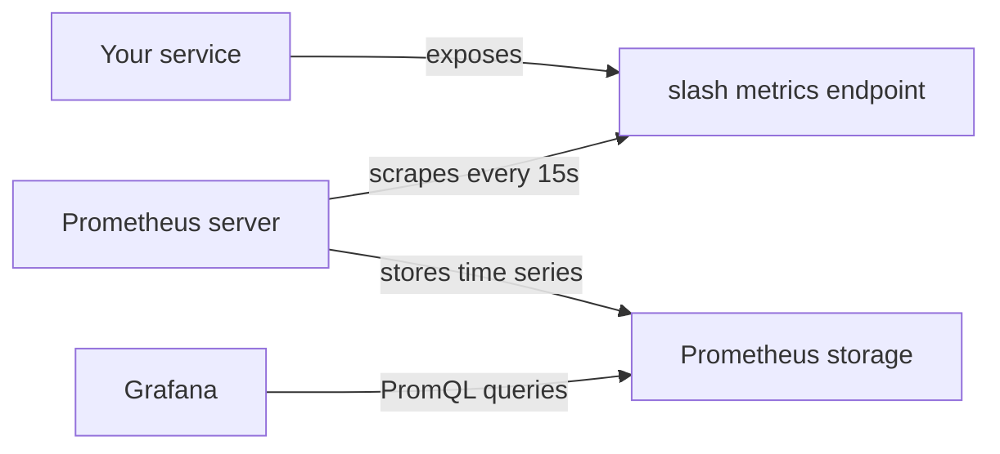
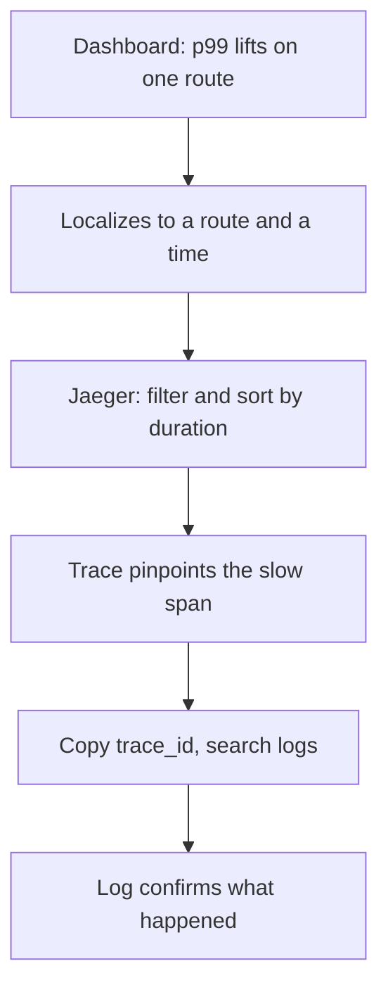

# Lecture 3 — Prometheus Metrics, the RED Method, PromQL, and a Grafana Dashboard that Localizes a Regression

> **Time:** 2 hours. Read the metric types first, the RED middleware second, and the PromQL/Grafana/stack material last. **Prerequisites:** Lectures 1 and 2 (you will reuse the `statusRecorder` and the chi route pattern). **Citations:** the `client_golang` godoc at <https://pkg.go.dev/github.com/prometheus/client_golang/prometheus>, the `promhttp` godoc at <https://pkg.go.dev/github.com/prometheus/client_golang/prometheus/promhttp>, the Prometheus metric-types doc at <https://prometheus.io/docs/concepts/metric_types/>, the histograms-and-quantiles practice doc at <https://prometheus.io/docs/practices/histograms/>, the naming guide at <https://prometheus.io/docs/practices/naming/>, and Tom Wilkie's RED method article at <https://www.weave.works/blog/the-red-method-key-metrics-for-microservices-architecture/>.

## 1. The model: pull, not push

Metrics in Prometheus work opposite to how most people first assume. Your service does **not** push numbers to a metrics server. Instead, your service exposes an HTTP endpoint — conventionally `/metrics` — that returns the *current values* of all its instruments as plain text, and a Prometheus server **scrapes** that endpoint on an interval (every 15 seconds is typical). The service is a passive source of truth; Prometheus is the active collector. This pull model has consequences worth internalizing: a metric is a *current aggregate value held in memory in your process*, not an event you emit; Prometheus computes rates and ratios by differencing successive scrapes; and a service that is down simply fails to be scraped (which Prometheus records as the `up` metric going to 0 — a free liveness signal).


*Prometheus pulls current values from your service; it never receives a push.*

`client_golang` is the official Go client (citation: <https://github.com/prometheus/client_golang>). It gives you instrument types, a registry to hold them, and an HTTP handler to expose them.

## 2. The four metric types, and when each fits

Prometheus has four core metric types (citation: <https://prometheus.io/docs/concepts/metric_types/>). Choosing the right one is the difference between a useful metric and a misleading one.

### 2.1 Counter — monotonically increasing

A `Counter` only goes up (it resets to zero only when the process restarts). Use it for *totals of events*: requests served, errors, bytes written. You never read a counter's raw value directly in a dashboard — a number like "4,812,309 total requests since boot" is meaningless. You read its **rate**: `rate(http_requests_total[5m])` is requests per second over the last five minutes, and *that* is the useful number. (Citation: <https://pkg.go.dev/github.com/prometheus/client_golang/prometheus#Counter>.)

```go
requests := prometheus.NewCounter(prometheus.CounterOpts{
	Name: "http_requests_total",
	Help: "Total number of HTTP requests served.",
})
requests.Inc()        // +1
requests.Add(3)       // +3 (Add panics on a negative; a counter cannot go down)
```

### 2.2 Gauge — a value that goes up and down

A `Gauge` is a snapshot of a current value that can rise or fall: in-flight requests, queue depth, connection-pool size, memory in use. Unlike a counter, you read a gauge's value directly — "there are 7 requests in flight right now" is meaningful. (Citation: <https://pkg.go.dev/github.com/prometheus/client_golang/prometheus#Gauge>.)

```go
inflight := prometheus.NewGauge(prometheus.GaugeOpts{
	Name: "http_requests_in_flight",
	Help: "Number of HTTP requests currently being served.",
})
inflight.Inc() // request started
inflight.Dec() // request finished
```

### 2.3 Histogram — a distribution

A `Histogram` samples observations (almost always *durations*) into a set of cumulative **buckets**, plus a `_sum` and a `_count`. This is the type you use for latency, and it is the heart of RED's Duration signal. A histogram named `http_request_duration_seconds` with buckets at 0.005, 0.01, 0.025, ... produces, on scrape, a series of `http_request_duration_seconds_bucket{le="0.025"}` counters (how many observations were ≤ 25ms), plus `_sum` (total seconds) and `_count` (total observations). From those cumulative buckets, PromQL computes any quantile you ask for — p50, p95, p99 — with `histogram_quantile()` (Section 6). (Citation: <https://pkg.go.dev/github.com/prometheus/client_golang/prometheus#Histogram>.)

The reason latency *must* be a histogram and not a simple average: the average hides the tail. A service with a 20ms average might have a 2-second p99 — one request in a hundred is catastrophically slow — and the average smears that into invisibility. The tail is what pages you, so you must measure the tail, and only a histogram (or summary) lets you.

```go
duration := prometheus.NewHistogram(prometheus.HistogramOpts{
	Name:    "http_request_duration_seconds",
	Help:    "HTTP request latency in seconds.",
	Buckets: prometheus.DefBuckets, // .005,.01,.025,.05,.1,.25,.5,1,2.5,5,10
})
duration.Observe(0.038) // a 38ms request
```

`prometheus.DefBuckets` is a reasonable default for web-request latencies measured in seconds. When your service's latencies cluster elsewhere, choose buckets deliberately — `prometheus.ExponentialBuckets(0.001, 2, 15)` gives 15 buckets from 1ms doubling each step (1ms, 2ms, 4ms, ...), good for a service whose interesting range is sub-second. Pick buckets that bracket the latencies you care about resolving; a quantile can only be estimated to the resolution of the bucket it falls in.

> **A note on native histograms.** Newer Prometheus and `client_golang` support *native* (exponential) histograms with automatic, high-resolution buckets configured via `NativeHistogramBucketFactor` on `HistogramOpts`. They are excellent and the future, but classic explicit buckets are still the broadly-compatible default and what every Grafana example assumes. We use classic buckets this week and mention native histograms so the name is not a surprise when you meet it.

### 2.4 Summary — quantiles computed in-process

A `Summary` also tracks a distribution, but it computes configured quantiles *inside your process* and exposes them directly. The fatal limitation: **summary quantiles cannot be aggregated across instances**. If you run ten replicas, you cannot combine their p99 summaries into a fleet-wide p99 — the math does not work, you would be averaging quantiles, which is meaningless. A histogram *can* be aggregated (you sum the buckets across instances, then compute the quantile), which is why **histograms are almost always the right choice for a multi-replica service** and summaries are a niche tool for single-instance, exact-quantile needs. When in doubt, histogram. (Citation: <https://prometheus.io/docs/practices/histograms/>.)

## 3. Labels, vectors, and the cardinality rule

A bare counter is one time series. Usually you want the same metric split by dimension — requests *by route*, *by method*, *by status code*. That is a **vector**: `CounterVec`, `HistogramVec`, `GaugeVec`. Each unique combination of label values is a separate time series.

```go
requests := prometheus.NewCounterVec(
	prometheus.CounterOpts{
		Name: "http_requests_total",
		Help: "Total HTTP requests by method, route, and status code.",
	},
	[]string{"method", "route", "code"},
)
requests.WithLabelValues("GET", "/notes/{id}", "200").Inc()
```

Now you can ask "rate of 5xx on `/notes/{id}`" in PromQL. But labels carry a hard, expensive rule:

> **Never use a label whose value is unbounded.** Every distinct label-value combination is a separate time series, and each time series costs memory in your process and in Prometheus, plus index entries forever. A label like `code` has ~5 realistic values (200, 400, 404, 500, 503). A label like `route` has as many values as you have route *templates* — a few dozen. Those are bounded. A label like `note_id`, or `user_id`, or the raw `path` (`/notes/4f2`, `/notes/9ab`, ...) is *unbounded*: every note creates a new time series, the count grows without limit, and you get a **cardinality explosion** that exhausts memory and can take down your Prometheus. This is the single most expensive metrics mistake there is.

This is exactly why Lecture 1's middleware used `chi.RouteContext(r.Context()).RoutePattern()` — the *template* `/notes/{id}`, bounded — and not `r.URL.Path` — the concrete path `/notes/4f2`, unbounded. Label by the template. If you ever feel the urge to label a metric by an ID, stop: that detail belongs on a *span* (high cardinality is fine on a span, it is one request) or in a *log line*, never on a metric.

## 4. The registry and `promhttp`

Instruments must be **registered** before they appear at `/metrics`. There are two paths.

The explicit path — create your own registry, register each instrument, and serve that registry. This is the disciplined choice: you control exactly what is exposed, and tests can use a fresh registry without global state.

```go
reg := prometheus.NewRegistry()
reg.MustRegister(requests, duration)

mux.Handle("/metrics", promhttp.HandlerFor(reg, promhttp.HandlerOpts{}))
```

The `promauto` path — register at construction against a registerer, in one step:

```go
var requests = promauto.With(reg).NewCounterVec(
	prometheus.CounterOpts{Name: "http_requests_total", Help: "..."},
	[]string{"method", "route", "code"},
)
```

`promauto.With(reg)` binds the auto-registration to *your* registry rather than the global `prometheus.DefaultRegisterer`. Prefer this over the bare `promauto.NewCounterVec` (which uses the global default) when you want test isolation and explicit control. (Citation: <https://pkg.go.dev/github.com/prometheus/client_golang/prometheus/promauto>.)

`promhttp.HandlerFor(reg, opts)` returns an `http.Handler` that serializes your registry's metrics into the Prometheus text exposition format. Mount it at `/metrics`. A scrape returns something like:

```
# HELP http_requests_total Total HTTP requests by method, route, and status code.
# TYPE http_requests_total counter
http_requests_total{code="200",method="GET",route="/notes/{id}"} 1432
http_requests_total{code="404",method="GET",route="/notes/{id}"} 7
# HELP http_request_duration_seconds HTTP request latency in seconds.
# TYPE http_request_duration_seconds histogram
http_request_duration_seconds_bucket{method="GET",route="/notes/{id}",le="0.025"} 1301
http_request_duration_seconds_bucket{method="GET",route="/notes/{id}",le="0.05"} 1421
http_request_duration_seconds_bucket{method="GET",route="/notes/{id}",le="+Inf"} 1439
http_request_duration_seconds_sum{method="GET",route="/notes/{id}"} 21.4
http_request_duration_seconds_count{method="GET",route="/notes/{id}"} 1439
```

## 5. The RED method as middleware

RED is the opinionated answer to "what should I measure for a request-serving service?": **Rate, Errors, Duration** (citation: Tom Wilkie, <https://www.weave.works/blog/the-red-method-key-metrics-for-microservices-architecture/>). All three come from exactly two instruments — a counter and a histogram — wired in one middleware that runs on every request.

```go
package observability

import (
	"net/http"
	"strconv"
	"time"

	"github.com/go-chi/chi/v5"
	"github.com/prometheus/client_golang/prometheus"
)

type Metrics struct {
	requests *prometheus.CounterVec
	duration *prometheus.HistogramVec
}

func NewMetrics(reg prometheus.Registerer) *Metrics {
	m := &Metrics{
		requests: prometheus.NewCounterVec(prometheus.CounterOpts{
			Name: "http_requests_total",
			Help: "Total HTTP requests by method, route, and status code.",
		}, []string{"method", "route", "code"}),
		duration: prometheus.NewHistogramVec(prometheus.HistogramOpts{
			Name:    "http_request_duration_seconds",
			Help:    "HTTP request latency in seconds by method and route.",
			Buckets: prometheus.DefBuckets,
		}, []string{"method", "route"}),
	}
	reg.MustRegister(m.requests, m.duration)
	return m
}

// Middleware records the RED signals for every request. Mount it once on the
// router, inside the otelhttp wrapper so the route pattern is resolvable.
func (m *Metrics) Middleware(next http.Handler) http.Handler {
	return http.HandlerFunc(func(w http.ResponseWriter, r *http.Request) {
		start := time.Now()
		rec := &statusRecorder{ResponseWriter: w, status: http.StatusOK}

		next.ServeHTTP(rec, r)

		route := chi.RouteContext(r.Context()).RoutePattern()
		if route == "" {
			route = "unmatched" // bound cardinality for 404s on unknown paths
		}
		m.duration.WithLabelValues(r.Method, route).Observe(time.Since(start).Seconds())
		m.requests.WithLabelValues(r.Method, route, strconv.Itoa(rec.status)).Inc()
	})
}
```

Three decisions in that code matter. First, the **route label is the chi route template**, for the cardinality reason from Section 3. Second, unmatched requests (404s on paths that match no route) are bucketed under a single `"unmatched"` route, otherwise an attacker spraying random URLs could explode your cardinality through the front door. Third, the histogram is **not** labeled by `code` — only the counter is. Labeling the histogram by code would multiply its already-numerous bucket series by ~5; Duration cares about *how long*, not *what status*, so leave code off the histogram and keep it on the counter where Errors needs it.

The gRPC equivalent is the same shape via an interceptor: a `grpc_server_handled_total{grpc_method,grpc_code}` counter and a `grpc_server_handling_seconds{grpc_method}` histogram, recorded in a `grpc.UnaryServerInterceptor`. The contrib ecosystem ships this (the `go-grpc-middleware` Prometheus interceptor), but the principle is identical: count by method and code, time by method.

## 6. Reading RED in PromQL

The two instruments become the three signals through three queries.

**Rate** — requests per second, summed across all routes, or split by route:

```promql
sum(rate(http_requests_total[5m]))                 # total RPS
sum by (route) (rate(http_requests_total[5m]))     # RPS per route
```

**Errors** — the *ratio* of failures to total, which is more useful than a raw error rate because it normalizes for traffic. A 5xx is a server error; here is the per-route 5xx ratio:

```promql
sum by (route) (rate(http_requests_total{code=~"5.."}[5m]))
  /
sum by (route) (rate(http_requests_total[5m]))
```

**Duration** — the p99 latency per route, computed from the histogram buckets with `histogram_quantile()`:

```promql
histogram_quantile(0.99,
  sum by (le, route) (rate(http_request_duration_seconds_bucket[5m]))
)
```

`histogram_quantile(φ, ...)` estimates the φ-quantile (0.99 = p99) from the cumulative bucket counters. Read that query inside-out: `rate(..._bucket[5m])` gives the per-second rate of each bucket; `sum by (le, route)` aggregates buckets across instances (preserving the `le` bucket-boundary label and the `route` label); `histogram_quantile(0.99, ...)` interpolates the 99th percentile within the bucket it lands in. **The `le` label must survive the aggregation** — that is why it is in the `by` clause; drop it and `histogram_quantile` has no buckets to work with. This is the most common PromQL mistake with histograms; keep `le`. (Citation: <https://prometheus.io/docs/practices/histograms/#quantiles>.)

## 7. The local stack via docker compose

The whole observability stack runs in containers. Four services: the `notes` app, Postgres, Jaeger (traces), Prometheus (metrics), Grafana (dashboards). A trimmed compose file:

```yaml
services:
  jaeger:
    image: jaegertracing/all-in-one:1.57
    ports:
      - "16686:16686"   # Jaeger UI
      - "4317:4317"     # OTLP gRPC receiver (the app exports here)
    environment:
      COLLECTOR_OTLP_ENABLED: "true"

  prometheus:
    image: prom/prometheus:v2.52.0
    ports:
      - "9090:9090"
    volumes:
      - ./prometheus.yml:/etc/prometheus/prometheus.yml:ro

  grafana:
    image: grafana/grafana:11.0.0
    ports:
      - "3000:3000"
    environment:
      GF_AUTH_ANONYMOUS_ENABLED: "true"
      GF_AUTH_ANONYMOUS_ORG_ROLE: Admin
    volumes:
      - ./grafana/provisioning:/etc/grafana/provisioning:ro
      - ./grafana/dashboards:/var/lib/grafana/dashboards:ro
```

`prometheus.yml` tells Prometheus where to scrape. The `notes` service exposes `/metrics`; Prometheus scrapes it every 15 seconds:

```yaml
global:
  scrape_interval: 15s

scrape_configs:
  - job_name: notes
    static_configs:
      - targets: ["host.docker.internal:8080"] # the app on the host
    metrics_path: /metrics
```

(`host.docker.internal` reaches the host from inside the container on Docker Desktop; on Linux compose, put the app in the compose network and use its service name.) Bring it up with `docker compose up -d`, then: Jaeger at <http://localhost:16686>, Prometheus at <http://localhost:9090>, Grafana at <http://localhost:3000>.

## 8. A Grafana panel per RED signal

A Grafana dashboard is JSON; you provision it by dropping the JSON in the dashboards directory the compose file mounts. Each panel holds one PromQL query. A panel for the Duration signal (p99 by route) looks like:

```json
{
  "title": "Duration — p99 latency by route",
  "type": "timeseries",
  "datasource": "Prometheus",
  "fieldConfig": { "defaults": { "unit": "s" } },
  "targets": [
    {
      "expr": "histogram_quantile(0.99, sum by (le, route) (rate(http_request_duration_seconds_bucket[5m])))",
      "legendFormat": "{{route}}"
    }
  ]
}
```

You build three such panels — Rate (the RPS query), Errors (the ratio query, unit `percentunit`), Duration (the p99 query, unit `s`) — and that three-panel row *is* the RED dashboard. (Citation: <https://grafana.com/docs/grafana/latest/dashboards/>.) The mini-project ships a complete dashboard JSON; you do not hand-author every field, but you should understand that a panel is `{title, type, targets:[{expr}]}` and the `expr` is the PromQL from Section 6.

## 9. Localizing a regression — the whole point

Here is the workflow this entire week builds toward, and the mini-project drills it directly. Suppose someone ships a change that makes one query slow (the mini-project injects an artificial `pg_sleep` for a specific note).

1. **The dashboard localizes.** Within one scrape interval (~15s), the Duration panel's p99 line for `GET /notes/{id}` lifts off the floor — from 20ms to 400ms — while every *other* route's line stays flat. You have localized the regression to a route and a time *without reading a single line of code*. The Errors panel may also move if the slow query times out. This is the aggregate view doing its job: it tells you *that*, and *where in the service*, but not *why*.

2. **The trace pinpoints.** You switch tools. In Jaeger you filter traces by `service = notes` and `operation = GET /notes/{id}`, sort by duration, and open the slowest one. The waterfall shows the request's span tree: the server span is 400ms, the `service.GetNote` span is 398ms, and inside it the `db.query.GetNote` span is 395ms — bright red, with `db.statement` showing the query. You have pinpointed the regression to the database span, in the specific request, in seconds.

3. **The log confirms.** You copy the trace's `trace_id` and search your logs. There is the request-scoped log line — `"fetching note"` with that `trace_id` — and, because you instrumented well, a `"slow query"` warning the repository emitted, with the query's duration. The narrative is complete: dashboard said *where*, trace said *which span*, log said *what*.


*Localize on the dashboard, pinpoint in the trace, confirm in the log.*

The discipline is the two-step: **localize on the dashboard, pinpoint in the trace**. Do not try to localize in traces — you would be hunting through thousands of traces with no idea which route to look at; that is what the dashboard is for. Do not try to pinpoint in metrics — a metric labeled by note ID to "find the slow one" is the cardinality explosion from Section 3; that detail lives on the span. Each tool for its job. Master that two-step and you are the engineer who closes the incident in five minutes instead of fifty.

## 10. Wrap-up — the metrics checklist

When you add metrics to a service this week:

- [ ] Counter for totals (read as a `rate`), Gauge for current values, Histogram for latency. Summary only for single-instance exact quantiles.
- [ ] Latency is a `Histogram` with deliberately-chosen buckets (`DefBuckets` or explicit), never an average.
- [ ] The RED instruments are `http_requests_total{method,route,code}` (counter) and `http_request_duration_seconds{method,route}` (histogram).
- [ ] Every label is bounded — route is the chi *template*, never the concrete path; never label by an ID.
- [ ] Instruments are registered on an explicit `prometheus.Registry` (or via `promauto.With(reg)`), and `/metrics` is served by `promhttp.HandlerFor`.
- [ ] The RED middleware runs inside the `otelhttp` wrapper so the route pattern resolves.
- [ ] PromQL: `rate()` for Rate, the filtered-counter ratio for Errors, `histogram_quantile()` (keeping `le`) for Duration.
- [ ] A Grafana dashboard has one panel per RED signal, provisioned from JSON.
- [ ] You can walk dashboard → route → trace → slow span on a real regression in under five minutes.

Read the Prometheus histograms-and-quantiles practice doc before the mini-project — <https://prometheus.io/docs/practices/histograms/>. Exercise 3 (`exercise-03-prometheus-red-metrics.go`) builds the RED middleware against a custom registry with a fast and a slow handler so the histogram shows a real spread.

This is the last lecture of the week. The three signals — logs (Lecture 1), traces (Lecture 2), metrics (Lecture 3) — now point at the same request through one trace ID. The mini-project ties all three onto the `notes` service and makes you localize a regression for real.
