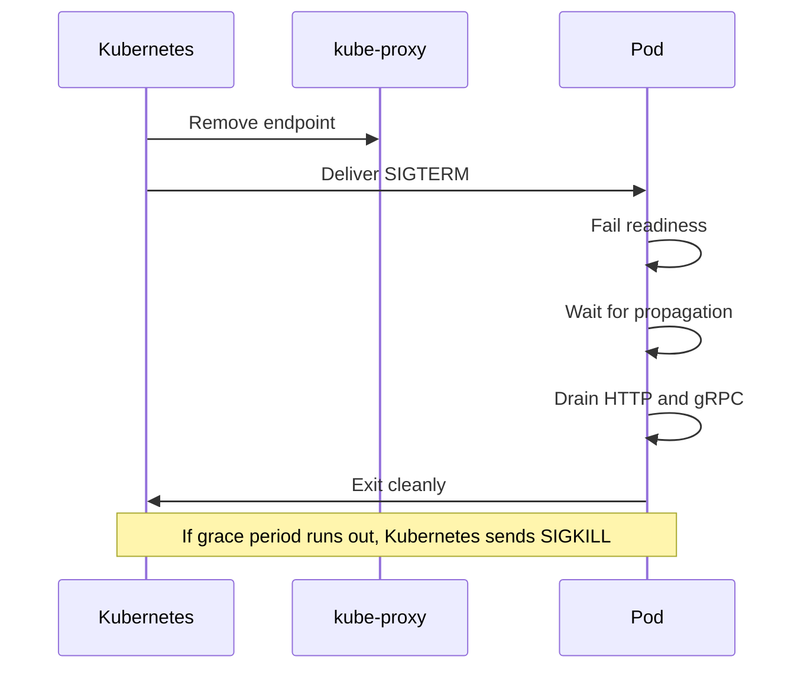
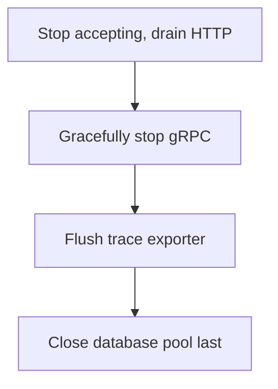

# Lecture 2 — Graceful Shutdown on `SIGTERM`: `signal.NotifyContext`, `http.Server.Shutdown`, gRPC `GracefulStop`, and the Rolling-Deploy Handoff

## Why this lecture exists

Lecture 1 got `notes` running on `kind` with honest probes. But the pod has a flaw: when Kubernetes terminates it — and Kubernetes terminates pods constantly (rolling deploys, scale-downs, node drains, rescheduling) — it sends `SIGTERM`, and a default Go program exits immediately, dropping every in-flight request on the floor. This lecture completes the disposability factor (factor IX) that Week 10 deferred: a graceful shutdown that, on `SIGTERM`, stops accepting new work, lets in-flight work finish, closes its resources in the right order, and exits cleanly within the termination grace period.

The key insight, and the reason this lands in Phase III of a *Go* course rather than a generic-DevOps one: **graceful shutdown is `context` cancellation applied to the whole process.** It is the exact machinery from Week 4 — a cancellable `context`, an `errgroup`, ordered teardown — lifted from a worker pool to `main`. If Week 4 is solid, this is a satisfying payoff; if it is hazy, re-read it first.

The references: the Kubernetes pod-termination doc at <https://kubernetes.io/docs/concepts/workloads/pods/pod-lifecycle/#pod-termination>, Go's `net/http` `Server.Shutdown` at <https://pkg.go.dev/net/http#Server.Shutdown>, and `signal.NotifyContext` at <https://pkg.go.dev/os/signal#NotifyContext>.

## What Kubernetes actually does when it terminates a pod

The termination sequence is precise, and graceful shutdown is written to fit it:

```
   pod termination timeline
   ------------------------
   t0  Kubernetes decides to terminate the pod (rollout, scale-down, drain).
   t0  TWO THINGS HAPPEN CONCURRENTLY:
         (a) the pod is removed from the Service endpoints (stops getting NEW traffic)
         (b) the container gets SIGTERM (and the preStop hook, if any, runs first)
   ...  the process has up to terminationGracePeriodSeconds to exit on its own.
   t+grace  if the process is still running, Kubernetes sends SIGKILL (forced, no cleanup).
```

The critical subtlety: (a) and (b) happen **concurrently and asynchronously**, propagated by different components. The endpoint removal goes through the API server, the endpoints controller, and every node's kube-proxy; the `SIGTERM` goes straight to the container via the kubelet. The `SIGTERM` very often arrives *before* the endpoint removal has propagated everywhere — so for a brief window after `SIGTERM`, the pod can *still receive new requests* from a kube-proxy that has not yet learned it is going away.

This is why a robust shutdown is more than "call `Shutdown` on `SIGTERM`," and why the `preStop` hook exists, covered below. First, the Go shutdown itself. Citation: <https://kubernetes.io/docs/concepts/workloads/pods/pod-lifecycle/#pod-termination>.


*Endpoint removal and SIGTERM fire concurrently, so the pod must fail readiness and wait before it stops draining.*

## The graceful-shutdown skeleton in Go

`signal.NotifyContext` gives a `context` that is cancelled when `SIGTERM` or `SIGINT` arrives. Everything downstream watches that context. An `errgroup` runs the servers and the shutdown watcher together.

```go
// cmd/notesd/main.go — the graceful-shutdown skeleton.
func run(cfg config.Config, logger *slog.Logger) error {
	// rootCtx is cancelled on SIGTERM/SIGINT. This is the whole-process
	// equivalent of the Week 4 cancellable context.
	rootCtx, stop := signal.NotifyContext(context.Background(),
		syscall.SIGTERM, syscall.SIGINT)
	defer stop()

	pool, err := pgxpool.New(rootCtx, cfg.DatabaseURL)
	if err != nil {
		return fmt.Errorf("connect db: %w", err)
	}
	defer pool.Close()

	tracerShutdown, err := observability.SetupTracing(rootCtx, cfg) // Week 9
	if err != nil {
		return fmt.Errorf("setup tracing: %w", err)
	}

	httpSrv := &http.Server{
		Addr:         cfg.HTTPAddr,
		Handler:      buildRouter(pool, logger), // chi router, Week 5/9
		ReadTimeout:  10 * time.Second,          // server-side timeouts (Lecture 3)
		WriteTimeout: 15 * time.Second,
		IdleTimeout:  60 * time.Second,
	}
	grpcSrv := buildGRPCServer(pool, logger) // Week 7
	grpcLis, err := net.Listen("tcp", cfg.GRPCAddr)
	if err != nil {
		return fmt.Errorf("listen grpc: %w", err)
	}

	g, gctx := errgroup.WithContext(rootCtx)

	// Run the HTTP server. ErrServerClosed on Shutdown is the clean exit, not an error.
	g.Go(func() error {
		logger.Info("http listening", "addr", cfg.HTTPAddr)
		if err := httpSrv.ListenAndServe(); err != nil &&
			!errors.Is(err, http.ErrServerClosed) {
			return fmt.Errorf("http serve: %w", err)
		}
		return nil
	})

	// Run the gRPC server.
	g.Go(func() error {
		logger.Info("grpc listening", "addr", cfg.GRPCAddr)
		if err := grpcSrv.Serve(grpcLis); err != nil &&
			!errors.Is(err, grpc.ErrServerStopped) {
			return fmt.Errorf("grpc serve: %w", err)
		}
		return nil
	})

	// The shutdown watcher: when the root context is cancelled (SIGTERM) or a
	// server errored (gctx cancelled), drain everything in order.
	g.Go(func() error {
		<-gctx.Done()
		logger.Info("shutdown signal received, draining",
			"grace", cfg.ShutdownTimeout)

		// A bounded budget for the drain. Must be < terminationGracePeriodSeconds
		// so we finish before Kubernetes SIGKILLs us. Grace 30s, budget 20s.
		shutdownCtx, cancel := context.WithTimeout(
			context.Background(), cfg.ShutdownTimeout)
		defer cancel()

		// 1. Stop accepting new HTTP connections; let in-flight requests finish
		//    (up to the budget). Shutdown blocks until they do or the ctx expires.
		if err := httpSrv.Shutdown(shutdownCtx); err != nil {
			logger.Error("http shutdown", "err", err) // log, keep draining the rest
		}
		// 2. Gracefully stop gRPC: refuse new RPCs, let in-flight ones finish.
		grpcStopped := make(chan struct{})
		go func() { grpcSrv.GracefulStop(); close(grpcStopped) }()
		select {
		case <-grpcStopped:
		case <-shutdownCtx.Done():
			grpcSrv.Stop() // budget blown — force it so we exit before SIGKILL
		}
		// 3. Flush the trace exporter so the last spans are not lost.
		_ = tracerShutdown(shutdownCtx)
		// 4. The pgx pool is closed by the deferred pool.Close() AFTER the
		//    servers stop, so no in-flight handler loses its connection mid-query.
		logger.Info("drain complete")
		return nil
	})

	return g.Wait()
}
```

Read the **order**, because order is the whole correctness argument:

1. **Stop accepting, then drain HTTP.** `httpSrv.Shutdown(ctx)` stops the listener (no new connections) and blocks until in-flight requests finish or the budget expires. In-flight requests keep their database connections because the pool is still open.
2. **Gracefully stop gRPC.** `GracefulStop` refuses new RPCs and waits for in-flight ones; we wrap it in a `select` with the budget so a stuck RPC cannot hold us past the grace period — `Stop()` forces it.
3. **Flush the trace exporter.** Otherwise the spans for the last requests — including the shutdown itself — are lost.
4. **Close the pool last.** The deferred `pool.Close()` runs after `g.Wait()` returns, i.e. after the servers have stopped, so no handler loses its database connection mid-query. Closing the pool *first* would break the very in-flight requests you are trying to drain.


*The teardown order: draining HTTP and gRPC happens before the pool that in-flight requests still depend on is closed.*

The `ErrServerClosed` / `grpc.ErrServerStopped` handling matters: when you call `Shutdown`/`GracefulStop`, the `Serve` goroutine returns *that specific error*, which is the *clean* exit, not a failure. Treating it as an error would make `g.Wait()` report a failure on a perfectly clean shutdown. Citation: <https://pkg.go.dev/net/http#Server.Shutdown> and the gRPC `GracefulStop` doc at <https://pkg.go.dev/google.golang.org/grpc#Server.GracefulStop>.

## The grace-period budget

The shutdown budget (`NOTES_SHUTDOWN_TIMEOUT`, 20s) must be **less than** `terminationGracePeriodSeconds` (30s in the Deployment). The arithmetic:

```
   terminationGracePeriodSeconds = 30s   (Kubernetes' SIGTERM -> SIGKILL window)
   preStop sleep                 =  5s   (cover the endpoint-removal race, below)
   shutdown budget               = 20s   (drain HTTP + gRPC + flush traces)
   safety margin                 =  5s   (do not race the SIGKILL)
   ---------------------------------------
   5 + 20 = 25s  <  30s grace   -> we exit before SIGKILL, every time.
```

If the budget exceeds the grace period, Kubernetes `SIGKILL`s you mid-drain — the exact thing graceful shutdown exists to prevent. Size the budget under the grace period, with a margin. Citation: the pod-termination doc's grace-period discussion.

## The `preStop` hook and the endpoint-removal race

Recall that `SIGTERM` can arrive *before* the pod is removed from the Service endpoints everywhere — so a kube-proxy that has not caught up can still send a new request to a pod that has already started draining, and `httpSrv.Shutdown` is no longer accepting, so that request is refused (a dropped request, on a deploy that was supposed to drop zero).

The standard fix is a `preStop` hook that sleeps briefly *before* the `SIGTERM` is delivered, giving the endpoint removal time to propagate. During the sleep the pod still serves normally (it has not started draining), so requests that arrive while the removal propagates are served, not refused:

```yaml
# in the container spec
lifecycle:
  preStop:
    exec:
      # Distroless has no shell, so we cannot `sleep` in the container. Use a
      # `sleep`-only init or set the grace period and rely on the platform's
      # readiness propagation. On a shell-less image, the common pattern is:
      #   - a tiny static `sleep` binary copied into the image, OR
      #   - terminationGracePeriodSeconds tuned + the app delaying its own
      #     Shutdown by `preStopDelay` after catching SIGTERM.
      command: ["/sleep", "5"]
```

For a distroless (shell-less) image, the `exec` `preStop` needs a `sleep` binary you copy in, *or* you implement the delay in the app: on catching `SIGTERM`, flip readiness to "not ready" (so kube-proxy is told to stop routing), wait `preStopDelay` for that to propagate, *then* call `Shutdown`. The in-app variant is cleaner for distroless:

```go
// On SIGTERM: fail readiness first, wait for the endpoint removal to propagate,
// THEN drain. This drains the race window the preStop sleep otherwise covers.
g.Go(func() error {
	<-gctx.Done()
	health.SetNotReady()                 // /readyz now returns 503 -> pulled from endpoints
	time.Sleep(cfg.PreStopDelay)         // ~5s for kube-proxy to catch up
	// ... then httpSrv.Shutdown(...), as above.
})
```

The sequence — fail readiness, wait for propagation, then stop accepting — is what closes the race and is the difference between "drops zero requests in the demo" and "drops zero requests under real rollout timing." Citation: the container-lifecycle-hooks doc at <https://kubernetes.io/docs/concepts/containers/container-lifecycle-hooks/> and the pod-termination doc.

## Why this makes a rolling deploy a handoff

Put Lecture 1's honest readiness together with this lecture's graceful drain, and a rolling deploy becomes a handoff that drops zero requests:

```
   rolling deploy, maxUnavailable: 0, maxSurge: 1
   ----------------------------------------------
   1. Kubernetes creates a NEW pod (v2). Old pods (v1) keep serving 100%.
   2. The new pod's READINESS probe polls. Only when /readyz passes (DB reachable)
      is the new pod added to the Service endpoints. <- Lecture 1's honest readiness
   3. An old pod is sent for termination: failed readiness first, endpoint removal
      propagates, then SIGTERM -> graceful drain of its in-flight requests. <- this lecture
   4. Repeat until all pods are v2. At no instant is there no ready pod taking traffic,
      and no terminating pod drops an in-flight request.
```

The two halves are independent and both required. Honest readiness ensures a new pod takes traffic only when it can serve; graceful drain ensures an old pod finishes what it started before it dies. Remove honest readiness and traffic hits a not-yet-ready pod; remove graceful drain and the terminating pod drops its in-flight requests. Challenge-01 proves zero drops with a load generator and a broken control run that removes one half and watches requests drop. Citation: <https://kubernetes.io/docs/concepts/workloads/controllers/deployment/#rolling-update-deployment>.

## Proving it locally

```bash
# Watch a graceful termination drain an in-flight request.
# 1. Start a slow request (a handler that sleeps 8s, for the demo).
curl -s "http://localhost:8080/notes?slow=8" &     # in-flight, 8s
# 2. Immediately delete a pod (simulating a rollout's termination).
kubectl delete pod -n notes <a-pod-serving-it> &
# 3. Observe: the curl COMPLETES with 200. The pod logged "draining" then
#    "drain complete" and exited cleanly — it did not drop the in-flight request.
kubectl logs -n notes <that-pod> --previous | grep drain
# {"msg":"shutdown signal received, draining","grace":"20s"}
# {"msg":"drain complete"}
```

If the curl returns a connection error instead of 200, the shutdown is not graceful — the process exited (or was killed) before the in-flight request finished. That is the failure graceful shutdown exists to prevent.

## What we built

By the end of Lecture 2, `notes` has:

- A graceful shutdown that, on `SIGTERM`, stops accepting, drains in-flight HTTP and gRPC requests, flushes the trace exporter, and closes the pool last — built from `signal.NotifyContext`, `http.Server.Shutdown`, gRPC `GracefulStop`, and an `errgroup`, all the Week 4 machinery applied to `main`.
- A shutdown budget sized under the termination grace period, with a margin, so the process always exits before `SIGKILL`.
- The readiness-fail-then-wait pattern (the distroless-friendly `preStop`) that closes the endpoint-removal race so a draining pod is not handed a new request.
- The understanding that a rolling deploy is a handoff whose two halves — honest readiness and graceful drain — both have to be present for zero dropped requests.

The disposability story Week 10 started is now complete: a process the cluster can start fast and stop cleanly. Lecture 3 adds the patterns that keep the service healthy when a *dependency* is not — timeouts, retries with jitter, circuit breaking, and load-shedding.
