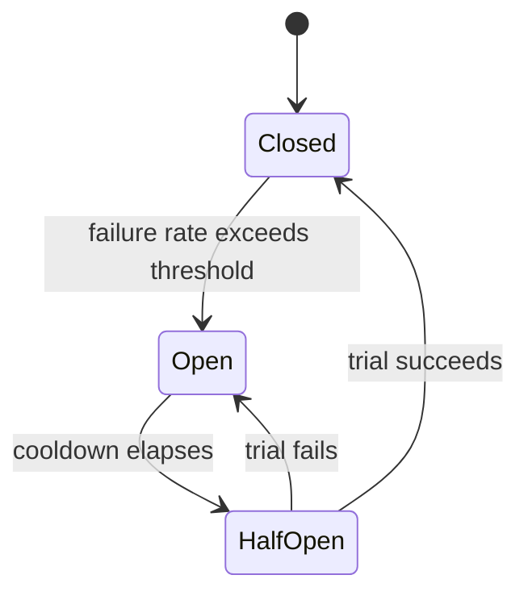
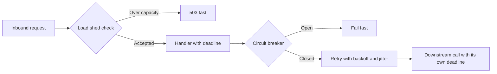

# Lecture 3 — Reliability Patterns: Timeouts Everywhere, Retries with Backoff and Jitter, Circuit Breaking, and Load-Shedding

## Why this lecture exists

Lectures 1 and 2 made `notes` a good citizen of the cluster: honest probes, graceful drain. Those keep the service healthy when *it* is being deployed or scaled. This lecture keeps the service healthy when a *dependency* is not — when Postgres is slow, a downstream is down, or the service is past its capacity. These are the reliability patterns a cloud-native service owes the cluster, and they are the patterns a senior interviewer probes after the liveness-vs-readiness question.

Four patterns, in order of how often they save you: timeouts on every call (the one you cannot skip), retries with backoff and jitter (the one most people get dangerously wrong), circuit breaking (the one that stops you finishing off a struggling dependency), and load-shedding (the one that keeps you up when you cannot serve everyone). All four are `context` and concurrency applied to failure — the Week 4 toolkit again.

The references: the Go context blog at <https://go.dev/blog/context>, the AWS "Exponential Backoff and Jitter" article at <https://aws.amazon.com/blogs/architecture/exponential-backoff-and-jitter/>, the SRE book's "Addressing Cascading Failures" at <https://sre.google/sre-book/addressing-cascading-failures/>, and "Handling Overload" at <https://sre.google/sre-book/handling-overload/>.

## Pattern 1 — Timeouts everywhere

The rule: **every outbound call has a `context` deadline.** No exceptions. A call with no timeout, against a slow or dead dependency, blocks a goroutine and holds a connection *forever*. Enough of them and the service exhausts its connection pool, its goroutines pile up, and the service wedges — and now your *healthy* service is unhealthy because a *dependency* was slow. A timeout converts "wait forever" into "fail in N milliseconds," which is a failure you can handle (retry, shed, return an error) instead of a hang you cannot.

Every layer gets a timeout:

```go
// 1. The server bounds how long it will spend reading/writing a request.
httpSrv := &http.Server{
	ReadTimeout:  10 * time.Second, // slow-loris protection: cap header+body read
	WriteTimeout: 15 * time.Second, // cap the response write
	IdleTimeout:  60 * time.Second, // close idle keep-alives
}

// 2. Every handler derives a per-request deadline (or inherits the client's).
func (h *Handler) GetNote(w http.ResponseWriter, r *http.Request) {
	ctx, cancel := context.WithTimeout(r.Context(), 3*time.Second)
	defer cancel()
	note, err := h.svc.Get(ctx, noteID(r)) // ctx carries the deadline down
	// ...
}

// 3. Every database call uses the request context's deadline. pgx honors it:
//    if the query outlives the deadline, pgx cancels it server-side and returns.
func (r *Repo) Get(ctx context.Context, id string) (Note, error) {
	row := r.pool.QueryRow(ctx, `SELECT id, title, body FROM notes WHERE id = $1`, id)
	// ... if ctx expires mid-query, QueryRow returns context.DeadlineExceeded.
}
```

The `context` you have threaded since Week 4 is the timeout backbone — the deadline set at the handler propagates through the service to the `pgx` call, and `pgx` cancels the query when the deadline passes. A timeout without `context` propagation is a timeout that fires but leaves the query running; the propagation is what makes the cancellation real. Citation: <https://go.dev/blog/context> and the `context` docs at <https://pkg.go.dev/context>.

A subtlety worth a sentence: a server `WriteTimeout` and a per-handler `context` deadline are different tools — the `WriteTimeout` is a hard cap the `net/http` server enforces on the connection; the `context` deadline is a cooperative cancellation the handler and its downstream calls observe. You want both: the context deadline so downstream work stops, the WriteTimeout as a backstop for a handler that ignores its context.

## Pattern 2 — Retries with exponential backoff and jitter

When a downstream call fails *transiently* — a momentary network blip, a brief 503 — retrying is correct. But retrying *wrong* is how you turn a blip into an outage. Three rules:

1. **Retry only transient, idempotent failures.** A `500` on a `GET` is retryable; a `400 Bad Request` is not (it will fail again — your request is wrong). A non-idempotent `POST` that may have partially succeeded is dangerous to retry. Retry on timeouts, connection errors, and 5xx on idempotent operations only.
2. **Exponential backoff.** Wait longer after each failure — 100ms, 200ms, 400ms, 800ms — so a struggling dependency gets breathing room, not a fixed-rate barrage.
3. **Jitter.** Randomize the wait. Without jitter, every client that failed at the same instant retries at the same instant — a synchronized **thundering herd** that keeps the recovering dependency on its knees. Jitter spreads the retries out so the load is smooth, not spiky.

The canonical, hand-written client (it is ~30 lines and you should understand every one):

```go
// internal/retry/retry.go
package retry

import (
	"context"
	"errors"
	"math"
	"math/rand"
	"time"
)

// Do runs fn with exponential backoff + full jitter, up to maxAttempts.
// It retries only when shouldRetry(err) is true (transient + idempotent).
// It honors ctx cancellation between attempts.
func Do(
	ctx context.Context,
	maxAttempts int,
	base, maxDelay time.Duration,
	shouldRetry func(error) bool,
	fn func(context.Context) error,
) error {
	var err error
	for attempt := 0; attempt < maxAttempts; attempt++ {
		if err = fn(ctx); err == nil {
			return nil // success
		}
		if !shouldRetry(err) {
			return err // permanent failure — do not retry a 400
		}
		if attempt == maxAttempts-1 {
			break // out of attempts; return the last error below
		}

		// Exponential backoff: base * 2^attempt, capped at maxDelay.
		backoff := float64(base) * math.Pow(2, float64(attempt))
		if backoff > float64(maxDelay) {
			backoff = float64(maxDelay)
		}
		// FULL JITTER: sleep a random duration in [0, backoff). This is the
		// AWS-recommended variant — it spreads retries the most and avoids
		// the synchronized herd. (rand.Int63n from a per-process source.)
		sleep := time.Duration(rand.Int63n(int64(backoff)))

		select {
		case <-time.After(sleep):
			// next attempt
		case <-ctx.Done():
			return ctx.Err() // the request's deadline beats the retry loop
		}
	}
	return err
}

// IsTransient is a sample retry predicate: timeouts and connection errors are
// transient; a context cancellation by the caller is not (the caller gave up).
func IsTransient(err error) bool {
	if errors.Is(err, context.Canceled) || errors.Is(err, context.DeadlineExceeded) {
		return false // the deadline already fired — retrying would exceed it
	}
	var transient interface{ Temporary() bool }
	if errors.As(err, &transient) {
		return transient.Temporary()
	}
	return false
}
```

The AWS article studies three jitter strategies (no jitter, equal jitter, full jitter) and finds **full jitter** — a random sleep in `[0, backoff)` — spreads load the best and completes work fastest under contention. The `select` on `ctx.Done()` is the load-bearing line that ties retries to the request deadline: the retry loop never outlives the request's `context`, so a 3-second request does not turn into a 30-second retry marathon. Citation: <https://aws.amazon.com/blogs/architecture/exponential-backoff-and-jitter/>.

The danger to internalize: **retries multiply load.** If every client retries 3 times, a dependency under stress sees up to 4x the request rate exactly when it can least handle it — retries can *cause* the cascading failure they were meant to survive. That is why retries are capped, jittered, and ideally paired with a circuit breaker (next), which stops retrying entirely when the dependency is clearly down.

## Pattern 3 — Circuit breaking

A circuit breaker stops you from hammering a dependency that is clearly down. It watches the failure rate of calls to a dependency and moves through three states:

```
   CLOSED  --(failure rate exceeds threshold)-->  OPEN
   OPEN    --(cooldown elapses)--------------->   HALF-OPEN
   HALF-OPEN --(trial succeeds)-------------->   CLOSED
   HALF-OPEN --(trial fails)----------------->   OPEN
```

- **Closed** (normal): calls pass through; failures are counted.
- **Open** (tripped): calls **fail fast** immediately — no request is even sent — for a cooldown period. This is the point: instead of every request waiting for a timeout against a dead dependency (and piling up goroutines), the breaker returns an error instantly, so the service stays responsive and the dead dependency gets a rest.
- **Half-open** (testing): after the cooldown, a trial request is let through; if it succeeds, the breaker closes (recovered); if it fails, it re-opens (still down).


*The breaker's three states: pass calls through, fail fast while cooling down, then test recovery with one trial.*

Using `sony/gobreaker`:

```go
// internal/downstream/client.go
import "github.com/sony/gobreaker/v2"

var cb = gobreaker.NewCircuitBreaker[*http.Response](gobreaker.Settings{
	Name:        "downstream",
	MaxRequests: 1,                // half-open: allow 1 trial request
	Interval:    30 * time.Second, // reset the failure count window
	Timeout:     10 * time.Second, // OPEN cooldown before HALF-OPEN
	ReadyToTrip: func(c gobreaker.Counts) bool {
		// Trip when >50% of at least 5 requests failed.
		return c.Requests >= 5 &&
			float64(c.TotalFailures)/float64(c.Requests) > 0.5
	},
})

func callDownstream(ctx context.Context, url string) (*http.Response, error) {
	return cb.Execute(func() (*http.Response, error) {
		req, _ := http.NewRequestWithContext(ctx, http.MethodGet, url, nil)
		return http.DefaultClient.Do(req)
	})
}
```

When the breaker is open, `cb.Execute` returns `gobreaker.ErrOpenState` immediately without calling the function — the fail-fast that keeps the service responsive. The interaction with retries: the retry predicate should treat `ErrOpenState` as **not retryable** (retrying an open breaker is pointless and burns the request's deadline). Breaker + retry compose: retry transient failures while the breaker is closed; stop entirely when it opens. Citation: <https://github.com/sony/gobreaker> and the cascading-failures chapter at <https://sre.google/sre-book/addressing-cascading-failures/>.

## Pattern 4 — Load-shedding under saturation

The previous three patterns handle a failing *dependency*. Load-shedding handles too much *inbound* load: when requests arrive faster than the service can handle, accepting all of them means serving all of them slowly (or crashing); accepting *some* and rejecting the rest fast means the accepted ones stay healthy. A service that sheds load degrades gracefully; a service that does not collapses under it.

The mechanism is a bound on inbound concurrency — a semaphore — that returns `503 Service Unavailable` (or `429`) immediately when full, rather than queuing unboundedly:

```go
// internal/middleware/shed.go
package middleware

import "net/http"

// Shed bounds concurrent in-flight requests to `limit`. Past the limit it
// returns 503 immediately rather than queuing — bounded concurrency, not an
// unbounded queue that turns saturation into a latency collapse.
func Shed(limit int, next http.Handler) http.Handler {
	sem := make(chan struct{}, limit) // a counting semaphore (Week 4)
	return http.HandlerFunc(func(w http.ResponseWriter, r *http.Request) {
		select {
		case sem <- struct{}{}: // acquired a slot
			defer func() { <-sem }()
			next.ServeHTTP(w, r)
		default: // no slot free — shed immediately
			w.Header().Set("Retry-After", "1")
			http.Error(w, "overloaded, retry shortly", http.StatusServiceUnavailable)
		}
	})
}
```

This is the bounded-worker-pool semaphore from Week 4 applied to the inbound HTTP path. The `default` case is the shed: when the semaphore is full, the request is rejected *immediately* (microseconds), not queued, so the service spends its capacity on requests it can actually finish. The `Retry-After` header tells a well-behaved client to back off — which, combined with the caller's jittered retry, smooths the load.

Crucially, **shedding should be reflected in readiness**: a pod that is shedding heavily is, arguably, not ready for *more* traffic, and a readiness probe that flips to 503 under sustained saturation tells the Service to route elsewhere (to a less-loaded pod) — load-shedding and readiness working together. The SRE book's "Handling Overload" is the canonical treatment of why graceful degradation beats collapse. Citation: <https://sre.google/sre-book/handling-overload/>.

## How the four compose

The four patterns are not alternatives; they layer:

```
   inbound request
      |
   [load-shed]  -- past capacity? -> 503 fast, do not even start          (Pattern 4)
      |  accepted
   [handler with context deadline]  -- bound the whole request            (Pattern 1)
      |
   [downstream call]
      |
   [circuit breaker]  -- dependency clearly down? -> fail fast            (Pattern 3)
      |  breaker closed
   [retry w/ backoff+jitter]  -- transient failure? -> retry, capped       (Pattern 2)
      |
   [the actual call, with its own context deadline]                       (Pattern 1)
```

Read inward: shed what you cannot serve, bound what you accept, fail fast on a dead dependency, retry a transient blip with jitter, and time-bound the call itself. Each pattern handles a different failure; together they are the difference between a service that contains a dependency's failure and one that amplifies it into its own outage — which is exactly what the dependency-outage drill (challenge-02) makes you prove.


*The four patterns layered: shed excess, bound the request, fail fast on a dead dependency, then retry transient blips.*

## What we built

By the end of Lecture 3, `notes` has:

- A `context` deadline on every outbound call, and read/write/idle timeouts on the server — so a slow dependency fails fast instead of wedging the service.
- A retry client with exponential backoff and full jitter, capped attempts, a transient-only predicate, and a `select` on the request `context` so retries never outlive the request.
- A circuit breaker on the downstream call that fails fast while open and half-opens to test recovery, composing with the retry predicate.
- A load-shedding middleware that bounds inbound concurrency and sheds excess with a fast 503, reflected in readiness under sustained saturation.

The service now tells the truth about its readiness (Lecture 1), drains its work on `SIGTERM` (Lecture 2), and contains a dependency's failure instead of amplifying it (this lecture) — the full operational contract. Lab 11 assembles all of it on `kind` and proves it under load; the reliability drill (challenge-02) kills Postgres mid-traffic and makes you show the blast radius stayed contained.
