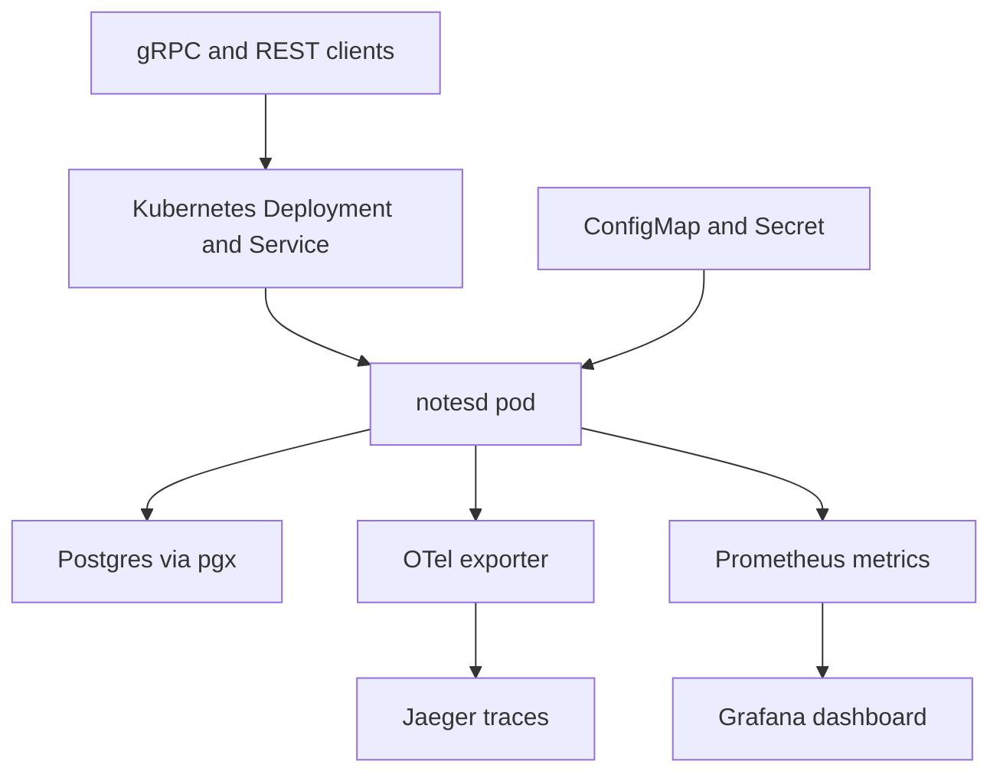
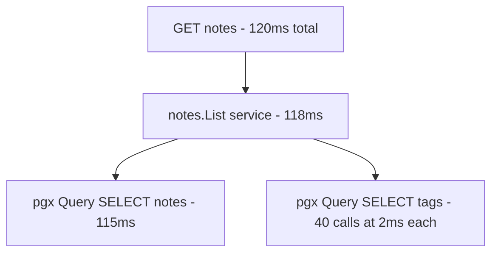

# Lecture 1 — Capstone Integration, Architecture Decision Records, and the Load-Test-and-Trace Report

## Why this lecture exists

You have eleven weeks of artifacts: a worker pool, an HTTP service, a Postgres data layer, a gRPC surface, a test suite, instrumentation, a container, a Kubernetes deployment, reliability patterns. This lecture does three things to turn them into a capstone. First, integrate them into one coherent, deployed service whose architecture diagram matches what you demo. Second, write the architecture decision records that turn "I built it this way" into "I chose this way for these reasons" — the artifact the defense Q&A interrogates. Third, produce the load-test-and-trace report that proves the Week 9 observability earns its keep under real load.

The references: the ADR community at <https://adr.github.io/> and the ADR-templates repository at <https://github.com/joelparkerhenderson/architecture-decision-record>, the OpenTelemetry docs at <https://opentelemetry.io/docs/>, and the Go `pprof` blog at <https://go.dev/blog/pprof>.

## Integration — one service, not eleven labs

The capstone is **one** service taken all the way, not a portfolio of the weekly labs side by side. The integration work is mostly *deletion and reconciliation*: one `cmd/notesd/main.go` that wires the config (Week 10), the pgx pool (Week 6), the chi router and middleware (Weeks 5, 11), the gRPC server (Week 7), the observability (Week 9), and the graceful shutdown (Week 11) into one process; one set of manifests (Week 11); one `compose.yaml` (Week 10); one test suite (Week 8). The labs were built incrementally on the same repo, so integration is making sure the seams are clean, not gluing separate projects.

The integration checklist, against the SYLLABUS capstone deliverables:

```
   capstone deliverable                                  built in
   ----------------------------------------------------- ----------
   1. Source code, GPL-3.0, clean under vet/staticcheck/-race  all weeks
   2. Dual transport: gRPC + REST over shared logic           Weeks 5, 7
   3. Postgres: pgx+sqlc, reversible migrations, a txn        Week 6
   4. Observability: slog + OTel->Jaeger + Prom + Grafana     Week 9
   5. Container: multi-stage distroless non-root, 12-factor   Week 10
   6. Kubernetes: Deployment/Service/ConfigMap, honest probes,
      graceful shutdown on SIGTERM within the grace period    Week 11
   7. Load-test-and-trace report                              this lecture
   8. Reliability-drill postmortem                            Lecture 2 / Week 11 challenges
   9. Production runbook                                      Lecture 2
   10. Five-minute demo video                                 Lecture 3
```

The scope review is where you confirm the domain is the right size: one bounded domain (notes, short URLs, feature flags, inventory, a job queue) with enough surface to exercise gRPC + REST + a transaction + a downstream call, but not so much that you cannot finish the operational work. The technical bar is fixed; the domain is yours to keep small enough to ship.

**The architecture diagram must match what you demo.** A diagram showing a Redis cache you never built, or omitting the gRPC surface you do demo, is the first thing a reviewer catches. Draw the system as it *is* — the SYLLABUS capstone diagram (Kubernetes box with the Deployment, ConfigMap/Secret, the pgx-to-Postgres edge, the OTel-to-Jaeger and metrics-to-Prometheus-to-Grafana edges, the gRPC and REST ingress) is the template; make yours reflect your service.


*The deployed architecture the diagram must match: one pod, one Postgres edge, and the trace and metrics paths into Jaeger and Grafana.*

## Architecture decision records

An ADR is a short, dated, immutable record of one architecturally significant decision. The format (Nygard's, the most common) is four parts:

```markdown
# ADR 0007: Serve REST and gRPC over a shared service layer

Date: 2026-06-19
Status: Accepted

## Context
The service must expose its domain to external clients (REST/JSON over HTTP)
and to internal services (gRPC). Duplicating the business logic behind two
transports risks the two surfaces diverging.

## Decision
Both the chi REST handlers and the gRPC server call the same `internal/notes`
service layer, which holds all business logic and owns the repository. The
transports are thin adapters: parse the request, call the service, marshal the
response. The `.proto` is the gRPC contract; the REST surface is hand-written.

## Alternatives considered
- gRPC-Gateway to generate REST from the proto. Rejected: adds a generated
  layer and a dependency; the hand-written REST surface is small and we want
  control over the JSON shape and error mapping.
- Two separate service layers. Rejected: guarantees divergence.

## Consequences
- One place holds the logic; the surfaces cannot disagree about behaviour.
- A new operation is added once in the service layer and adapted twice.
- The transports must agree on error mapping (a service error maps to an HTTP
  status AND a gRPC status code) — captured in ADR 0009.
```

The load-bearing decisions in a C30 capstone — the ones a senior reviewer will probe and you should have an ADR for:

```
   ADR candidates (write 5+)
   -------------------------
   - channel vs mutex in the concurrent path (Week 3-4 reasoning)
   - sqlc vs an ORM for the data layer (Week 6)
   - REST + gRPC over a shared service layer (Weeks 5, 7)
   - distroless/static vs alpine/debian for the runtime image (Week 10)
   - maxUnavailable: 0 and the rolling-update strategy (Week 11)
   - the reliability stack: timeouts + jittered retries + breaker + shed (Week 11)
   - the transaction boundary for the one multi-step write (Week 6)
```

The point of an ADR is not bureaucracy; it is that the *defense Q&A is a live ADR review*. When a reviewer asks "why `sqlc` and not GORM?", a confident answer that names the trade (legible SQL, compile-time-checked queries, no hidden N+1, vs the convenience of an ORM) is exactly the ADR's "alternatives" and "consequences" sections spoken aloud. Writing the ADRs *is* rehearsing the defense. Citation: <https://adr.github.io/> and the templates at <https://github.com/joelparkerhenderson/architecture-decision-record>.

## The load-test-and-trace report

Adding OpenTelemetry is table stakes; the load-test-and-trace report proves you can *use* it to find and fix a real latency problem on the deployed service. The loop is the Week 9 one — see it on the dashboard, localise it to the span — now on the deployed service under real load.

**Step 1 — drive load.** Point a load generator at the deployed service (via `kubectl port-forward` or, on a managed cluster, the public URL):

```bash
# A read-heavy load to expose query latency.
hey -z 60s -c 50 http://localhost:8080/notes
# A mixed load including writes.
hey -z 60s -c 30 -m POST -D body.json http://localhost:8080/notes
```

**Step 2 — read the RED dashboard.** The Week 9 Grafana dashboard shows rate, errors, and duration. Under load, look for the duration percentiles (p50/p95/p99): a healthy service has a tight distribution; a latency *finding* is a p99 that spikes, a percentile that climbs with load, or an endpoint that is much slower than its siblings.

```
   what the dashboard tells you
   ----------------------------
   p50 low, p99 high            -> a tail problem: some requests hit a slow path
   p99 climbs with concurrency  -> contention: a lock, a pool limit, a serial step
   one endpoint slow            -> that endpoint's query or downstream call
```

**Step 3 — localise to the span.** Click into a slow trace in Jaeger. The span tree (handler → service → pgx) shows *where* the time went. A common finding on a `notes`-shaped service:

```
   trace of a slow GET /notes (p99 outlier)
   ----------------------------------------
   GET /notes                            120ms
     notes.List (service)                118ms
       pgx.Query SELECT notes            115ms   <-- almost all the time is here
       pgx.Query SELECT tags (per note)    2ms   x40   <-- and an N+1!
```

The N+1 — one query per note to fetch its tags — is the finding: the span tree shows forty small `SELECT tags` spans under the list call, each fast individually but slow in aggregate, and the `SELECT notes` itself slow because it has no index on the filter column.


*The span tree localises the p99 outlier to one slow query plus a forty-call N+1 loop.*

**Step 4 — fix and re-measure.** The fix is two changes: add the missing index (a migration) and collapse the N+1 into one query (a `JOIN` or a `WHERE tag_note_id = ANY($1)`). Re-run the load and capture the before/after:

```
   finding              before (p99)   fix                              after (p99)
   slow SELECT notes    115ms          add index on (owner_id, created) 8ms
   N+1 on tags          40 queries     one batched query                1 query
```

**Step 5 — `pprof` for the CPU/alloc side (if the finding is in-process).** If the slow path is CPU or allocation, not the database, the report includes a `pprof` capture. The service exposes `net/http/pprof` (gated to non-prod or behind auth):

```bash
go tool pprof http://localhost:2113/debug/pprof/profile?seconds=30
# (top, list <func>, web — find the hot function, fix it, re-measure)
```

Citation: <https://opentelemetry.io/docs/> for the trace reading and <https://go.dev/blog/pprof> for the profile.

The report (`LOAD-AND-TRACE-REPORT.md`) is: the load profile, the before dashboard, the slow trace, the localised finding (the span where the time went), the fix (the migration/query/code change), and the after dashboard/trace showing the improvement. One finding, fully worked, beats a wall of graphs.

## What this lecture produced

By the end of Lecture 1, the capstone has:

- One integrated, deployed service whose architecture diagram matches the demo, with the eleven weeks' work reconciled into one coherent repo.
- A set of ADRs (5+) for the load-bearing decisions — the artifact the defense Q&A interrogates and the rehearsal for defending them.
- A load-test-and-trace report: a real latency finding, localised from the Grafana dashboard to a Jaeger span, fixed, and re-measured — the proof the observability is usable, not decorative.

Lecture 2 adds the operational deliverables: the reliability-drill postmortem (run one drill on yourself) and the production runbook (the document the next operator follows). Lecture 3 covers the demo and the defense.
