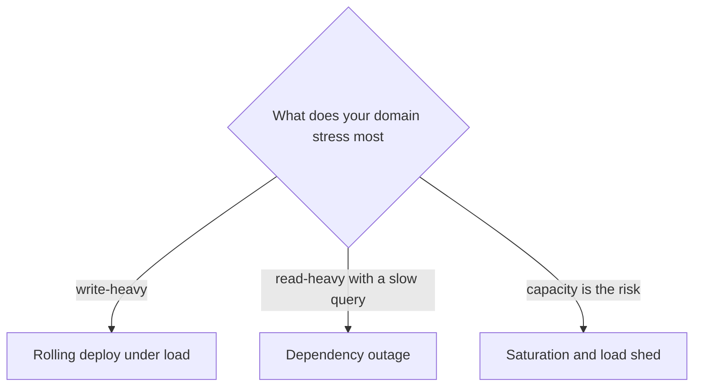
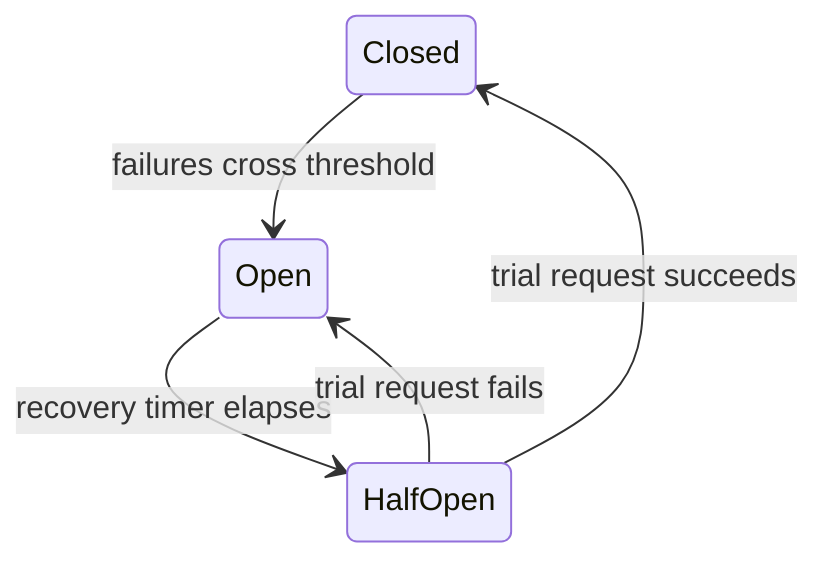

# Lecture 2 — The Reliability-Drill Postmortem and the Production Runbook

## Why this lecture exists

Lecture 1 made the service coherent and proved its observability. This lecture covers the two operational deliverables that separate a project from a system: the reliability-drill postmortem (you break your own service on purpose, observe how it survives, and write it up honestly) and the `production-runbook.md` (the document that lets someone who did not build the service operate it at 3am). Both are graded, and both are graded by being *used* — the defense walks one runbook section without you narrating, and the postmortem is read for honesty, not heroics.

The references: the SRE workbook's postmortem-culture chapter at <https://sre.google/workbook/postmortem-culture/>, the playbooks chapter at <https://sre.google/workbook/playbooks/>, and the incident-response chapter at <https://sre.google/workbook/incident-response/>.

## The reliability drill — break it on yourself, before the demo

The capstone requires you to run **one** reliability drill on yourself and write it up. The three options (you ran the machinery in Week 11's challenges; here you do it on the *integrated* capstone and write the postmortem):

```
   drill                     what you do                      what you prove
   ------------------------- -------------------------------- ----------------------------------
   rolling deploy under load deploy a new version while a      zero dropped requests; readiness +
                             load generator runs               graceful drain made the handoff
   dependency outage         kill Postgres mid-traffic         timeouts + jittered retries +
                                                               breaker contained the blast radius
   saturation / load-shed    drive past capacity               load-shedding kept accepted requests
                                                               healthy; readiness reflected reality
```

Pick the one that best stresses *your* domain. A write-heavy service makes the rolling-deploy-under-load drill interesting (an interrupted write is worse than an interrupted read). A read-heavy service with a slow query makes the dependency-outage drill interesting. The drill is not a demo of success — it is an experiment, and the postmortem documents what actually happened, including anything that surprised you.


*Pick the drill that best exercises the failure mode your domain actually has.*

## Writing the postmortem

A postmortem is a ~3–5-page document with a fixed structure. The discipline is **blameless and honest** — it documents the failure and what the system did, not "and then everything worked perfectly." The SRE-workbook structure, adapted:

```markdown
# Postmortem: Dependency-Outage Drill — Postgres killed mid-traffic

## Summary
One paragraph: what drill, what happened, the outcome. "Killed Postgres during
a 50 req/s read load. Reads failed fast (sub-second, then sub-ms once the
breaker opened); goroutines stayed bounded; liveness stayed green; no pod
restarted. Postgres restored after 90s; the breaker half-opened, found it
healthy, closed; reads recovered in ~8s with no restart."

## Timeline (UTC, to the second)
- 14:02:00  steady state: 50 req/s, all 200, p99 12ms
- 14:02:30  scaled postgres to 0
- 14:02:31  first read failures: 503 at ~the 2s query timeout
- 14:02:34  >5 failures crossed threshold; breaker OPENED; 503s now sub-ms
- 14:02:34+ go_goroutines flat at ~80 (did NOT climb)
- 14:04:00  scaled postgres to 1
- 14:04:12  breaker half-opened, trial succeeded, CLOSED
- 14:04:13  reads 200 again; pods 3/3 Ready; RESTARTS still 0

## What happened (and what each mechanism did)
- The query TIMEOUT turned the hang into a 503 in ~2s (without it: a hang).
- The CIRCUIT BREAKER turned subsequent 503s into sub-ms fail-fasts and kept
  goroutines bounded (without it: goroutines climb, pool exhausts, wedge).
- HONEST READINESS reported 503 so the Service stopped routing; liveness stayed
  200 so no restart storm.
- RECOVERY was automatic: the breaker found Postgres healthy and closed.

## What surprised me / what went wrong
Honest section. E.g.: "The first 4 requests after the kill waited the full 2s
timeout before the breaker opened — a small burst of slow failures I had not
accounted for. A lower ReadyToTrip threshold would shorten that window."

## Action items
- [ ] Lower the breaker's request threshold from 5 to 3 to open faster (#42).
- [ ] Add a Prometheus alert on go_goroutines climbing (a wedge early-warning).
- [ ] Document the recovery time (~8s) in the runbook's outage section.
```


*The breaker's state machine from the drill: it opened on repeated failures, then closed again once a trial request against the restored Postgres succeeded.*

The two sections graders read hardest are **what each mechanism did** (do you understand *why* it survived, or did it just happen to?) and **what surprised you / went wrong** (a postmortem with no honest finding is not a real drill). Citation: <https://sre.google/workbook/postmortem-culture/>.

## The production runbook

`production-runbook.md` lives in the repo root and answers, in concrete commands, the questions you will be asked at 3am. The SYLLABUS specifies its contents; the test is that a grader who did not build the service can follow any section cold. A section is followable cold only if it contains the literal commands, the expected output, and the next step when the output is wrong — not prose that assumes you already know.

The required sections:

### 1. Build and deploy — every command, no hand-waving

```markdown
## Deploy
1. Build and load the image:
   docker build -t notesd:$(git rev-parse --short HEAD) .
   kind load docker-image notesd:$(git rev-parse --short HEAD) --name notes
2. Apply manifests (image tag updated to the SHA):
   kubectl set image -n notes deploy/notes notes=notesd:$(git rev-parse --short HEAD)
3. Verify: kubectl rollout status -n notes deploy/notes   # "successfully rolled out"
   curl -s http://localhost:8080/readyz                   # -> ok
4. If the rollout hangs: kubectl get pods -n notes -> the new pod is not Ready;
   kubectl logs -n notes <new-pod> -> the readiness failure (usually DB unreachable).
```

### 2. Roll back — a bad rollout AND a bad migration

This is the section the defense most often walks, because it has two distinct cases:

```markdown
## Roll back a bad rollout
kubectl rollout undo -n notes deploy/notes         # back to the previous ReplicaSet
kubectl rollout status -n notes deploy/notes        # confirm the old version is serving
# Why it is safe: migrations are expand-only (additive), so the previous image's
# code still understands the current schema. Roll back FIRST, diagnose SECOND.

## Roll back a bad migration
# Expand-only migrations make most rollbacks schema-safe with no DB action.
# If a migration must be reverted:
migrate -path ./migrations -database "$NOTES_DATABASE_URL" down 1
# A destructive migration (a DROP) is NOT safely reversible — which is why every
# migration in this service is expand-then-contract (add nullable, dual-write,
# backfill, drop in a LATER deploy). State the rule: never ship a destructive
# migration in the same deploy as the code that needs the new shape.
```

### 3. The probe semantics — for THIS service

```markdown
## Probes
- /healthz (liveness): returns 200 if the process is alive. Depends on NOTHING.
  A failing liveness => the kubelet restarts the pod (the process is wedged).
- /readyz (readiness): returns 200 if Postgres is reachable (2s ping deadline).
  A failing readiness => the pod is pulled from the Service (NOT restarted).
- On SIGTERM, /readyz flips to 503 first (so the Service stops routing), then
  the pod drains for up to 20s, then exits. Grace period: 30s.
```

### 4. The five most likely outages, with the first three diagnostics each

```markdown
## Likely outages
1. Postgres unreachable -> readyz 503, pods NotReady, reads 503.
   Diagnose: (a) kubectl get pods -n notes -l app=postgres
             (b) kubectl logs <notes-pod> | grep "db unreachable"
             (c) check the breaker state metric notes_breaker_state.
2. Bad deploy (5xx after rollout) -> roll back FIRST (section 2), then diagnose.
   Diagnose: (a) kubectl logs <new-pod>  (b) the Jaeger trace for a failing req
             (c) compare the ADR/migration diff in the deploying commit.
3. Saturation (high p99, 503s with Retry-After) -> load-shedding firing.
   Diagnose: (a) the RED dashboard rate vs capacity  (b) notes_shed_total metric
             (c) go_goroutines (climbing => a leak, not just load).
4. Goroutine leak (memory climbs, p99 climbs over time) -> a missing context
   cancellation. Diagnose: (a) go_goroutines trend  (b) /debug/pprof/goroutine
             (c) the trace for a request that never completes.
5. Migration stuck/failed -> deploy aborts or readyz never passes.
   Diagnose: (a) the migrate job/step logs  (b) migrate version on the DB
             (c) whether the migration is expand-only (section 2).
```

### 5. The observability entry points and who to page

```markdown
## Where to look
- Logs: kubectl logs -n notes -l app=notes -f  (slog JSON, trace_id field).
- Traces: the Jaeger UI; pivot from a log line's trace_id to the full trace.
- Metrics: the Grafana RED dashboard; the breaker/shed/goroutine panels.

## Who to page
- You. This is a portfolio service; the discipline of writing "who to page" is
  the point. On a team, this names the on-call rotation and the escalation path.
```

The runbook is graded by being walked: in the defense, a reviewer picks one section and follows it without you narrating. A runbook that requires you in the room is not a runbook. Citation: <https://sre.google/workbook/playbooks/> and <https://sre.google/workbook/incident-response/>.

## What this lecture produced

By the end of Lecture 2, the capstone has:

- A reliability-drill postmortem (~3–5 pages) of one drill run on the integrated service, with an honest timeline, an account of what each mechanism did, and the surprise/finding that proves it was a real experiment.
- A `production-runbook.md` with the five required sections — deploy, rollback (rollout + migration), probe semantics, the five outages with diagnostics, and the observability entry points + who to page — each followable cold.

Lecture 3 covers turning all of this into a five-minute demo and defending it in the senior backend-Go interview loop.
