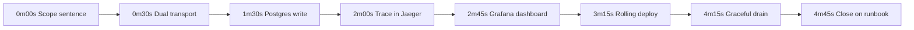
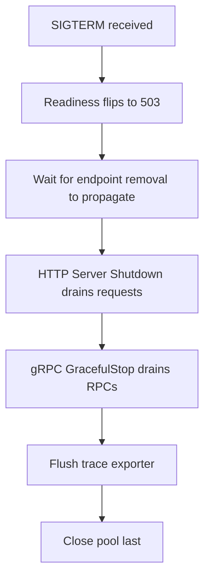

# Lecture 3 — Demo Discipline, the Five-Minute Video, and the Senior Backend-Go Interview Loop

## Why this lecture exists

The service is built, deployed, instrumented, drilled, and documented. This lecture is about communicating it: the five-minute demo video, the live defense choreography, and the senior backend-Go interview loop the defense rehearses you for. The capstone is graded on engineering and operability, not polish — but a demo that buries the engineering, or a defense answer that says "it works, trust me," loses points the work earned. This lecture is how you make eleven weeks legible in five minutes and defensible in a Q&A.

The reference for the demo discipline is the SRE workbook (the operational mindset behind a no-marketing-edits demo); the interview-loop content is the SYLLABUS career pack, made concrete here.

## The five-minute demo video

Voice-over required, no marketing edits. The point is not to impress with production values; it is to show the service works end to end and that *you* understand what is happening at each step. Stage it — have the cluster up, the port-forwards open, the load generator ready, and a terminal and the Jaeger/Grafana tabs prepared before you hit record. The choreography:

```
   the five-minute demo, in order
   ------------------------------
   0:00  One sentence of scope: "This is <domain>, a Go microservice serving
         gRPC and REST over a shared service layer, backed by Postgres, deployed
         to Kubernetes with honest probes and graceful shutdown." Lead with it.
   0:30  Dual transport: curl the REST endpoint AND grpcurl the gRPC endpoint;
         show they return the SAME domain data (shared service layer).
   1:30  Postgres: a write that goes through a transaction; show it persisted.
   2:00  A trace in Jaeger: the request you just made, handler -> service -> pgx
         span tree. "Same trace_id is in the slog log line" — show the log.
   2:45  The Grafana RED dashboard: rate/errors/duration reflecting your traffic.
   3:15  A rolling deploy under load: start the load generator, kubectl rollout
         restart, show drop=0 while pods hand off. "Zero dropped requests."
   4:15  A clean graceful drain: hold an in-flight request, delete its pod, show
         the request completes 200 and the pod logged drain complete.
   4:45  Close: point at the runbook. "Here is how the next operator runs this
         without me." One sentence. Stop at 5:00.
```


*The five-minute demo moves in one continuous take from the scope sentence to the runbook close.*

Two disciplines. **Say the scope sentence first** — it is the thesis of the whole capstone, and a reviewer who hears it knows what to watch for. **Show, do not assert** — every claim ("they return the same data," "zero dropped requests," "the trace ties to the log") is demonstrated on screen, not narrated as a fact to trust. The video is the artifact a hiring manager opens; it should make them want to read the repo. Citation: the demo-discipline mindset from the SRE workbook's incident-response and communication chapters.

## The live defense

The defense is a reviewer-panel Q&A (in person or recorded + Q&A). The reviewers run the demo with you, then probe behind it. The questions are predictable because they are the senior backend-Go interview questions — which is the point of the whole career pack. A confident, specific answer that *points at your code, your ADR, your runbook* is what the defense rewards.

What the panel probes:

- **Concurrency.** "Show me the bounded worker pool / the goroutine that could leak / the `context` cancellation path. What does the race detector prove about this code, and what can't it prove?" Point at the Week 4 pool and the `go test -race` run.
- **Reliability decisions.** "Why a circuit breaker here and not just retries? What happens to an in-flight request during your rolling deploy? Walk me through the graceful-shutdown order — why is the pool closed last?" Point at the Week 11 code and ADRs.
- **Architecture.** "Why `sqlc` and not an ORM? Why serve both gRPC and REST instead of one? Why distroless and not alpine?" These are your ADRs spoken aloud.
- **Operations.** "It's 3am, the deploy you just shipped is throwing 500s. Walk me through it." (Correct first move: roll back, *then* diagnose — the runbook section 2.) "Where do the logs live? How do you pivot to the trace?" Point at the runbook.
- **The drill.** "What did your dependency-outage drill prove? What surprised you?" Your postmortem.

The pattern: every question has an artifact behind it — code, an ADR, the runbook, the postmortem, the trace report. The defense is where the rubric is scored; bring the system, not slides.

## The senior backend-Go interview loop

The career pack is the loop a cloud-native shop runs, and your capstone is the worked example you bring to every round. The five areas (the homework drills them; here is the map):

### 1. Go language deep-dive

Pointer vs value receivers (when each, and the consistency rule); interfaces at the consumer ("accept interfaces, return structs"); error wrapping and `errors.Is`/`errors.As`; generics vs interfaces (the decision matrix from Week 2); the zero value; `defer`/`panic`/`recover` semantics (and why `panic` is not exception handling). The interviewer probes whether you write *idiomatic* Go or Java-in-Go.

### 2. Concurrency

Goroutine lifecycle and leaks (who closes the channel; the leaked-goroutine reproduction from Week 3); channel vs mutex (when each is the simpler answer); `select` patterns; `context` cancellation and deadlines (why it is threaded everywhere); the race detector (what `go test -race` proves and what it cannot — it proves a race *occurred* in this run, not that none *can*); the memory model at interview depth. This is the most-probed area for a Go role.

### 3. Services and data

HTTP server design (the handler/service/repo seam, composable middleware); gRPC vs REST trade-offs (internal vs external, the contract, streaming); transaction isolation and concurrent-write hazards (lost update, write skew — Week 6); migration strategy (expand-then-contract, reversibility); the typed-query-vs-ORM argument (your `sqlc` ADR).

### 4. Cloud-native operations

**Liveness vs readiness** — *the* question that separates people who have operated a service from people who have not (liveness depends on nothing; readiness checks dependencies; conflating them causes a restart storm). Graceful shutdown on `SIGTERM`. The distroless/12-factor rationale. Retries-with-jitter and circuit breaking. Reading a trace and a flame graph. Your Weeks 9–11 work is the worked example for every one of these.

### 5. System design with a Go lens

Six prompts (challenge-02 has you write two as dossiers): design a URL shortener, a rate limiter, a job queue, a feature-flag service, a deploy that drops zero requests, a service that survives a database failover. Each answer names the actual Go primitives (a bounded worker pool with `errgroup`, a `context`-cancellable pipeline, a `pgx` transaction, a `gobreaker` breaker) and the cloud-native pieces (the readiness probe, the graceful drain, the expand-only migration) — not hand-waving. Your capstone is the reference design you reason from.

### Behavioural

Five backend-specific prompts: "walk me through a service you owned in production" (your capstone), "the worst data race you've shipped" (the Week 4 race you found with `-race`), "a deploy that went wrong and what you changed" (your reliability-drill finding). The framework: situation, what you did, what you learned — concrete, specific, and pointing at the artifact.

## Two worked answers, to set the bar

The defense rewards specific, code-backed answers. Two of the most-probed questions, answered the way you should answer them — pointing at code, naming the trade.

**"Show me a goroutine that could leak, and how you prevent it."** The wrong answer is "I don't have any." The right answer points at the code and names the rule:

```go
// A worker that WOULD leak: if the consumer stops reading `out` and there is
// no cancellation, this goroutine blocks forever on the send and is never
// collected — a leak. The fix is the context: the send races the ctx.Done().
func (s *Service) stream(ctx context.Context, ids []string) <-chan Result {
	out := make(chan Result)
	go func() {
		defer close(out) // the producer closes — the "who closes" rule
		for _, id := range ids {
			r := s.fetch(ctx, id)
			select {
			case out <- r: // deliver...
			case <-ctx.Done(): // ...OR bail if the caller cancelled. No leak.
				return
			}
		}
	}()
	return out
}
```

"The goroutine could leak if the caller stops reading — the `select` on `ctx.Done()` is what lets it exit instead of blocking forever on the send. The producer closes the channel because it is the sender (the who-closes rule). `go test -race` and a goroutine-count assertion in the test prove it does not leak — though `-race` proves a race *did not occur in that run*, not that none *can*; for leak-proof I assert the goroutine count returns to baseline after the call." That answer names the bug, the fix, the rule, and the limit of the tool — exactly what a senior interviewer is listening for.

**"Walk me through your graceful-shutdown order — why is the pool closed last?"** Point at the Week 11 `run` skeleton and narrate the order: "On `SIGTERM`, I fail readiness first so the Service stops routing, wait for the endpoint removal to propagate, then `http.Server.Shutdown` drains in-flight HTTP requests, then gRPC `GracefulStop` drains RPCs (wrapped in a `select` with the budget so a stuck stream cannot hold me past the grace period), then I flush the trace exporter, and the pool is closed *last* — by a deferred `Close` after the servers stop — because an in-flight handler still holds a connection from it; close the pool first and I break the very requests I am draining. The budget is 20s under a 30s grace period so I always exit before `SIGKILL`." That is the close-order rule, the budget arithmetic, and the reason, in one breath.


*The pool closes last because an in-flight handler still holds a connection from it until every drain step finishes.*

The pattern for every defense answer: name the thing, point at the code, state the trade or the rule, and name what it does *not* cover. "It works, trust me" is the answer that loses points the work earned.

## What this lecture produced

By the end of Lecture 3, you have:

- A five-minute demo video (voice-over, no marketing edits) showing the service end to end — dual transport, a trace, the dashboard, a zero-drop rolling deploy, a clean graceful drain — leading with the scope sentence and showing every claim rather than asserting it.
- A defense rehearsed against the senior backend-Go interview loop, with an artifact (code, ADR, runbook, postmortem, trace report) behind every likely question.
- The interview-prep map across the five areas, with your capstone as the worked example for each.

This is the end of C30 · Crunch Go. You started at the Go tour in Week 1; you finish operating a deployed, observable, gracefully-shutting-down Go microservice, with a runbook the next operator can follow, a postmortem of a failure you survived on purpose, and the interview loop rehearsed against your own work. That is the job — and it is the difference between someone who writes Go services and someone the platform team trusts in production.
